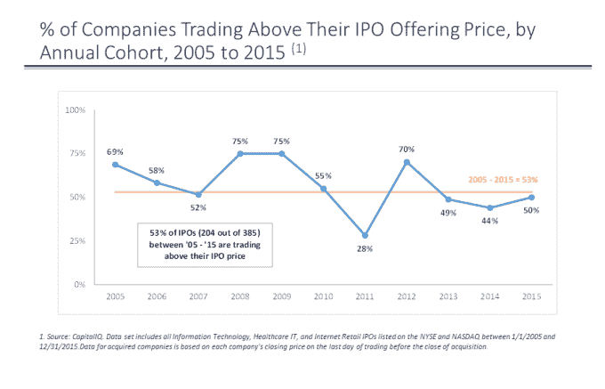

# 不要相信“IPO 窗口”的神话

> 原文：<https://web.archive.org/web/https://techcrunch.com/2016/06/22/dont-buy-into-the-myth-of-the-ipo-window/>

肖恩·吉斯是

[Technology Crossover Ventures](https://web.archive.org/web/20221208100326/http://www.tcv.com/)

(TCV)，一个成长阶段的投资者，他积极参与 TCV 在 Actifio，ExtraHop，Fuze 和 GoDaddy 的投资

我们正在等待 Twilio 的首次公开募股，科技媒体周期充斥着关于本周的公开募股是否会打开首次公开募股窗口的问题。

对于外行人来说，IPO 窗口代表着公司上市的时间。关闭的 IPO 窗口实际上是“市场状况不佳”的委婉说法——而且，根据公开市场和 IPO 从业者的说法，当前的市场状况不佳，这导致了 IPO 市场的历史疲软。

如果你不相信我，可以看看这里的文章，还有这里的(我保证还有几十篇)。

SecureWorks 于 2016 年 4 月问世，它将成为打破 IPO 窗口的隐喻之锤。不幸的是，SecureWorks 的 IPO 定价低于其申报范围，并在几个月内低于其 IPO 价格。

如果你认同 IPO 窗口的概念，SecureWorks 的 IPO 及其随后的公开市场表现是一个合乎逻辑的结果——如果你试图穿过一个关闭的 IPO 窗口，你会遍体鳞伤地出现在另一边——他们怎么敢无视传统智慧？

我不想对 SecureWorks 的长期前景做出任何断言，但我确实认为他们的 IPO 表现和长期前景与所谓的 IPO 窗口无关。

IPO 从业者提供了无数不要让公司上市的市场相关理由:美联储可能会加息；科技股风向标收益疲软；投资者可能会被即将发布的就业报告分散注意力；接下来的一周可能会下雨……我几乎听到了书中的每一个论点，它们都是胡扯。

所以让我非常明确地说——当合适的公司想要上市时，市场条件根本不重要。

首先，让我们看看 2016 年发生了什么。在 Q1(零科技公司 IPO)，中国和油价是 IPO 市场疲软的原因——但极具讽刺意味的是，今年寻求上市的北美科技公司中，几乎没有一家与中国或油价有任何关联——也没有任何关联。

我们现在处于第二季度(Twilio 的两次 IPO 预计将于本周定价)，每个人都在关注利率、英国退出欧盟和即将到来的总统选举……同样，与技术无关。我可以进一步推断这一论点——绝大多数科技公司都有足够强大的顺风来克服与宏观相关的市场力量。

但仍有许多公司暂停了 IPO，这在很大程度上是因为 IPO 窗口已经牢牢关闭。让我们看看事实是如何与 IPO 窗口的神话相吻合的:

*   误解 1:当窗口关闭时上市的公司将无法完成订单

这里的想法是，恐惧让投资者望而却步。但总有一些投资者会疏导自己内心的沃伦巴菲特，会“在人们恐惧时贪婪，在人们贪婪时恐惧。”

o SecureWorks 可能不得不降低其发行价，但订单被超额认购了数倍(这意味着他们从潜在投资者那里收到的股票订单是其 IPO 收益的数倍)。

o 而且，如果其他公司因为感觉到关闭的窗口而等待上市，那么这将理想地推动更多的需求到只有*的*公司上市。

*   误解 2:在一个充满挑战的市场上市的公司将无法筹集到足够多的资金，并且/或者会经历太多的稀释

o 当一家公司在一个不稳定的市场上市时，必须做出一些牺牲，但一家聪明的初创公司可以通过仔细调整发行股票的数量来最大限度地减少负面结果。如果担心的是稀释，就不要像中间步骤那样筹集那么多资本和削减发行规模。如果计划以 20 亿美元的市值筹集 2 亿美元，但订单只能以 10 亿美元的估值完成，那么只需筹集 1 亿美元，稀释率也是一样的。简单的数学！

o 如果未来需要更多资金，等到股票升值到可以接受的水平，再进行后续发行。如果一家公司出于偿付能力的原因急需资金，那么投资者和公开市场几乎肯定会讨厌更大的一系列问题。

*   误解 3:当窗口关闭时上市会导致 IPO 失败

o 根据 IPO 的定义，一家筹集资金并开始公开交易的公司已经成功了！！

o 让我们来看一个例子:OpenTable 在 2009 年 1 月申请上市，这可能是过去 20 多年来最糟糕的“市场状况”。他们最初的申报价格区间是 12-14 美元/股，最终涨到了 16-18 美元/股。他们将 IPO 定价为每股 20 美元，首日交易收于 24.50 美元。五年后，Priceline 以 26 亿美元收购了 OpenTable，合每股 103 美元

我可以继续神话，但不要只相信我的话，让我们看看数据。在过去的 10 年中，大约一半的首次公开募股(T2)目前低于其首次发行价，这意味着相对于 IPO 价格的长期表现与市场条件无关。

看似显而易见，但我从未真正见过这些数据！虽然数据中有很多噪音，有太多的变量无法得出结论，但事实上，相反的情况可能是正确的——2008 年和 2009 年的表现相对于其 IPO 价格似乎是最好的(尽管，我认为，这更有可能来自逆向选择和相对估值倍数，更不用说还有<20 data points).

当然，除了市场条件之外，还有很多因素需要考虑，比如:公司规模、商业模式成熟度、盈利能力等等。此外，首次公开募股还有巨大的情感和人力因素——艰难的首次公开募股或受打压的股票可能会对员工产生士气低落的影响，这可能会在未来几年产生影响。

最后，亏损估计你作为一家上市公司的前几个季度也会对股票产生长期影响(这被称为被关进“惩罚箱”)。有些人可能会理直气壮地说，市场状况可能会对你的股价产生你无法控制的负面影响(但你猜怎么着，其他所有上市公司都会有同样的问题)。

管理团队和董事会将考虑所有这些因素。

硅谷的传言是，等待 IPO 的初创公司陷入了僵局。许多公司拥有强大而忠诚的管理团队、经久不衰的产品、推动可预测且可盈利的收入增长的规模，以及确保符合合规性法规的 IT/财务系统。毫无疑问，有些人比其他人更适合，投资者会权衡这些因素。但它们都不应该仅仅因为所谓的 IPO 窗口关闭就退缩。如果你仍然不相信我，看看 Acacia，这是今年第二次科技 IPO。它于 5 月上市，股价比 23 美元的发行价上涨了近 80%。那一定意味着窗户是开着的，对吗？