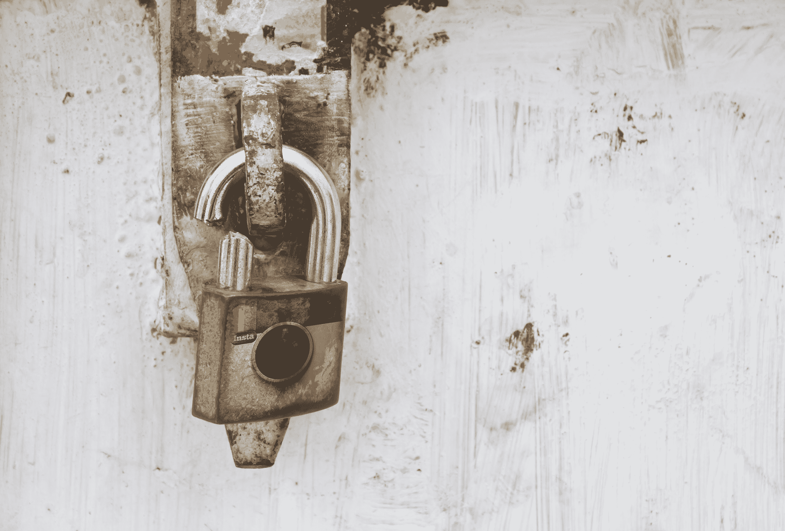

# 不要慌！你的 Instagram(可能)不只是被黑了 

> 原文：<https://web.archive.org/web/https://techcrunch.com/2015/12/02/dont-panic-your-instagram-probably-wasnt-just-hacked/>

# 不要慌！你的 Instagram(可能)不仅仅是被黑了

大约两个小时前，我收到了家人一连串的短信。

“我的 Instagram 被黑了！”一读。

“我登录不了 Instagram！我收到通知说我已经被注销了！”

你也是吗？

不要惊慌。一群人收到了这些警报——不，这不是一个大的超级黑客。

目前还不清楚到底发生了什么，但 Instagram 表示这不是恶意行为的结果。他们说，只是“一个错误”——而且是一个现在就应该修复的错误。

继续上传你的咖啡、鞋子和其他物品的图片，从上面看，图片完全居中。

https://twitter.com/instagram/status/672153910967054337

https://twitter.com/instagram/status/672154293185568768