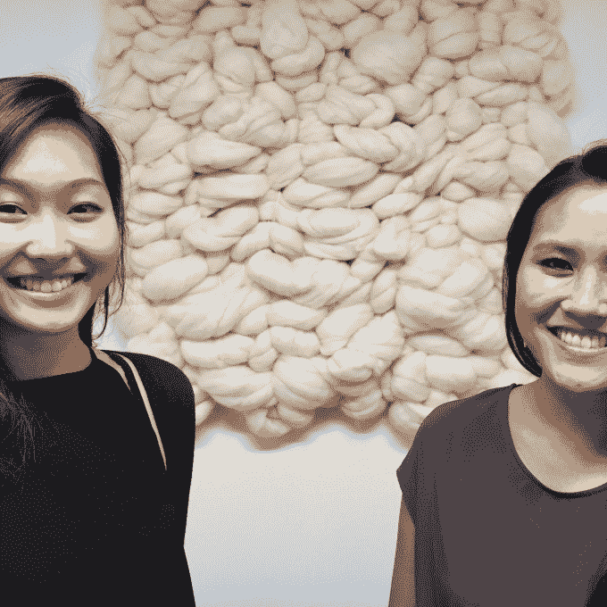
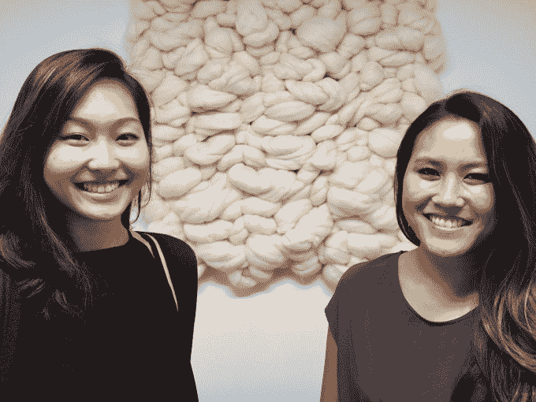
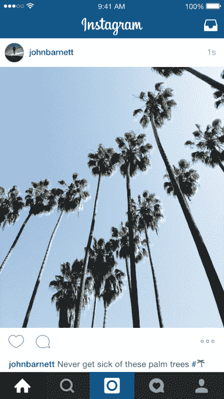

# Instagram 认为广场之外，现在允许横向和纵向照片和视频 

> 原文：<https://web.archive.org/web/https://techcrunch.com/2015/08/27/dont-sacrifice-the-shoes/>

# Instagram 认为在广场之外，现在允许风景和肖像照片和视频

Instagram 上有五分之一的照片或视频周围出现了令人讨厌的空白，因为人们使用其他应用程序给他们的风景或肖像图像添加信箱，以适应 Instagram 的方形裁剪。所以今天，iOS[和安卓](https://web.archive.org/web/20221223211519/https://itunes.apple.com/us/app/instagram/id389801252?mt=8)[的 Instagram 不再要求所有照片和视频都是方形的。现在，当用户上传照片时，他们可以捏或点击左边的格式按钮](https://web.archive.org/web/20221223211519/https://play.google.com/store/apps/details?id=com.instagram.android&hl=en)[发布他们的风景或肖像照片和视频](https://web.archive.org/web/20221223211519/http://blog.instagram.com/post/127722429412/150827-portrait-and-landscape)。尽管如此，正方形仍然是允许的。

这一变化可能会在 Instagram 中开启新的艺术表现形式。传统拍摄的风景视频不会失去电影感。时尚摄影师讨厌广场迫使他们从人们服装的肖像照中裁剪出鞋子。对于日常用户来说，这一变化意味着他们不必提前计划发布到 Instagram，或者最终从集体照片中删除朋友的脸。

Instagram 的创始人最初为什么选择广场？“我们听到的故事是，它看起来很漂亮，当他们嘲笑它时，它在 feed 上看起来真的很好，”Instagram 产品经理阿什利·尤奇说，她领导了今天的变化。

但她告诉我，用户说“他们有一些不适合正方形的时刻想要分享。重要的部分会被砍掉。通过实现这一点，我们可以给你更多的创作自由。”

该功能的产品设计师 Christine Choi 解释说:“你可以讲述你的视觉故事，而不必担心它是否适合应用程序。”

例如，以下是 Yuki 和 Choi 在 Instagram 上的照片:

这就是它现在的样子:

一个额外的小调整:Instagram 上的过滤器现在是“通用的”这意味着您可以在视频上使用照片滤镜，在照片上使用视频滤镜。

每张照片和视频仍会显示相同的姓名标签、描述、反馈按钮和评论。无论照片或视频的大小如何，这些信息都可以很好地处理它们。现在，用户不必打开一个不同的应用程序并添加信箱，就可以在 Instagram 中获得他们的非方形照片。然而，图片在用户档案中仍然会显示为正方形。

抛弃正方形格式可以让 Instagrams 在照片网络之外更容易分享。Instagram 的母公司脸书等其他应用已经接受了更广泛的格式。现在，当用户将他们的照片从 Instagram 整合到脸书时，他们会以他们所有的荣耀出现，而不是尴尬的被卡在正方形里。