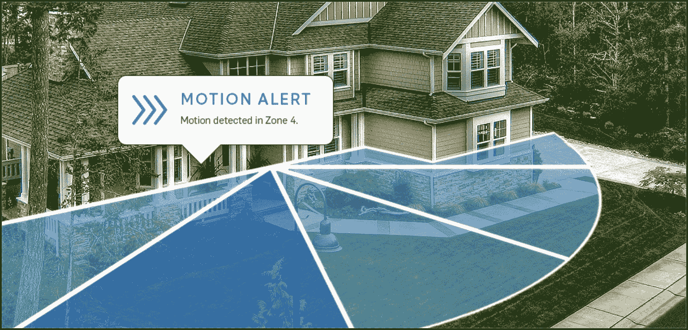

# Doorbot 变成了 Ring，这是一个家庭安全解决方案，也可以问候你的访客

> 原文：<https://web.archive.org/web/https://techcrunch.com/2014/09/29/doorbot-ring-home-security-doorbell/>

在成功筹集了 25 万美元的众筹活动和承诺通过家庭网络远程查看任何来到你家门口的人的第一代产品之后，Doorbot 正在重新命名为 [Ring](https://web.archive.org/web/20230321211900/http://ring.com/) ，并推出了重新设计的硬件，更加关注家庭安全，这种设计应该有助于它更好地适应周围环境，并补充现有的房屋设计选择。

Ring 创始人兼首席执行官杰米·西米诺夫(Jamie Siminoff)承认，虽然 Doorbot 基本上是成功的，但它也是第一代产品，有自己的缺陷和不足，来自这些缺陷和不足的反馈为 Ring 的设计提供了信息。作为一个品牌，Ring 的设计不仅仅是为您的前门提供远程呈现解决方案；其目的是创造一个公司形象，可以适用于总家庭安全，着眼于未来和家庭保护的家庭治疗。

西米诺夫说:“在设计门铃的早期，我们决定我们真正做的是设计一个完全反过来的警报系统。”“这不是一个复制 ABT 正在做的事情、金丝雀正在做的事情，甚至是 Dropcam 对其窗户和门系统所做的事情的报警系统，而是实际上建立了某种犯罪前系统。”

除了录制视频之外，Ring 还可以在检测到运动时提醒用户，在任何潜在的犯罪发生之前提醒用户。这通常意味着他们可以远程“应答”门，即使他们在世界的另一端，这足以在事情发生之前阻止它。该设备上的双向通信就像打电话一样，而不是 Doorbot 的一键通功能，这使得与门口的任何人进行通信都更加容易，广角视频也以高清分辨率录制到云中。

虽然 Doorbot 主要是作为门铃设计的，但 Ring 首先被视为一种安全措施，Siminoff 承认，除了功能的演变，硬件在设计方面也变得更好。

“门机器人，我认为它最终被证明是一个‘好’产品，但我肯定不会说它是最好的产品，”西米诺夫在接受采访时说。“我们现在看待这个世界的方式有点像，‘不管我们是否与苹果竞争，我们都必须将我们的产品与苹果进行比较’，我不认为我们在那个层面上取得了成功。”

Siminoff 说，不管他们正在创造的产品是否也是苹果目前正在销售的产品，任何硬件制造商都应该将自己与 Cupertino 进行比较，因为这就是多年来 iPhone 的销售对消费者预期的影响。西米诺夫指出，在某种程度上，就连苹果也在与自己的良好声誉作斗争，普通消费者现在希望他们所有的各种电子设备都达到这种质量和设计水平。

但是，西米诺夫说，主要卖点仍然是它在增加安全感方面的作用。这是因为它适合一个大部分白天犯罪都在发生的角色。

西米诺夫说:“我们很快就开始认识到，在家或在家的外表是白天犯罪的最佳预防措施之一。”。“仅在美国，每年就有 100 多万起盗窃案发生在没人在家的白天。从统计数据来看，这是最有可能影响你的犯罪之一，80%的犯罪都是从前门开始的。”

【YouTube https://www.youtube.com/watch?v=vl8sZI5AH4g]

有了 Doorbot，这家初创公司听到客户说，他们会在前门与他们描述为“粗略”的人交谈，这些人会认为他们在家(即使他们通过 Doorbot 应用程序远程交流)，然后离开。这导致了重点的转移，由此 Ring 将成为主要入口通道的大使和守护者，此外还为送走您不感兴趣的访客以及与送货人员交流提供便利。

戒指现在[可在](https://web.archive.org/web/20230321211900/https://ring.com/store/products/ring-doorbell-satin-nickel)预购，价格为 199 美元，直到 11 月 1 日，届时它将恢复到 249 美元的全价。它有四种不同的外观，在 2015 年 1 月 1 日之前免费提供基于云的视频录制，届时将提供订阅选项。该设备可以在 iOS 和 Android 上运行，通过 Wi-Fi 连接，并且不受天气影响。它可以以 30fps 的速度录制 720p 视频，具有用于夜间录制的红外 led，并配有 5,200mAh 可充电电池(因此它不需要电源，但需要充电)。订单将于 11 月 3 日开始向早期预购客户发货。

我问西米诺夫，他是否认为 Dropcam 旗下的谷歌或其他竞争对手会带来任何直接威胁，他说他肯定认为他们会朝着这个方向发展，但他相信他们在这一领域已经有足够的领先优势和经验。我对这种设备的主要兴趣仍然是确保 UPS 的人不会在按门铃后立即逃跑，但家庭安全和更专业的新外观可能有助于铃声成为更多现代家庭的标准配置。