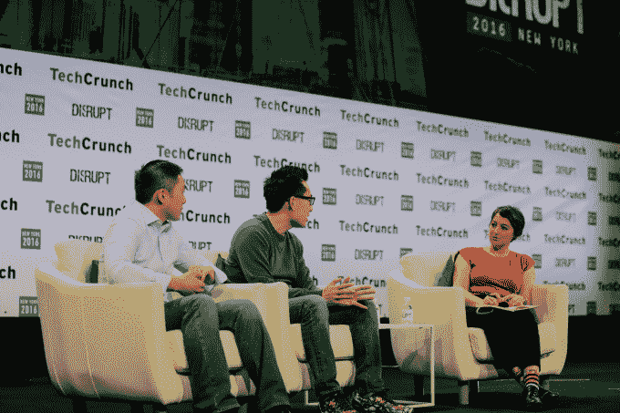
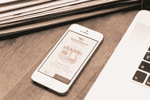

# DoorDash 融资 5.35 亿美元，目前估值 14 亿美元

> 原文：<https://web.archive.org/web/https://techcrunch.com/2018/03/01/doordash-series-d/>

餐馆外卖服务公司 [DoorDash](https://web.archive.org/web/20230328183314/https://www.doordash.com/) 正带着最新一轮的资金加入独角兽俱乐部。

该公司宣布在 D 轮融资中筹集了 5.35 亿美元。虽然没有提到估值，但一位接近 DoorDash 的消息人士告诉我们，新的融资对该公司的估值为 14 亿美元(融资后)。

根据 CrunchBase 的数据，DoorDash 之前已经筹集了大约 1 . 86 亿美元[，最近一次](https://web.archive.org/web/20230328183314/https://www.crunchbase.com/organization/doordash)[的估值超过了 7 亿美元](https://web.archive.org/web/20230328183314/https://www.forbes.com/sites/briansolomon/2016/03/22/what-its-like-to-raise-127-million-as-silicon-valleys-bubble-bursts/#4f5f32ef2f22)。

当被问及这一融资水平是否意味着 DoorDash 开始考虑首次公开募股时，首席执行官许宏涛说，“这对我们来说没有什么真正的改变。相反，我们认为它增加了更多的灵活性，让我们可以选择在哪里投资，以及如何为公司融资。”

这轮融资由软银集团牵头，红杉资本、GIC 和惠康信托参与其中。软银的杰弗里·豪森博尔德和 GIC 的杰里米·克兰兹将加入红杉资本的阿尔弗雷德·林和凯鹏华盈的约翰·杜尔登的董事会。

“DoorDash 的技术优势，出色的管理团队和不懈的商业关注反映在他们惊人的增长和令人印象深刻的单位经济上，”Housenbold 在融资公告中说。“送餐只是第一章。Tony 和他的团队有一个大胆的愿景，那就是创建世界上最好的物流公司，我们很高兴能与他们合作，帮助他们加速发展。”

该公司表示，它现在与美国前 100 名餐饮品牌中的近 90%合作，包括温迪快餐、IHOP 和芝士蛋糕工厂。

也许更令人印象深刻的是:徐说，公司去年的边际贡献为正，这意味着每笔订单都是盈利的。事实上，DoorDash 在其早期市场已经开始盈利。

所有这些似乎都是快递业务的必要条件，但它解决了人们的担忧，即按需模式只有在得到风险资本补贴的情况下才能发挥作用。徐过去曾表示，DoorDash 的物流平台足够先进，足以使业务可持续发展，最新的数据似乎证明了这一点。

“这真的是这次融资的驱动力，”他说。“我们发现我们的论点被证实了。现在是时候采取这种运营策略并加速增长了。”

这些增长计划包括从 600 个城市扩张到 1，600 个城市(DoorDash 仍然专注于美国和加拿大)，以及增加 250 名员工。

徐表示，DoorDash 将对其驱动平台进行大量投资，该平台允许餐厅通过自己的网站和应用程序提供 DoorDash 驱动的送货服务，因此他们可以服务“所有渠道的所有客户”

而且，正如[徐早就暗示的那样](https://web.archive.org/web/20230328183314/https://techcrunch.com/2014/05/22/doordash-17-3m-sequoia/?ncid=fb&utm_source=feedburner&utm_medium=feed&utm_campaign=fb&utm_content=FaceBook)，他也想把 Drive 变成一个服务于更广泛商业的平台，而不仅仅是餐馆。他拒绝透露这些计划的细节，只是说我们可以“期待今年看到一些交付”