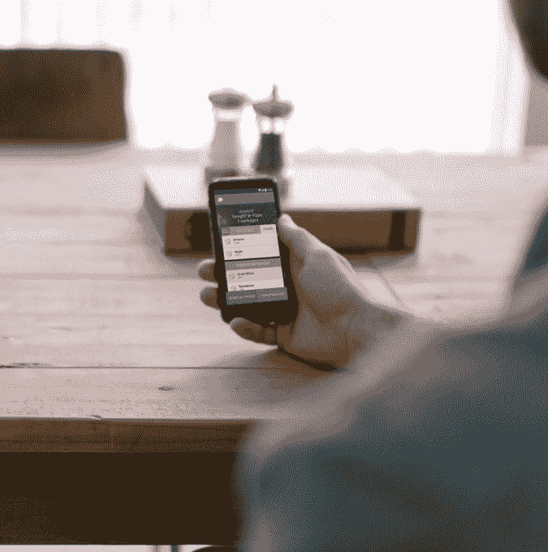
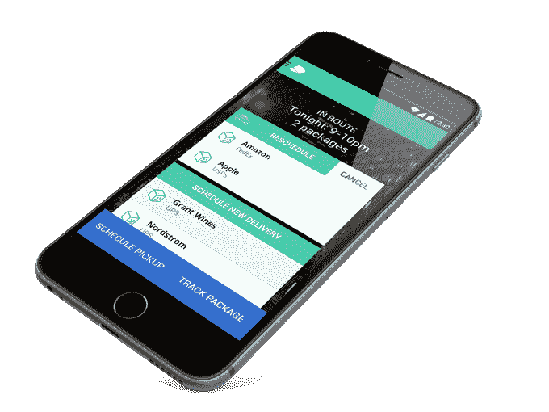

# 门童，一家消除包裹投递失误的初创公司，来到了芝加哥，很快也来到了纽约 

> 原文：<https://web.archive.org/web/https://techcrunch.com/2015/10/23/doorman-a-startup-eliminating-missed-package-deliveries-comes-to-chicago-and-soon-new-york/>

门童公司通过允许消费者最晚在午夜安排他们自己的送货来解决错过送货的问题，现在已经在 T2 投入使用，并准备很快在 T4 投入使用。这次扩张紧随今年夏天早些时候门童的种子基金[之后，该公司为了扩大业务增加了 150 万美元的资金。](https://web.archive.org/web/20221210032745/https://beta.techcrunch.com/2015/06/02/doorman-raises-1-5-million-to-eliminate-missed-package-deliveries/#.s2agxy:jFFb)

门卫想要解决的想法相当普遍——人们越来越多地在网上购物，但快递，包括亚马逊 Prime 的两天送达选项，仍然可以看到包裹在一天的不同时间到达。在一些情况下，包裹被放在门口台阶上，可能会被偷，或者其他时候，它们会被保留，直到有人可以签字，例如高价值的电子产品或葡萄酒。一些消费者通过将他们在网上购买的东西送到办公室来解决这个问题，但对于后来不得不放入汽车后备箱或骑自行车或乘坐公共交通工具的大件物品来说，这不是一个好的解决方案。

门童用户向在线零售商提供他们的个人“门童地址”(门童仓库中的一个位置)，而不是在 UPS 或联邦快递等托运人认为合适的时候送货。然后，公司会为你签收包裹，直到你准备好接收为止。用户通过门卫应用程序中的推送通知得到提醒，并可以安排他们每周 7 天从下午 6 点到午夜送货。

这项服务最近与 T2 的奥古斯特智能锁(August Smart Lock)合作，这是一种用户可以通过手机控制的联网门锁，允许门卫客户安排送货，然后允许门卫代理一次性临时进入他们的家，以便他们可以将包裹放在里面。

门童目前提供三个定价等级，包括每包 3.99 美元的价格，以及每月 29 美元的会员资格，提供 1 小时的送货窗口，以及无限制的送货和包裹退货。

这项服务由 Zander Adell 和 Kapil Israni 在 2013 年创立，首先到达旧金山，现在已经从 3000 多家零售商那里运送了超过 5 万个包裹。去年，[还收购了一家名为【Luna 的竞争对手，以巩固湾区的包裹递送业务。](https://web.archive.org/web/20221210032745/https://beta.techcrunch.com/2014/05/06/doorman-acquires-luna-to-create-consolidated-package-delivery-service/)

Adell 拒绝透露 Doorman 现在有多少客户，或者有多少是活跃的常客，但他说第三季度服务增长了 50%。

随着假期购物季前的扩张，以及即将抵达纽约的计划，门童希望利用今年预计将在这两个新市场实现的大量电子商务销售。事实上，全国零售联合会[预测今年将近一半的假日购物将在网上完成。](https://web.archive.org/web/20221210032745/https://nrf.com/media/press-releases/retailers-very-digital-holiday-season-according-nrf-survey)

“在像芝加哥这样的城市地区，20%的包裹投递在第一次尝试时会失败。在某些邮政编码区，这一数字可能高达 50%，”阿德尔提到在芝加哥引进门卫的决定时说。

“在芝加哥，只有不到 7%的出租公寓有门卫，”阿德尔继续说道。“随着假期的临近，以及网上购物的普遍普及，合作公寓、公寓和租赁大楼正被迫重新考虑其交付/存储政策和程序。他补充说:“随着城市中包裹递送数量的增加，但门卫的数量没有增加，包裹盗窃率也在增加——这是假期中的‘季节性机会犯罪’，但对网上购物的人来说，这确实是一个全年的问题。”

虽然看门人无疑是安排包裹递送更方便的方式，但在某种程度上，它正面临来自许多按需递送和快递服务的竞争，其中一些服务在下班后提供，包括亚马逊(Prime Now)、Instacart(用于杂货)、优步、邮政、谷歌快递等公司。随着越来越多的方式将分娩快速送到您目前所在的地点，这些竞争对手逐渐不需要为下班后安排送货上门。

也就是说，这些竞争对手通常提供有限的产品选择，或者旨在允许您在当地商店购物——他们不与网络上的任何电子商务网站合作。这为看门人留下了继续发展的空间。但现在，2015 年假期前的扩张将有助于证明这是否是购物者愿意在更科技友好的旧金山市场之外支付的额外便利。