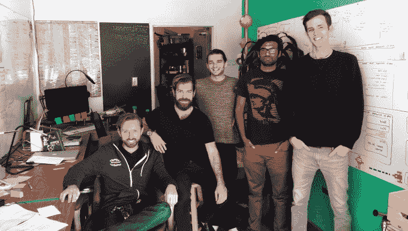
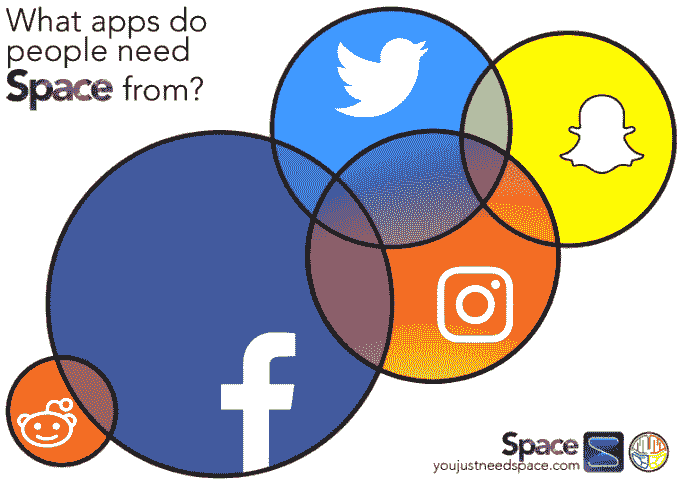

# 多巴胺实验室提供工具来促进和减少应用程序成瘾

> 原文：<https://web.archive.org/web/https://techcrunch.com/2017/02/13/dopamine-labs-slings-tools-to-boost-and-reduce-app-addiction/>

洛杉矶的一家小初创公司多巴胺实验室(Dopamine Labs)不仅开发了将用户与应用程序挂钩的工具，该公司现在还为人们提供了一种戒除应用程序习惯的方法。

该公司由两名获得南加州大学博士学位的神经科学家组成，基于两人在南加州大学的互补研究，开发了一种所谓的“强化 api”。

该公司认为，使用其 API——几行代码——应用程序开发人员可以增加用户参与度，并对任何应用程序进行正面强化。

这项工作是基于公司联合创始人 t .道尔顿·库姆斯和拉姆齐·布朗的双重研究。

库姆斯是神经经济学领域的博士，也是该公司的首席执行官，他负责识别和理解决策过程中涉及的化学和生物学。首席运营官布朗毕业于神经信息学博士学位，该学位涉及开发工具以帮助神经科学家更好地了解大脑。

他们两人开发了一项技术，声称可以提高应用程序的使用率，并有一些测试客户的数据作为支持。

道尔顿·库姆斯，拉姆齐·布朗和多巴胺实验室团队的其他成员。

最初的客户 [Root](https://web.archive.org/web/20230111211847/http://rootlearn.com/) ，一款面向大学生的教学工具，在集成了多巴胺实验室 api 之后，学生出勤率提高了 9%。小额贷款机构 [Tala](https://web.archive.org/web/20230111211847/http://tala.co/) 的小额贷款偿还率提高了 14%,而提供健康生活指导的初创公司 [Vimify](https://web.archive.org/web/20230111211847/https://www.vimify.com/) 在坚持日常饮食和锻炼计划方面提高了 21%。

收益最大的是像鼓励日常运动的 [Movn](https://web.archive.org/web/20230111211847/https://www.movinganalytics.com/index-exp2.html?utm_expid=125894732-4.DNuyHu8-R4qoYND4G_FOaQ.2) 和 [Brighten](https://web.archive.org/web/20230111211847/http://brighten.in/) 这样的应用程序，前者每月步行的分钟数有 60%的提高，后者是一个社交网络，应用程序的打开次数和发送的积极信息有 167%的提高。

“我们问自己，未来科技和人类的方向是什么，”布朗在接受采访时说。“我们对人类行为的一些预感适用于技术，反之亦然……以及如何为人类使用和导航应用程序建立更好的方式。”

凭借其 api 工具的优势，该公司已经从 [Lowercase Capital](https://web.archive.org/web/20230111211847/https://lowercasecapital.com/) 筹集了大约 25 万美元的种子资金(Matt Mazzeo 负责这笔交易)。

“多巴胺 api 是一种工具，可以让任何应用程序上瘾，”布朗说。“前提非常简单……人们不仅仅喜欢从通知中获得的多巴胺，它还会改变大脑的线路。”

两位神经科学家最终找到了一种方法，以鼓励重复访问的方式管理应用程序中“奖励”的交付。

库姆斯认识到这种工具固有的滥用潜力，表面上看，这种工具可能会增加成瘾，并表示该公司有严格的服务条款来限制滥用。

但现在，该公司开发了另一种工具(针对 Android 用户)，可以帮助打击其工具可能会产生的成瘾行为。

这款名为 [Space](https://web.archive.org/web/20230111211847/http://youjustneedspace.com/) 的新应用程序的工作原理与多巴胺 api 相反。空间应用实际上减少了继续一种行为的驱动力，而不是鼓励用户行为和创造鼓励应用使用的新神经线路。

库姆斯引用了围绕快乐原则和行为所做的初步实验，这些实验代表了神经科学领域的一些最早的现代进展——特别是詹姆斯·奥尔兹和彼得·米尔纳的工作。

奥尔兹和米尔纳是第一个确定大脑潜在“快乐中心”的神经科学家，并确定神经化学物质多巴胺的释放是快乐感觉背后的化学物质。

后来的研究完善了这一理论，将重点放在多巴胺这种可以产生欲望的化学物质上。通过延迟欲望激发的满足感，科学家们实际上可以打破产生“欲望”化学物质的行为和欲望对象之间的联系。

从本质上讲，这就是太空的作用。它减少了应用程序提供的刺激，从而产生了继续使用应用程序的需求。随着这种情况的消失，人们不太倾向于使用这款应用。

“我们建造空间的部分原因是，我们试图用多巴胺实验室建造的核心是认识和理解技术改变人的核心论点，”布朗说。“我们可以将此视为一项设计任务……我们是行为设计领域的领导者，我们无意成为思想警察。”

相反，布朗认为该公司的角色是提供工具，在移动应用程序方面鼓励良好行为，减少不良行为。

“我想做的是分发一套易于使用的工具给用多巴胺 api 制作应用程序的人，给用应用程序的人分发空间应用程序，”布朗说。“我们不是要开始或停止，我们是要让人们选择他们想成为的人…和方式。”