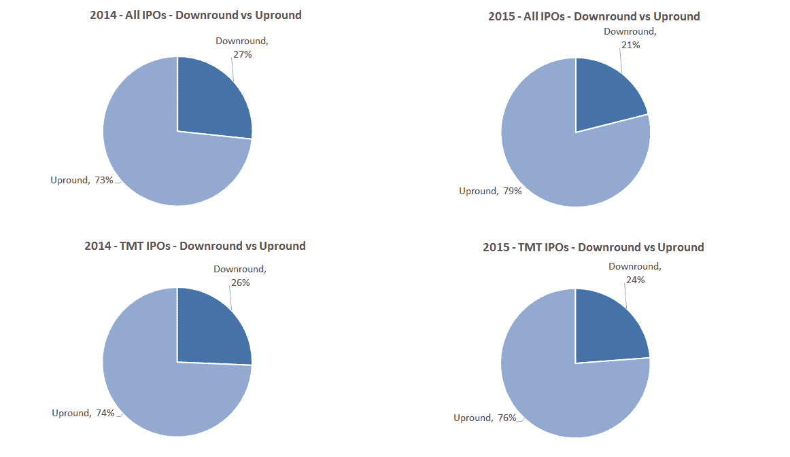

# 末日降临？数据显示没有

> 原文：<https://web.archive.org/web/https://techcrunch.com/2015/12/05/down-round-doom-the-data-says-no/>

本·纳拉辛做了 25 年的企业家，8 年的种子投资者，现在是一名风险投资家，是

[Canvas Ventures](https://web.archive.org/web/20230311160456/http://www.canvas.vc/)

.

More posts by this contributor

艾贝尔森撰稿人

More posts by this contributor

最近关于科技 IPO 市场的一次讨论得出了这样的评论:“今年所有的 IPO 都是下行轮。”Square 最近的首次公开募股定价低于上一次私人募股，促使科斯拉(Square 投资者)的合伙人基思·拉布瓦对华尔街日报评论说，“创业公司的类固醇时代已经结束了。”但是关于 IPO 第二轮的[数据，一个我们三月份在 TechCrunch 上首次报道的概念，讲述了一个不同的故事。](https://web.archive.org/web/20230311160456/https://www.google.com/url?q=https://techcrunch.com/2015/03/21/no-need-for-alarm-over-private-company-valuations/&sa=D&usg=AFQjCNG4suWD60Lht-i_vJXpsl2UjX_lUQ)

与我们关于 IPO 首轮融资的故事一样，我们收集了截至 2015 年 10 月底的 IPO 数据，并将每家公司的 IPO 价格与它们最近一轮私募融资进行了比较，以确定哪些是首轮融资。

这是我们学到的。

今年迄今为止，已有 95 宗 IPO，其中 21 宗是科技股。其中，共有 20 家公司和 5 家 TMT 公司进入下一轮融资；比去年略少。

2014 年，27%的首次公开募股(IPO)处于下跌阶段，而今年迄今为止，这一比例为 21%。TMT 的价差略小，2014 年有 26%的 IPO 出现下跌，而今年迄今为止这一比例为 24%。

因此，尽管一些 IPO 的定价低于公司上一轮私募融资的价格，但它们的速度还没有加快，而且仍是少数。

一个有趣的趋势是，在最后一轮私募后，IPO 上市的速度比以前快得多，这使得加速的缺乏变得更加有趣。2014 年，从上一轮私募到 IPO 的时间平均 20 个月；今年，这个时间减少了一半。在 TMT，上市时间从 21 个月缩短到 10 个月。

人们可能会认为，如果交易被匆忙推向市场，价格就会反映出来，因为公众投资者执行了 IPO 过程和尽职调查所要求的严格性——但下行轮次的小幅减少并不表明事实就是如此。

虽然 IPO 市场肯定在不断发展，并为上市公司创造了更具挑战性的现实，或许因此创造了一个自我净化的系统，只有能够维持或证明其估值合理的 IPO 才能进入市场，但数据表明，IPO 下跌的趋势并没有恶化。