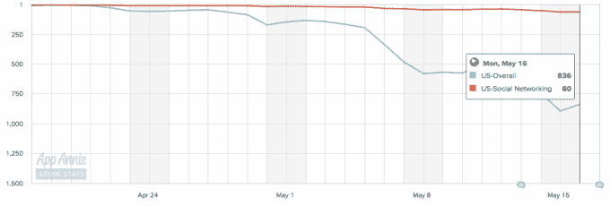

# 与投资者会面讨论融资事宜

> 原文：<https://web.archive.org/web/https://techcrunch.com/2016/05/17/down-to-lunch-has-met-with-investors-about-raising-funding/>

我们从多个渠道获悉，Down to Lunch 已经与投资者就潜在的融资回合进行了会面。

由于其非常简单的方法，Down to Lunch 在崛起过程中成为了一个宠儿:向你的朋友发出信号，表明你对午餐、饮料或其他任何东西感兴趣，并找出谁想吃。这是一个简单的概念，但实际上填补了一个像脸书这样的大公司还没有完全弄清楚如何确定的空白。这个利基市场的价值尚不清楚，但话说回来，其他类型的成功低接触应用程序都是从早期的利基应用程序开始的。

细节很少，而且公司在与投资者会面时，也总有可能不会选择融资。

我们听到这些都是因为该应用程序面临审查，因为有人认为有些人对短信邀请感到恼火。自疯狂增长并飙升至应用商店榜首后，它在过去 30 天里在顶级免费应用和顶级社交网络应用类别中均有所下滑。在社交应用中，使用积极的选择加入短信邀请并不罕见，但往往不会产生强大的保留。在有明显交易回报的情况下，它能更好地发挥作用——参见优步。

此外，在 Twitter 和 App Store 上还发生了一场“诽谤运动”，据称该应用程序被用于人口贩运，对此该公司已公开否认。该公司表示，这极大地负面影响了其用户群和应用商店排名。

Down to Lunch 之前已经筹集了资金，该应用程序似乎不需要太多时间来运行，这可能会给他们更多的跑道。但筹集资金可以帮助公司更快地扩大服务规模，这对于阻止来自其他初创公司和大型公司的潜在竞争非常重要，如果 Down to Lunch 看起来会成功，这些公司将瞄准这个领域。

“现在有很多关于午餐的讨论——不幸的是，大多数都不是真的，”联合创始人 Nikil Viswanathan 说。“事实是，我们非常专注于创造最好的产品，帮助人们每天与朋友一起出去玩。关于邀请，大学生喜欢这个应用程序，并要求提供一种简单的方法来邀请朋友。我们一直努力让这成为可能的最佳体验。关于人口贩卖诽谤运动——是的，那些谣言极大地影响了我们，但我们会反弹回来的。这是一次紧张的旅程，我们致力于创造一个世界，让你的朋友融入你的日常生活，因为这是我们想要生活的世界！”

尽管如此，在风险资本投资生态系统走软的情况下，消费者应用程序并不是没有吸引注意力。凭借其参与度和用户基础，Musical.ly 正以 5 亿美元的巨额估值筹集[1 亿美元。虽然该公司证明了它能够表现出很强的参与度，但不清楚“吃午饭”是否能比得上这种招摇。](https://web.archive.org/web/20230329064006/https://techcrunch.com/2016/05/06/musical-ly-raising-100-million-at-500-million-valuation-for-social-music-videos/)

也不清楚这是否只是一个新颖的用例，在逐渐消失之前迅速吸引了大量的注意力。Yo，另一个时尚，显示了相似的迅速崛起和衰落——Yo[也能够吸引少量资金](https://web.archive.org/web/20230329064006/https://techcrunch.com/2014/07/18/yo-raises-1-5m-in-funding-at-a-10m-valuation-investors-include-betaworks-and-pete-cashmore/)。但吃午餐可能会被证明是一个足够大的用例，它可以吸引融资并再次像火箭一样起飞。