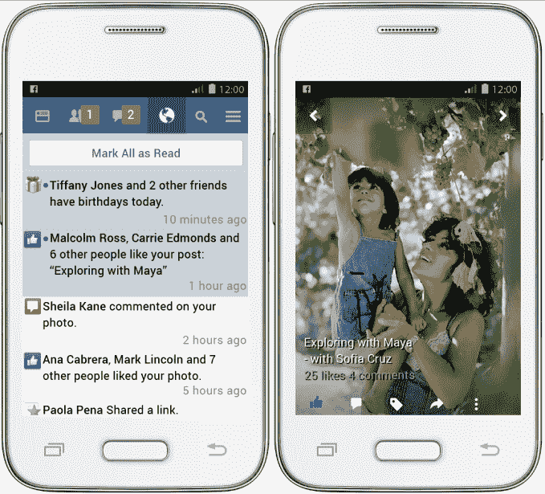
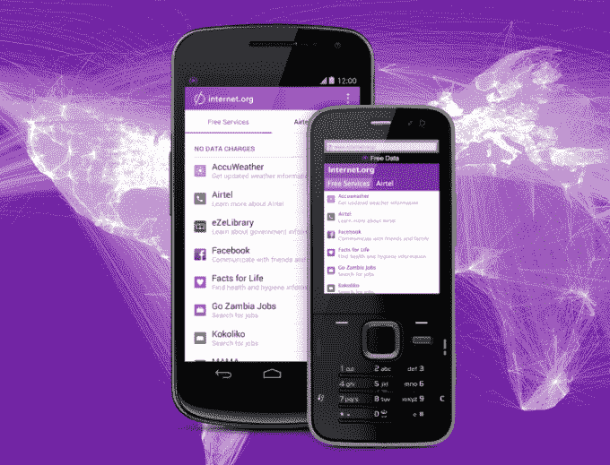

# 脸书 Lite 是一款面向发展中国家的精简版 Android 应用 

> 原文：<https://web.archive.org/web/https://techcrunch.com/2015/06/04/download-facebook-lite/>

脸书的网络连接很弱，速度慢得令人痛苦；在印度、非洲和东南亚普遍存在的吝啬的数据计划中，费用高得令人望而却步。所以今天，[脸书发布了](https://web.archive.org/web/20221006194319/http://newsroom.fb.com/news/2015/06/announcing-facebook-lite/)一款低分辨率的 Android 应用程序，它可以在糟糕的网络或过时的手机上运行，并且比普通的智能手机应用程序消耗的数据少得多。它将于今天在亚洲推出[，并在未来几周内到达拉丁美洲、非洲和欧洲的部分地区。](https://web.archive.org/web/20221006194319/https://play.google.com/store/apps/details?id=com.facebook.lite&hl=en)

[脸书 Lite](https://web.archive.org/web/20221006194319/https://play.google.com/store/apps/details?id=com.facebook.lite&hl=en) 专为发展中国家设计，旨在帮助该社交网络搭载下一个 10 亿用户。脸书 Lite 不提供视频或附近的朋友等数据密集型功能。但如果用户愿意接受这种分辨率和低分辨率的图像缩略图，他们可以从地球上最偏远的角落快速、流畅、廉价地访问脸书。

您可以在下面观看脸书建兴的快速视频演示:

## 脚踏实地

从加州门洛帕克的顶级智能手机、LTE 网络和无限数据计划来看，你可能不会认为脸书有什么问题。但这与脸书大多数用户生活的地方完全不同，当然也不是达到 20 亿用户里程碑所需的地方。

“大约一年前，那时我们意识到我们当前的脸书体验需要做更多的工作，特别是在新兴市场，更具体地说是在网络不好的地方，”脸书 Lite 的产品经理 Vijay Shankar 告诉我。因此，脸书开始了两条平行的道路。首先，它将尝试优化其旗舰应用程序，以更少的数据更快地加载。它已经[缩减了它的主要安卓应用](https://web.archive.org/web/20221006194319/https://beta.techcrunch.com/2014/06/19/facebook-for-android/)。

其次，Shankar 告诉我“我们提出了另一个想法。如果我们从零开始为新兴市场打造这款产品会怎么样？我们如何彻底地重新架构它？”

Shankar 说，与其想象这些地区的问题是什么，不如“我们做了大量实地研究，在非洲、印度和印度尼西亚花了大量时间。”该团队发现解决方案需要三样东西:

1.  **在任何安卓手机**上工作，不受存储空间、内存和 CPU 的限制
2.  **即使在 2G 移动连接上也能快速加载**，这是地球上 40 亿人面临的难题
3.  **使用尽可能少的数据**，因为数据计划的高昂成本实际上是互联网使用的最大障碍，而不是网络接入

## 未开发的市场

脸书多年来一直在追逐发展中国家。五年前，它推出了 Facebook Zero，这是一个纯文本版本的脸书，由运营商资助，以此来说服人们他们需要互联网。脸书收购了 Snaptu，该公司曾帮助其为发展中国家开发了一款功能手机应用，随后将其更名为“人人手机脸书”。

最近，脸书启动了大 Internet.org 计划，让 50 亿没有网络的人也能上网。在与电信公司的合作中，脸书制造了无人机，像谷歌的 Project Loon 气球一样在农村地区降落互联网，并开发了数据压缩技术。

它还推出了 Internet.org 应用程序，提供运营商补贴的免费访问有限的“基本互联网服务”，包括当地健康和公民信息、新闻、维基百科、脸书和信使。运营商希望互联网的免费体验能激励人们购买数据套餐，但是 Internet.org 遭到了批评，T2 认为挑选免费服务违背了网络中立性。

但脸书无法让运营商为每个人的免费互联网接入付费，所以它试图让用户自己付费变得尽可能便宜。经过 6 个月的工作，[脸书在 1 月](https://web.archive.org/web/20221006194319/https://beta.techcrunch.com/2015/01/25/facebook-lite-rides-again/)向孟加拉国、尼伯尔和尼日尼亚等几个国家发布了它的第一版脸书精简版，TechCrunch 作家 Darrell Etherington 发现了这一点。

Shankar 说，从那时起，它在 Google Play 商店收到了近 50，000 条评论，平均评分为 4.3 星，但许多评论只是人们问它何时会在他们的国家出现。他们太想要它了，以至于他说“一些人通过在互联网上发挥创意，在其他国家获得了这款应用”，这意味着使用 VPN 欺骗 Google Play 让他们下载。

## 关于数据使用的精简版

今天，脸书建兴开始其正式的全球推广。Shankar 说，它的大小不到 1 兆字节，即使在速度很慢的 2G 网络上，也能在几秒钟内以低廉的价格下载下来。我用它玩了几分钟，尽管做了一些妥协，但它的流畅和功能齐全还是让我感到惊讶。

脸书让这款应用使用更少数据的主要方法是从不预装全分辨率图像。新闻提要中的照片和链接预览缩略图起初看起来有些粗糙。如果被挖掘，它们将加载全分辨率，但脸书只希望在人们自愿的情况下做这些大数据拉取。如果你试图将一张照片发布到脸书 Lite，该应用程序会压缩图像，然后在后台发送，所以它很小，你不必花时间盯着屏幕。

“每次到服务器的往返都是痛苦的，”Shankar 说，所以“我们非常小心我们在应用程序中提供的功能和体验。”会有一些广告，但脸书的几个顶级格式，如应用安装广告，不会出现在脸书建兴。广告商可能不喜欢他们的创意资产被压缩成低分辨率的想法，但否则，用户可能会在它们加载之前就浏览过它们。

几年前，脸书试图通过在一个 HTML5 网站周围构建其 iOS 和 Android 应用程序作为包装器，在发布多版本移动代码方面走捷径。现在它转向了一个不同的方向，完全为低带宽连接构建一个完整的代码库。

Shankar 说，脸书认真思考了这个问题，但决定数十亿的潜在用户绝对值得额外的努力。“在主要的脸书体验中增加多个界面是我们未来几年必须保持的。”脸书并没有轻视这个对发展中国家的新承诺。