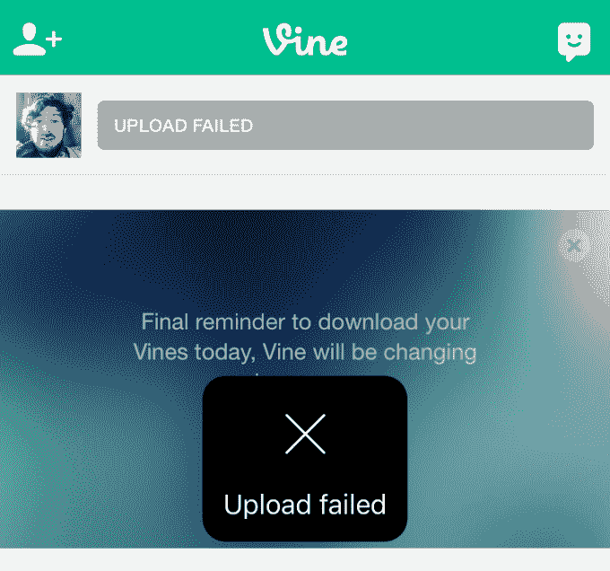
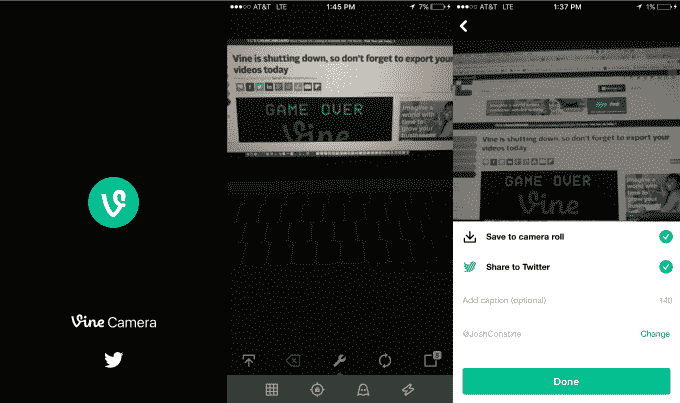

# Vine 关闭分享功能，推出 Vine Camera 

> 原文：<https://web.archive.org/web/https://techcrunch.com/2017/01/17/download-vine-camera/>

我们所知道的葡萄树已经死了。今天，Twitter 关闭了在 [Vine](https://web.archive.org/web/20230404070644/https://vine.co/) 中的分享、喜欢、评论和谩骂，并发布了其继任者 Vine Camera，作为在 [iOS](https://web.archive.org/web/20230404070644/https://itunes.apple.com/us/app/vine-camera/id592447445?mt=8) 和 [Android](https://web.archive.org/web/20230404070644/https://play.google.com/store/apps/details?id=co.vine.android) 上的应用更新。它还停止了 Vine Windows Phone 应用程序。

如果你没有更新，现在你仍然可以打开旧的 Vine 应用程序，在那里你可以查看你的旧提要和个人资料，并[下载你的视频](https://web.archive.org/web/20230404070644/https://techcrunch.com/2017/01/17/vine-is-shutting-down-today-so-dont-forget-to-export-your-videos/)。但 Twitter 向我证实，最终如果你不更新到 Vine Camera，该应用程序将停止工作，你将没有任何功能。

对于 Vine Camera，没有太多的演示。基本上就是没有附加社交网络的老 app 的摄像头屏幕。网格、焦点锁定、ghost line-up 和 flash 工具仍然存在，但您将无法再使用 Vine Soundboard、Snap-To-Beat 或 Featured Track 声音跟踪工具。

拍摄视频后，会出现一个共享屏幕，默认情况下会打开保存到相机胶卷和发布到 Twitter 的选项。你可以添加标题或更改你分享的 Twitter 账户，但仅此而已。在 Twitter 上共享的 Vine 被托管在他们在 Twitter 平台上的推文中，并且不显示任何 Vine 标志。

正如我们今天早些时候报道的， [Twitter 现在将循环播放所有 6.5 秒以下的视频](https://web.archive.org/web/20230404070644/https://techcrunch.com/2017/01/17/tvine/)，无论它们来自 Vine 还是其他地方。

Vine 成立于 2012 年，在推出前被 Twitter 收购，是超短循环视频格式的先驱。它成为青少年时尚、网络迷因和混合文化的滋生地。有趣的视频剪辑和奇怪的声音将很快被 Vine 社区回收和重新语境化，创造出创新的幽默和愚蠢的笑话。最终，一个明星创作者的寡头政治出现了，他们主演并交叉推广彼此的藤蔓，直到他们统治了流行和喜剧页面。

但随着 YouTube 的持续，Instagram 增加了视频，Snapchat 的故事变得越来越受欢迎，视频制造商逃离了 Vine，转而投向竞争对手，收视率下降。与此同时，其母公司 Twitter 正在努力应对用户和收入的增长，最终决定通过停止策划或托管 Vine 视频来削减成本。Twitter 没有完全关闭它，而是给了 Viners 时间来下载他们的视频，然后冻结了附加的社交网络，并将应用程序重新发布为一个精简的 Vine 相机。

现在的问题是，Twitter 是否计划对 Vine Camera 进行任何额外的开发工作，以保持它与 Instagram 和 Snapchat 等其他照片和视频应用的相关性，或者它是否会让它从记忆中消失。