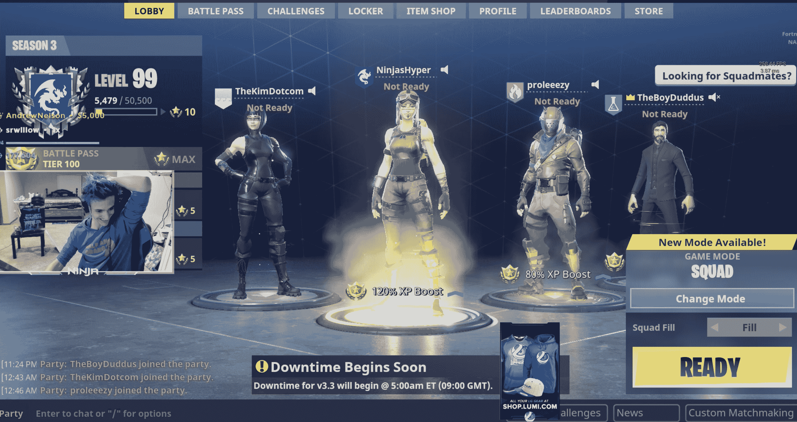

# 德雷克和忍者正在 Twitch  直播堡垒之夜

> 原文：<https://web.archive.org/web/https://techcrunch.com/2018/03/14/drake-and-ninja-are-playing-fortnight-live-on-twitch/>

# 德雷克和忍者正在 Twitch 上玩堡垒之夜直播

德雷克、[职业电竞选手](https://web.archive.org/web/20230405161653/http://halo.esportspedia.com/wiki/Ninja)忍者、金·多特康姆、特拉维斯·斯科特和 NFL 球员 JuJu Smith-Schuster 有什么共同点？

他们现在都在一起玩堡垒之夜，并在 Twitch 上直播。是的，说真的。

你可以在这里收听忍者频道的[来了解一下](https://web.archive.org/web/20230405161653/https://www.twitch.tv/ninja)的行动。

目前，直播观众的数量徘徊在 60 万左右，打破了 Twitch 在[创下的 38.8 万](https://web.archive.org/web/20230405161653/https://www.polygon.com/2018/2/6/16979394/dr-disrespect-tyler-1-twitch-viewers-record-holder)直播同时观众的纪录。

德雷克和忍者几小时前开始在忍者频道一起玩[，随着直播的传播，其他成员很快也加入了进来。忍者是在 PC 上玩的，而德雷克是在 PS4 上玩的，但是由于堡垒之夜对这两个系统的跨平台支持，这两个游戏可以一起玩。](https://web.archive.org/web/20230405161653/https://www.twitch.tv/ninja)

这个小组有相当多的技术困难——特别是在向他们的聚会添加新玩家时，主要是因为每个人的好友请求都达到了极限。如果堡垒之夜继续成为名人和运动员的首选游戏，这肯定是 Epic will 要努力的事情。

说真的，对于电子竞技和直播来说，这是一个重要时刻。主流名人不仅花时间玩(和谈论)大规模流行的视频游戏，而且现场直播，让成千上万的其他人可以观看，这一事实是对 Twitch 和 Epic Games 等两个行业和公司的未来的巨大验证。

你可以想象，Twitter 正在变得疯狂，我们已经有了一些惊人的迷因。

哦，还有一件事。Epic Games(创造了《堡垒之夜》的公司)应该在太平洋时间凌晨 2 点/美国东部时间凌晨 5 点关闭游戏服务器。有人想打赌他们会重新安排吗？