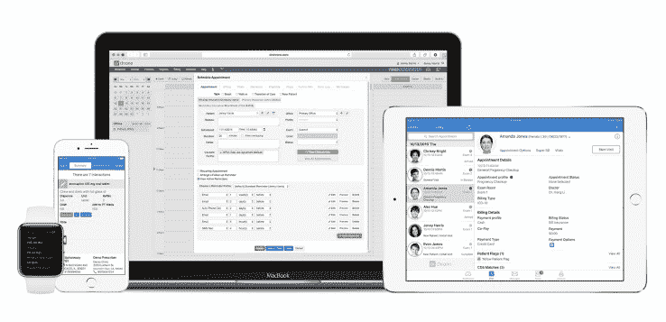

# Drchrono 在首轮融资中筹集了 1200 万美元，用于收购 athenahealth  等 EHR 老牌平台

> 原文：<https://web.archive.org/web/https://techcrunch.com/2017/04/06/drchrono-raises-12-million-in-series-a-to-take-on-older-ehr-platforms-like-athena-health/>

# Drchrono 在首轮融资中筹集了 1200 万美元，用于收购 athenahealth 等 EHR 老牌平台

几家早期风险投资机构向医疗实践管理平台 drchrono 注入了 1200 万美元的 A 轮融资，以帮助这家成立八年的公司与 athenahealth 和 Allscripts 等更大的健康组织中的 EHR 现有公司竞争。

Drchrono 已经在很大程度上成为小型医疗实践的首选后端平台，处理从电子医疗记录到计费和日程安排的一切事务。It [已被列为](https://web.archive.org/web/20230403181647/https://blog.drchrono.com/drchrono-featured-2014-inc-500-list/)美国发展最快的私营公司之一，并声称已为 800 多万患者提供服务，处理了超过 35 亿美元的医疗索赔。

但是现在，野心更大了。在过去的几年里，这家初创公司开始与 ZocDoc 和 DemandForce 等更大的公司进行整合。苹果现在是移动企业合作伙伴，允许该公司在 iPads、智能手机甚至 Apple Watch 上集成患者信息。相比之下，一些更古老的系统仍然将纸质记录从一个地方传真到另一个地方。

Drchrono 计划将其软件和移动应用推广到更大的医院和医疗诊所。“总的趋势是，我们看到人们离开传统平台，转向云……所以我们希望确保我们抓住这些交易，”联合创始人丹尼尔·基瓦蒂诺斯告诉 TechCrunch。

但当该公司告诉 TechCrunch 它已经看到 1200 万美元的年度经常性收入时，为什么要筹集资金呢？为什么不直接把收入转回公司呢？Kivatinos 和联合创始人 Michael Nusimow 表示，新的资金将帮助他们更快地实施他们的大计划，帮助他们营销和建设 drchrono 的基础设施。

该公司还与前副总统乔·拜登的 [Argonaut 项目](https://web.archive.org/web/20230403181647/http://argonautwiki.hl7.org/index.php?title=Main_Page)合作，该项目在奥巴马政府期间启动，并与私营公司合作开发基于快速医疗互操作性资源( [FHIR](https://web.archive.org/web/20230403181647/https://en.wikipedia.org/wiki/Fast_Healthcare_Interoperability_Resources) )的 API，以帮助美国电子医疗记录系统标准化。

早期风险投资公司 Runa Capital 领投了这轮融资，Maxfield Capital、Quicken 首席执行官 Eric Dunn 和 FundersClub 也提供了资金。Drchrono 此前筹集了 670 万美元，使现在筹集的资金总额接近 1900 万美元。