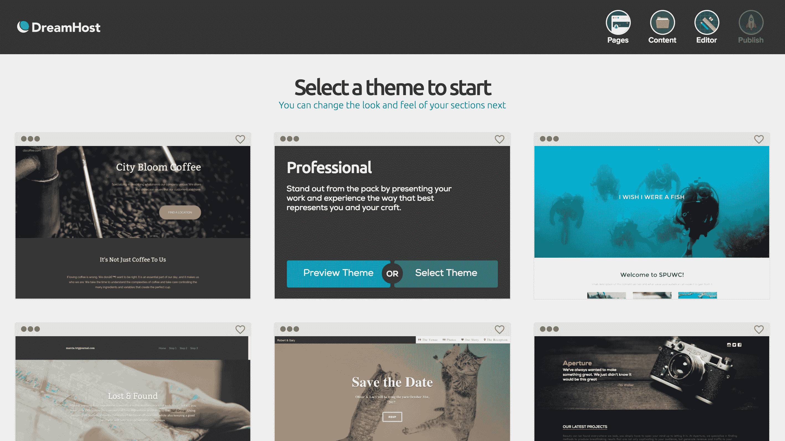

# DreamHost 推出其 Remixer 网站构建器，以更好地与 Squarespace、Wix 和其他公司竞争技术危机

> 原文：<https://web.archive.org/web/https://techcrunch.com/2017/02/07/dreamhost-launches-its-remixer-website-builder-to-better-compete-with-squarespace-wix-and-others/>

# DreamHost 推出其 Remixer 网站构建器，以更好地与 Squarespace、Wix 和其他公司竞争

[DreamHost](https://web.archive.org/web/20230206154340/https://www.dreamhost.com/) 今天宣布推出 [Remixer](https://web.archive.org/web/20230206154340/https://www.dreamhost.com/website-builder/) ，这是一款新的点击编辑网站构建器，用户只需要一个易于维护的网站，不需要接触任何代码。新平台包含在任何 DreamHost 托管计划中。

如果您过去使用过类似的平台，Remixer 可能会觉得很熟悉。你可以从一个预先制作好的主题开始(目前有 13 个主题可供选择，还会有更多)，然后你可以上传图片或者从 Instagram、脸书和其他服务中导入它们。您也可以从 SoundCloud、YouTube 和 Vimeo 导入音频和视频。像类似的服务一样，Remixer 还允许您只需点击几下鼠标就可以添加地图、评论部分和表单。该服务总共有 70 多个内容部分。

DreamHost 还提供了对约 60 万幅免版税图像和图形的访问权限。

虽然你可能因其托管服务而了解 DreamHost，但该公司在 OpenStack 生态系统中也长期扮演着重要角色。OpenStack 是一个开源项目，本质上允许大型企业、电信公司和托管公司在其数据中心运行类似 AWS 的云计算服务。DreamHost 在 OpenStack 和 Kubernetes 容器管理服务的基础上构建了 Remixer。实际上，该应用程序作为一组微服务运行在 Kubernetes 集群之上，该集群运行在基于 OpenStack 的 [DreamCompute 平台](https://web.archive.org/web/20230206154340/https://www.dreamhost.com/cloud/computing/)上。

