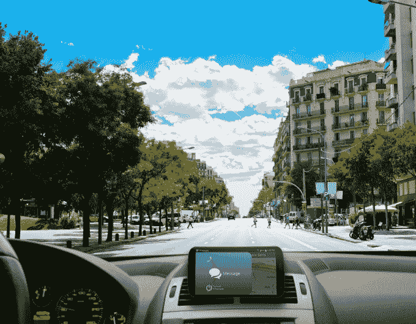
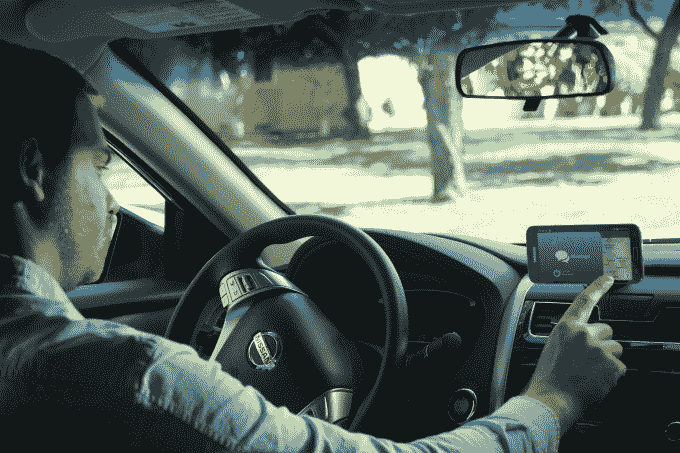

# Drivemode 为一款司机不用看手机就能使用的应用筹集了 200 万美元

> 原文：<https://web.archive.org/web/http://techcrunch.com/2014/12/11/drivemode-raises-2-million-for-an-app-drivers-can-use-without-looking-at-their-phone/>

理想情况下，没有人会在开车时使用智能手机。现实中，人们确实如此——经常将自己、乘客和其他人置于危险之中。今天从 stealth 崛起的一家新公司 Drivemode 得到了 200 万美元的种子资金支持，它开发了一款 Android 应用程序，可以让你不用*看一眼就能使用你的手机。*

Drivemode 应用程序提供对常用电话功能的访问，如通话、信息、导航、应用程序和音乐，并利用语音旁白的组合让您知道自己在菜单上的位置。此外，它使用明亮的颜色和大动画，让你只用你的周边视觉就能看到你的手机屏幕。

“我们正在与汽车制造商合作，以确保我们的界面足够好，甚至可以嵌入到汽车中，”Drivemode 联合创始人兼首席执行官约·阿桔解释道。他说，他还不能确认与汽车制造商在这方面的任何交易，但正在与几家公司进行讨论。

“政府有指导方针，确保你每次看屏幕的时间不超过两秒钟，”他补充道。“但我们试图通过从根本上简化互动来使其为零。”

[gallery ids="1093727，1093726，1093724，1093723，1093722"]

阿桔在日本出生和长大，在哈佛商学院毕业后，曾在波士顿做风险投资。他还领导了 Zipcar 的国际合作。但直到他搬到加州的一家初创公司工作，他才真正开始对总体驾驶体验感到失望。

阿桔说，智能手机的界面被设计成当你拿在手中使用时，你必须找到并触摸小按钮。他发现，在车上使用手机没有一个好的界面。

当然，这并不完全正确——[谷歌有“汽车之家”，例如](https://web.archive.org/web/20230314221626/https://play.google.com/store/apps/details?id=com.google.android.carhome)，它提供了大按钮，你可以在驾驶时更容易地点击。市场上还有许多类似的应用程序。还有一个面向司机的应用子集，专注于自动回复文本或大声朗读文本，以及汽车的嵌入式系统，如 [MyFord Touch 和 Sync](https://web.archive.org/web/20230314221626/https://techcrunch.com/2014/12/11/ford-ditches-microsoft-for-qnx-in-latest-in-vehicle-tech-platform/) 。然而，我不得不同意阿桔的观点，没有人已经完全确定了这类事情的界面，用户可能对这些选择感到不舒服而盲目使用它们。

另一方面，Drivemode 希望让你不用看手机就能使用它的应用，正如它的视频(见下文)幽默地展示的那样。

【YouTube https://www.youtube.com/watch?v=90BSPis1Tv8]

Drivemode 用户不再只是提供更大的按钮或建议你打开应用程序，然后只通过语音操作它，而是在菜单中滑动，同时用语音旁白宣布各种选择。除了颜色和动画，该应用程序还使用智能技术来学习你的行为，以便提供更好的建议。例如，它可以学习你的日常习惯，以便将经常去的目的地(如“家”)作为导航选项移到列表的顶部，或者当你进入通话部分时，它可以建议你最喜欢的联系人(如你的配偶)。

你甚至可以通过 Drivemode 访问手机应用，包括播放音乐和其他内容的应用。此外，它还具备此类应用常见的支持功能，比如来电信息读出和自动回复来电和信息。

## 200 万美元的资金和博客读者的 10K

该公司现在是一个位于圣何塞和日本的六人团队，成员还包括联合创始人北斗·上田(目前是特斯拉的全职员工)、产品负责人杰夫·标准普尔(Jeff Standard)，以及机械工程师/Android 开发人员中川弘(Hiro Nakagawa)。

Drivemode 完全由总部位于东京的孵化基金支持，该基金通常投资于当地公司，但选择投资总部位于美国的 Drivemode，因为它有可能吸引全球观众。

“使用智能手机代替车载导航系统正在成为一种真正的全球趋势，驾驶模式可以在许多使用安卓系统的国家得到广泛采用，”孵化 GP 特鲁·阿库拉在一份声明中说。

除了资金，阿桔还能够建立自己的团队，吸引投资，甚至布置自己的办公室，这都要归功于他作为一名有影响力的日本博主的地位。他在一篇帖子上宣布他将离开 Globespan Capital Partners 去创业后，读者们捐赠了超过 10，000 美元。

## 提供有限的邀请

Drivemode 今天在美国面向有限数量的测试者推出。国际用户可以提供一个电子邮件地址，以便在未来的扩展中得到提醒。从公司网站(不是 Google Play)下载安卓应用后，可以使用**激活码 TCMODE** 立即上手。