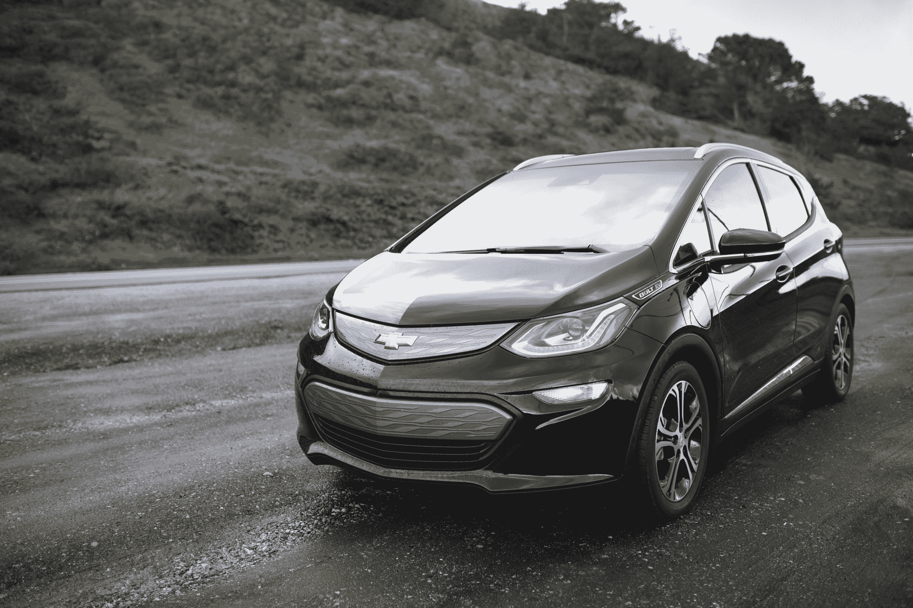
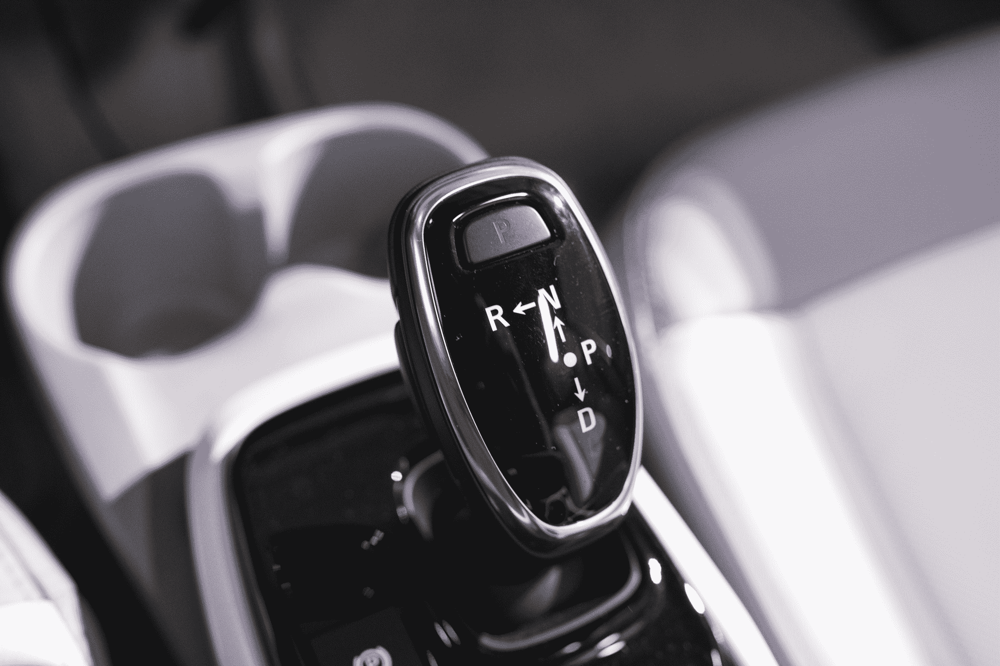
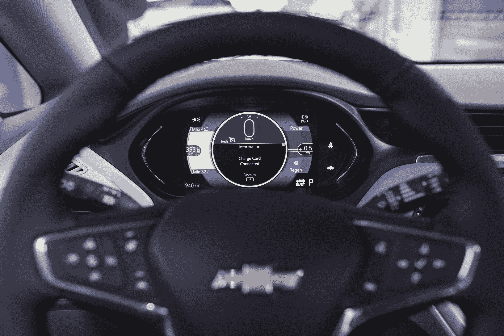
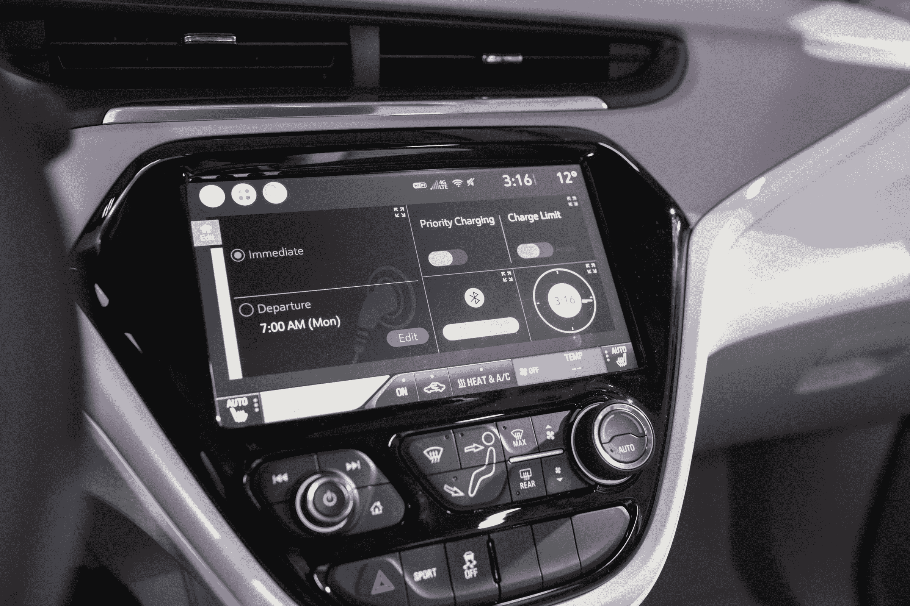

# 驾驶 2017 款雪佛兰 Bolt EV 

> 原文：<https://web.archive.org/web/https://techcrunch.com/2017/01/24/driving-the-2017-chevrolet-bolt-ev/>

开雪佛兰 Bolt 一开始有点虎头蛇尾；最初感觉很像驾驶一辆普通的汽车，尽管它比普通的紧凑型四门汽车能提供更多的加速。它仍然很有趣，但是当你完全接受汽车的电动部分时，真正的乐趣才开始。

Bolt 的设计平易近人，至少一开始有点熟悉，尽管它实际上是引擎盖下的一种非常不同的汽车，这要归功于它的 60 千瓦时电池和电动马达。雪佛兰知道，很多车主将是首次购买电动汽车，如果你有很长的驾驶燃气汽车的历史，这需要一个学习过程。

Bolt 旨在以普通司机可以理解的方式说“嗨”，但如果你付出一点努力，深入了解这款纯电动汽车与众不同的原因，你肯定会得到回报。

我驾驶 Bolt EV 参加了雪佛兰在帕洛阿尔托举办的一次活动，部分是在 Bolt 首批买家之一的美丽、现代的住所举办的，还穿越了北加州最有吸引力的道路，包括蜿蜒的狭窄道路，即使在异常潮湿的天气中，Bolt 也能轻松应对。这趟旅程还包括环太平洋公路，这条公路风景优美，开得太快简直是一种耻辱。

博尔特本身并不是速度恶魔，但它也不笨。与其他一些电动汽车不同，它 6.2 秒的 0-60 英里/小时的时间不会为它赢得世界上最快的量产车的排名。但它感觉很快，也很有趣——无论是在基本驱动模式下，还是在运动功能启动时，它都会给你带来非常明显的加速，但作为一种权衡，它会更快地消耗你的电池储备。

不，总的来说，Bolt 感觉不像一辆跑车，但它确实不是；这是一辆宽敞的小型汽车，非常适合在城市驾驶条件下使用，为四口之家提供了舒适的空间，可转换的储物空间为行李提供了大量空间，特别是如果您使用折叠放平的后排座椅处于关闭位置。举例来说，你可以合理地为一个三口之家提供一个紧身的格子背，或者使用全折叠储物空间为阿朵提供一周的露营用品。

博尔特确实感觉像是一辆有一些火的家用汽车，但是，如果像我上面暗示的那样，你冒险离开汽车的默认驱动模式，并利用它可以提供的一些独特功能，这是一个有趣的商数。

在驾驶时，你只需按下新的电子换挡杆，这款车的感觉与你可能习惯的任何基于化石燃料的驾驶非常相似；当你踩下现在不恰当地命名为“油门”的踏板时，它会加速；当你踩下踏板时，它会滑行，缓慢而平稳地减速。然而，再次踩下电子换挡，你就进入了“低速”模式，这是默认情况下螺栓再生制动开启的地方，也是汽车的特性真正开始闪耀的地方。

如果你以前没有用过带再生制动的汽车，这需要一段时间来适应；实际上，这辆车并不是传统意义上的“刹车”。相反，它通过电机提供阻力，并利用你的动量推动阻力，并收集由此收集的能量，将其放回电池，回收电荷。

使用再生制动，你实际上不需要使用制动踏板那么多，这取决于你在预测什么时候你需要停止和计时你的减速。将你的脚从加速器上移开会产生一种相当积极的感觉——虽然不是突然的——刹车，你可以使用这种技术，通过一点练习，准确而容易地在十字路口停下来。

我们有足够的时间来测试 regen 制动功能，其中包括使用安装在方向盘上的拨片来实现这一点，你可以在低模式下使用它来加快减速率(是的，这就是我的意思)，也可以在常规驱动模式下使用它，即使它没有接合也可以手动触发它。这两种方法我都喜欢，但最终我开始觉得“低速”行驶才是真正的默认。

再生制动实际上为驾驶体验增加了一种乐趣，而这种乐趣是你驾驶燃气汽车时完全无法获得的:它让你在不接触制动的情况下试图掌握驾驶能力的过程变得更加有趣，它鼓励你试图以最高效率驾驶，通过最有效地使用再生制动来尽可能地收回每一英里。

回过头来看，我不确定这听起来是否有趣，但实际上，确实如此。使用桨增加了触觉控制元素，这让驾驶员非常满意。实际上，一位雪佛兰工程师告诉我，通过再生制动，你可能只能收回多达 5%的电荷，也就是说不到 12 英里——虽然不足以产生巨大的影响，但还是有意义的——不管怎样，真正的问题是你试图收回这种能量的乐趣。

> 一旦你到了“低点”，你就会一直呆在那里。

所有这些令人惊讶的是，雪佛兰特意设计了一种完全隐藏这一点的体验；与传统汽车相比，默认驾驶模式具有更“自然”的驾驶感觉，实际上是一种完全由软件驱动的手段，旨在为电动汽车新手司机弥合差距。这是一个很好的接触，但请记住我的话:一旦你变得“低”，你就会一直呆在那里。

在物质享受方面，螺栓也是一个强大的车辆，特别是考虑到雪佛兰已经决定如何装备甚至基本模型装饰。例如，有一个 10.2 英寸的电容式触摸屏显示器标准，以及对 Android Auto 和苹果地图的支持。这些选项有效地取代了车载导航——雪佛兰表示，它认为现在没有必要了，因为几乎所有的司机都在口袋里装着世界上最棒的地图服务，我完全同意这一点。

虽然我仍然推荐 Android Auto 或 CarPlay 作为你的主要信息娱乐界面，但原生的 Chevy 界面实际上并不坏，有许多预设选项，包括“Family ”,可以从不同的单独布局中选择，如媒体和快速访问联系人。这些可以定制，但如果有的话，我觉得他们有点压倒性和繁忙的产品和视觉展示范围。但是不管怎样，插上你的手机，那个又大又漂亮的触摸屏就派上了用场。

【YouTube https://www.youtube.com/watch?v=rf_Kb3_nxTs&w=718]

数字仪表板更好，有三种不同的设置，根据您对汽车技术的舒适程度而定。我最喜欢的一个高级模式，提供了您剩余里程的视图，包括根据您最近的驾驶历史和一生的驾驶习惯建立的高和低估计。这是非常有用的，尤其是如果你是电动汽车的新手，因为即使充满电行驶 238 英里，里程焦虑仍然是一个问题，许多因素可能会导致你实际上从这种能力中获得多少英里的显著变化，即使是逐趟旅行。

雪佛兰的系统信息丰富，但不会让人不知所措，它会让你猜测你的真实世界范围，让你更准确地计划行程。它仍然可以使用来自其他信号的输入，包括天气和道路状况，但它在动态调整估计方面利用现有的智能做了很多工作。

[gallery ids="1442882，1442879，1442877，1442876，1442875"]

内部的其他方面也同样设计得很好。像素般的修饰很有吸引力，虽然它是白色的，但汽车的设计师向我保证它很容易清洁，不会很快捡起灰尘。这款车的设计也是为了最大化内部空间，这一点显而易见——尽管它实际上是一辆小型车，但它的内部感觉要大得多，我能够轻松舒适地将我 6 英尺 2 英寸、200 磅的车架放入驾驶舱，而我通常在类似尺寸的车辆中会感到局促，包括日产 Juke。

最后，Bolt 是我第一次觉得自己可以拥有一辆实用的电动汽车。价格合适，驾驶起来很有趣，有足够的载货空间和足够的航程，可以参观家人的湖边小屋，而不必停下来充电。真实世界的范围测试将不得不等待更长的审查，但驾驶加州的高速公路和旧金山的城市街道是完全愉快的，这使得它很容易根据第一印象推荐。

[gallery ids="1442872，1442873，1442883，1442874，1442894，1442892，1442891，1442889，1442888，1442886，1442885"]