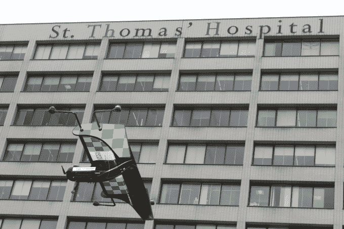

# 英国报告 称，无人机发展应首先关注社会公益

> 原文：<https://web.archive.org/web/https://techcrunch.com/2018/07/23/drone-development-should-focus-on-social-good-first-says-uk-report/>

一个由英国政府支持的无人机创新项目正在探索无人机如何造福城市——包括医疗交付、交通事故响应、火灾响应以及建筑和再生等用例——报告了该项目的第一阶段的早期学习成果。

作为内斯特高空飞行挑战赛的一部分，五个城市区域被用作无人机测试平台——即伦敦、西米德兰兹、南安普敦、普雷斯顿和布拉德福德。

到目前为止，作为该项目的一部分，已经分析了无人机技术的五个有益于社会的用例，包括考虑该技术的技术、社会和经济影响。

该项目自去年 12 月以来一直在进行。

该项目和报告背后以创新为重点的慈善机构 Nesta 希望英国成为塑造以人为本的无人机系统的全球领导者，并在报告中写道:“城市必须塑造无人机的未来:无人机不得塑造城市的未来。”

在报告中，它概述了无人机技术在城市实施中面临的一些挑战，并提出了一些政策建议。

它还表示，除了无人机送货或飞行出租车载人等“商业或投机”应用之外，对社会有益的用例已经成为城市对技术潜力的早期赢家。

迄今为止，通过该项目探索的五个用例是:

*   **伦敦内的医疗交付** —一个无人机交付网络，用于在 NHS 设施之间运送紧急医疗产品，该网络将在网络中的医院之间相对较短的距离内定期运送病理样本、血液制品和设备等产品
*   **西米德兰兹郡的交通事故响应** —对西米德兰兹郡的交通事故做出响应，以在紧急服务到达之前和到达现场时为其提供支持，使其能够分配正确的资源并更有效地做出响应
*   **布拉德福德的消防响应** —西约克郡消防和救援服务的紧急响应无人机。无人机将提供高质量的信息，以支持紧急呼叫处理人员和消防地面指挥官，比目前可能的速度更快地到达现场，并帮助工作人员计划对事件的严重性做出适当的反应
*   **普雷斯顿的建设和再生** —支持城市项目建设工作的无人机服务。这将包括在施工前和施工期间例行使用无人驾驶飞机，以便勘察现场和收集关于工程进度的实时信息
*   横跨索伦特海峡的医疗递送——使用递送无人机将南安普敦横跨索伦特海峡连接到怀特岛。无人机可以在大约 20 英里的距离内携带重达几公斤的轻型有效载荷，医疗产品的交付是一个关键的优势

Nest 指出了在一些有趣的实验之外扩大无人机使用的技术和监管挑战:“在复杂的环境中，超出操作员视觉视线的飞行、自主和精确飞行是关键，开发无人驾驶交通管理(UTM)系统以安全管理空域也是关键。在孤立的情况下，这些问题已经接近解决，但在复杂的城市环境中大规模解决这些问题还不容易。”

“虽然对所有被调查的用例都有需求，但不同用例的经济性各不相同:一些用例带来明显的成本节约；其他的带来更广泛的社会效益。随着技术的发展，监管需要发展，以允许这些用例运行。还需要建设通信网络和 UTM 系统等基础设施。

该报告还强调了公众信心的重要性，写道:“城市对无人机可能带来的可能性感到兴奋，特别是在关键的公共服务方面，但也对技术主导的嗡嗡声保持警惕，这些声音可能掩盖对隐私、安全和滋扰的担忧。城市希望抓住无人机背后的机会，但要以响应市民需求的方式来做。”

该慈善机构紧急呼吁公众参与关于无人机未来的讨论。

“到目前为止，普通公众发挥的作用很小，”它警告说。“有人支持将无人机用于公共利益，如紧急服务。首先，无人机开发的重点应该放在公共利益的使用案例上。”

鉴于阻碍开发可行的无人机服务实施的监管、技术和基础设施挑战的综合(和交织)复杂性，Nesta 还建议创建测试床，在其中可以开发无人机服务，并获得“支持它们的设施和监管批准”。

“监管也需要改变:例行许可必须是可能的，某些类型空域的全面禁令必须放松，除了最具挑战性的用途之外，需要为所有用途建立自动化许可系统——与无人驾驶交通管理系统相关联。我们将需要一个学习系统，在英国内外分享该技术的监管和治理进展，例如与 Eurocontrol 合作，”它补充道。

“最后，英国将需要投资基础设施，无论这是由公共部门还是私营部门完成的，以发展广泛无人机操作所需的通信和 UTM 基础设施。”

最后，Nesta 认为“有明确的证据表明，无人机对英国来说是一个机遇”——他指出已经有“数百家”公司在该领域运营；以及在该领域有研究实力的英国大学；以及建议公共当局可以节省资金或提供“新的和更好的服务，由于无人机”。

与此同时，它警告称，英国对无人机的政策反应落后于“领先国家”——这表明该国可能会浪费适当发展一些早期承诺的机会。

“尤其是美国、欧盟、中国、瑞士和新加坡，在改革监管、创建试验台和支持有创新想法的企业方面迈出了更大的步伐。如果我们做对了，奖励就是我们永久地塑造了这项新技术——而英国也获得了它的那份经济利益。”

你可以在这里阅读[完整报告。](https://web.archive.org/web/20230321071341/https://media.nesta.org.uk/documents/Flying-High-full-report-and-appendices.pdf)