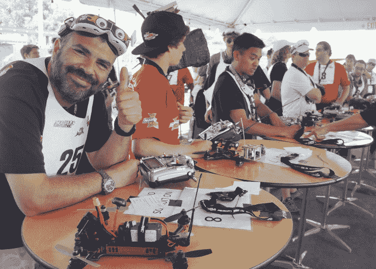

# 无人机竞赛组织 IDRA 与 ESPN 达成转播协议 

> 原文：<https://web.archive.org/web/https://techcrunch.com/2016/04/12/drone-racing-organization-idra-scores-broadcast-deal-with-espn/>

听说过第一人称无人机竞速吗？如果没有，那你就有得吃了。这项充满活力和激情的运动，或者说竞争，无论你怎么称呼它，都在快速发展，看起来 ESPN 想要分一杯羹。体育网络今天与国际无人机竞赛协会签署了一项协议，这可能有助于将竞赛纳入主流。

如果你不熟悉这项活动，第一人称无人机竞赛让参赛者以极快的速度驾驶无人机通过预设的路线——同时佩戴头盔显示器，显示无人机本身的视图。他们真的走得很快。在这里，这个视频将更好地解释它，并且更夸张:

https://www.youtube.com/watch?v=4flD2dClWbs

激动人心？是的。未来派？当然可以。恶心诱发？很有可能。尤其是如果你决定从无人机的视角观看(是的，你可以这样做)。

根据 IDRA 与 ESPN 签署的“多年国际媒体发行协议”，该网络将在其流媒体 ESPN3 服务上播放 2016 年[无人机竞速锦标赛](https://web.archive.org/web/20221025223901/http://dronenationals.com/)(全国和世界)，整个赛事将被浓缩为一个小时的特别节目，在 ESPN2 和其他可能的频道上播放。

“ESPN 看到它朝着一个大的方向发展，并得到了一些高层的认可，”IDRA 董事长 Scot Refsland 在接受 TechCrunch 的电话采访时说。“我们有专业的播音员、现场采访、简介，所有这些东西。ESPN 对这个领域非常感兴趣，他们也想成为我们的国际合作伙伴。”

目前，内容将由 Generate LA 制作，由资深体育电视制片人大卫·加万特(David Gavant)掌舵。

ESPN 很可能也会给无人机竞速一个自己的在线垂直领域，就像它对电子竞技(或网络体育，或你所拥有的东西)所做的一样，比如*英雄联盟*和 *DotA 2* 。前提是这些镜头不会让观众晕车。

监管问题既是一个问题，也是一个机遇。IDRA 与联邦航空局密切合作，允许他们将整个操作作为无人机商业化的案例研究

“目前，我们的立法并不真正支持无人机比赛。它脱离了灰色地带，”Refsland 说——但联邦航空局一直很通融。“他们在安全问题上非常严格，但他们愿意接受这样的解释，‘好吧，这是一个封闭的课程，由 AMA、模型航空学院、联邦航空局和州政府办公室的人监控。’他们明白风险和商业可行性之间的风险。"

IDRA [最近将](https://web.archive.org/web/20221025223901/http://idra.co/2016/04/drone-racing-companies-idra-and-rotorsports-announce-merger/)与另一家无人机竞赛组织 RotorSports 合并，目的是为了更快的增长，并确保在这个潜在有利可图的新竞争格局的大门中，他们的脚是最大的。