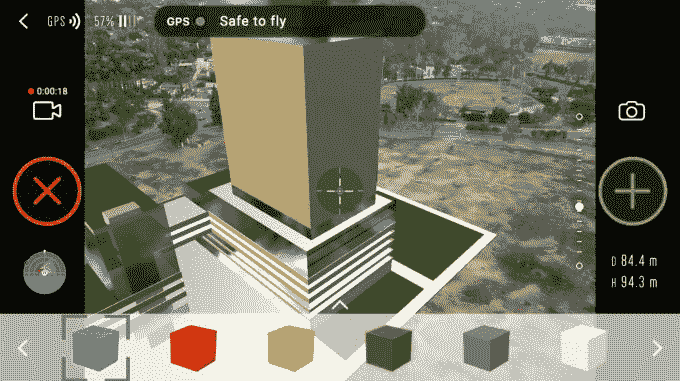

# DroneBase 在 B 轮融资中筹集了 1200 万美元，宣布推出企业增强现实工具 

> 原文：<https://web.archive.org/web/https://techcrunch.com/2018/02/15/dronebase-raises-12m-in-series-b-funding-announces-enterprise-ar-tool-for-drone-pilots/>

# DroneBase 在 B 轮融资中筹集了 1200 万美元，宣布推出企业 AR 工具

如果你在过去的一两年里购买了一架无人机，那么它很有可能每年只在你的小工具柜里出现几次。这可能不会让你对你的购买感觉太好，但它也让一件昂贵的专业设备处于休眠状态，许多人都可以使用。

DroneBase 是一家将无人机用户与商业任务联系起来的初创公司，这样他们就可以防止灰尘落在他们的飞行功能机上，同时也磨练他们的技能，并在这个过程中获得报酬。有兴趣为房地产或保险目的获得物业无人机镜头的人或企业，可以使用这家初创公司与拥有技能和设备的 DJI 无人机飞行员联系，以获得他们需要的视频或图像。

这家总部位于洛杉矶的初创公司宣布，它已经完成了由 prehand Ventures 和 Union Square Ventures 共同牵头的 1200 万美元 B 轮融资。DJI、赫斯特风险投资公司和普利兹克集团也参与了这一轮投资。

“这一轮标志着 DJI 通过 SkyFund 对 DroneBase 的第三次投资，这表明我们对他们在一个快速增长的行业中持续成功的信心，这个行业刚刚开始实现其全部潜力，”DJI 高管 Jan Gasparic 在一份声明中说。

除了宣布他们的最新一轮融资，DroneBase 还展示了一款新的增强现实企业工具，该公司希望这款工具可以让专业用户鸟瞰 3D 模型。AirCraft Pro 目前处于最早期阶段，用户可以在驾驶无人机飞行时将缩放块放入增强世界。

现在这有点像游戏的环境，但该公司希望使用该技术将现实的 CAD 模型导入到实时无人机视频快照中，以用于未来的真实世界位置。

DroneBase 联合创始人兼首席执行官丹·伯顿(Dan Burton)告诉 TechCrunch，“不幸的是，没有无人机的 ARKit，所以我们必须建立一些相当复杂的技术。"这是围绕同步遥测数据与视频数据和地理空间数据."

面向 DJI 用户的无人机驾驶服务此前也只适用于 iOS 设备，但该公司现在宣布，这款应用已经面向安卓用户在谷歌 Play 商店推出。该公司有数万名 DJI 无人机飞行员使用他们的应用程序，他们现在已经在 60 多个国家执行了超过 10 万次商业无人机任务。