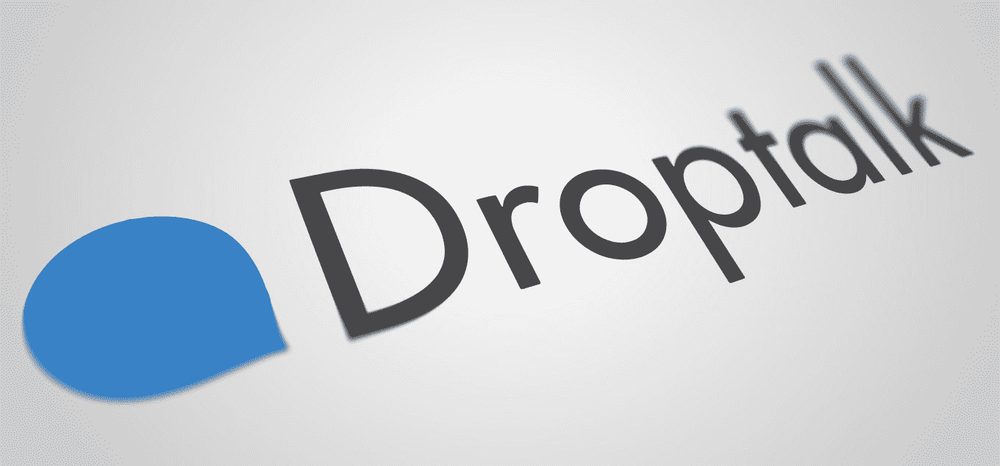
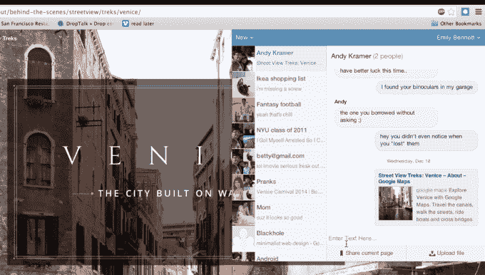

# Dropbox 收购秘密通讯初创公司 Droptalk 

> 原文：<https://web.archive.org/web/https://techcrunch.com/2014/06/05/dropbox-acquires-stealth-messaging-startup-droptalk/>

Dropbox 已经吞并了另一家早期创业公司，这是一家名为 [Droptalk](https://web.archive.org/web/20221207081720/http://www.droptalk.us/) 的秘密公司，该公司正在开发一款工具，允许你通过 Chrome 扩展与朋友私下分享链接，随后将推出 iOS 和 Android 应用程序。没有一个产品是公开的，因为该公司刚刚推出了有限的测试版浏览器插件。

交易条款没有披露。

是什么让这家公司对 Dropbox 有吸引力(当然，除了名字！)的好处在于，除了网络共享功能，该工具还与你的云存储集成在一起，因此你可以在对话期间看到谁在更新哪些文件或将文件添加到共享文件夹中。结合一个类似消息传递的界面，以及利用云存储组件进行移动消息传递的计划，很容易理解为什么 Droptalk 可能会有一些吸引力。

Droptalk 是大约一年前由一群前脸书和 LinkedIn 工程师创建的，他们希望改变人们相互沟通和完成工作的方式，该公司在宣布收购的博客帖子中解释道。这个想法和之前的许多想法一样，不是通过改造收件箱来解决“工作邮件”问题，而是提供更好的分享和交流工具，这样你就不必太依赖电子邮件了。

创始团队包括连续创业者[拉克什·马图尔](https://web.archive.org/web/20221207081720/https://www.linkedin.com/pub/rakesh-mathur/0/9/b84)和[阿什·巴德瓦吉](https://web.archive.org/web/20221207081720/http://investing.businessweek.com/research/stocks/private/person.asp?personId=206853&privcapId=118085856)以及首席技术官[阿南德·普拉卡什](https://web.archive.org/web/20221207081720/https://www.linkedin.com/in/anandprakash)。

Mathur 创建了 Webaroo，并在 3 年时间里为超过 6000 万用户建立了基于 SMS 的社交消息平台。他还监督了 Junglee 到亚马逊和 Snapstick 到 Rovi 的出口。与此同时，Bhardwaj 带来了多年的经验，帮助 Aricent 成长为一家 300 亿美元的公司，并与 Mathur 一起帮助 JustChalo 最近退出 OpenTable。普拉卡什还在 Webaroo 工作，最近在 LinkedIn 工作。

这个五人小组的其他成员还有前脸书人曼维尔·舒拉和 T2 人尼尔梅斯·梅塔。所有人现在都加入了 Dropbox，作为这笔交易的一部分，Droptalk 本身似乎也在关闭，因为它不再接受测试版注册。然而，我们知道这笔交易可能不仅仅是一笔收购——可能有一些计划将 Droptalk 开发的一些技术实际集成到 Dropbox 的核心产品中。

鉴于 Dropbox 之前对开发工作相关沟通工具的公司感兴趣，这是有道理的。例如，今年早些时候，[收购了 Zulip，另一家开发工作场所聊天解决方案的秘密公司](https://web.archive.org/web/20221207081720/https://beta.techcrunch.com/2014/03/17/dropbox-acquires-zulip-a-stealthy-workplace-chat-solution-still-in-private-beta/)。像 Droptalk 一样，Zulip 也允许员工在电子邮件之外进行交流，并接入用户的在线存储。

然而，虽然 Zulip 有一些小额种子投资，但 Droptalk 却是完全自举的。

【YouTube https://www.youtube.com/watch?v=MGL91VhpCgw]

下面是宣布这笔交易的[公司博客文章](https://web.archive.org/web/20221207081720/http://www.droptalk.us/)的全文:

> Droptalk 加入 Dropbox！
> 
> 我们很高兴地宣布，今天 Droptalk 将加入 Dropbox。大约一年前，我们开始通过取消“工作邮件”来结束围绕沟通和协作的不必要的摩擦。这个世界应该有一个更好的做生意的方式和一个集成的共享产品，我们的团队迅速创造了这个答案。
> 
> 在 bootstrap 基金和一个由前脸书和 LinkedIn 工程师组成的团队的支持下，我们开始改变人们不仅发信息的方式，而且改变他们在所有设备上完成工作的方式。有了 Droptalk，你所有的交流都在浏览器、平板电脑或手机上进行，不再需要电子邮件。更重要的是，任何时候你更新了云中的共享文件夹，对话中的其他人都可以看到更新后的版本，并直接进入同一主题中的文档或链接。
> 
> 作为我们过渡到 Dropbox 的一部分，我们不再接受新的测试版注册。我们要感谢所有参与测试并给我们宝贵意见的人。我们非常感谢您的支持，我们将与 Dropbox 合作，让每个人都能更轻松地进行协作，并随时向您提供最新信息。
> 
> 我们的团队今天将加入 Dropbox。我们再次感到兴奋的是，我们有机会与 Dropbox 合作，共同努力，让世界各地数百万人的生活更加简单。加油 Dropbox！
> 
> 最佳，
> 阿南德·普拉卡什，阿什·巴德瓦伊，拉凯什·马图尔，曼维尔·舒拉，尼尔梅斯·梅塔