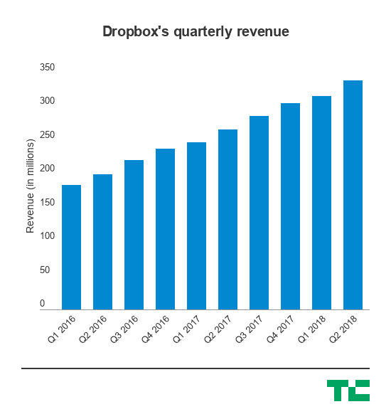

# 尽管超出了华尔街的预期，Dropbox 还是崩溃了，宣布首席运营官·丹尼斯·伍德赛德将离开 

> 原文：<https://web.archive.org/web/https://techcrunch.com/2018/08/09/dropbox-announces-coo-dennis-woodside-is-leaving-as-its-second-quarterly-check-in-with-wall-street-once-again-outperforms/>

早在四年多前，当丹尼斯·伍德赛德加入 Dropbox 担任首席运营官时，该公司正试图证明其作为 Web 2.0 宠儿迅速崛起时达到的 100 亿美元估值是合理的。现在，Dropbox 是一家估值近 140 亿美元的上市公司，它再次向华尔街表明，它能够凭借更加强劲的企业业务和消费者基础超越预期。

Dropbox 第二季度的业绩在收益和收入方面都超出了华尔街的预期。该公司还宣布，丹尼斯·伍德赛德将离开公司。伍德赛德加入时，Dropbox 正开始理清其企业业务，它能够发展企业业务，并向华尔街证明，它最终可能成为一家成功的上市公司。首次公开募股确实很成功，该公司的股票在首日交易中飙升了 40%以上，所以伍德赛德基本上完成了他的工作，让它成为一个为华尔街做好准备的企业是有道理的。

“我认为作为一个团队，我们在过去的四年半里取得了巨大的成就，”伍德赛德在接受采访时说。“当我加入时，他们的收入有几亿美元，员工不到 500 人。(首席执行官)德鲁(休斯顿)和阿拉什(菲尔多西)建立了一个伟大的企业，从那时起，我们已经扩展到全球。我们近一半的收入来自美国以外，我们有超过 30 万个团队负责我们的 Dropbox 业务产品，该产品在美国刚刚起步。这些都是团队的成就，我非常自豪。”

该股最初在延长交易中上涨超过 7%，尽管在市场收盘和该公司报告其收益之前，该股已经上涨了 10%。但在那次飙升之后，Dropbox 的股价现在下跌了约 5%。Dropbox 是最近几个月上市的许多 SaaS 公司之一，包括 DocuSign，它们取得了相当大的成功。虽然 Dropbox 成功地以强大的企业业务证明了自己，但该公司生来就有消费者根基，并试图在其推出的企业产品中延续这种简单性，如其合作工具 Dropbox Paper。

以下是这些数字的简要概述:

*   **Q2 收入:**同比增长 27%，至 3.392 亿美元，而预期收入为 3.31 亿美元。
*   **Q2 通用会计准则毛利率:**73.6%，去年同期为 65.4%。
*   **Q2 调整后收益:**相比之下每股 11 美分，相比之下每股 7 美分。
*   **付费用户:**1190 万付费用户，高于去年同季度的 990 万。
*   **ARPU:**:116.66 美元，去年同期为 111.19 美元。

因此，Dropbox 不仅能够表明它能够继续增加收入，其用户的实际价值也在上升。这很重要，因为 Dropbox 必须表明，它可以继续获得更高价值的客户——这意味着它正在逐步向财富 100 强的链条上移动，并让越来越大、越来越成熟的公司加入进来，这些公司可以为它提供越来越大的合同。这也给了它更大的战略行动空间，比如去年底[迁移到自己的架构](https://web.archive.org/web/20221219191548/https://techcrunch.com/2017/09/15/why-dropbox-decided-to-drop-aws-and-build-its-own-infrastructure-and-network/)，从长远来看，这可能会大大提高其业务的利润率。

“本季度早些时候，我们确实谈到了过去几年对 SMR 技术的投资，这是一种创新的存储技术，使我们能够优化成本和性能，”伍德赛德说。“我们继续创新方法，使我们能够实现更好的性能，并带来更好的经济效益。”

该公司仍在寻求以新员工的形式做出重大举措，包括最近宣布任命新的产品副总裁和产品营销副总裁，分别是[亚当·纳什和](https://web.archive.org/web/20221219191548/https://techcrunch.com/2018/08/08/dropbox-hires-a-new-vp-of-product-and-vp-of-product-marketing/)纳曼·汗。Dropbox 在首席执行官德鲁·休斯顿(Drew Houston)领导下的新团队的任务是继续该公司进军大型企业的道路，这可以让它与付费在线托管文件并从几乎任何地方访问文件的普通消费者一起，拥有更可预测和更强大的业务。

此外，随着伍德赛德的退出，还有一些高管变动。现任业务战略和运营副总裁的 Yamini Rangan 将成为首席客户官，向休斯顿汇报工作，通信副总裁吴林华也将向休斯顿汇报工作。

Dropbox 进行了第一次季度收益检查，并超过了华尔街的预期，尽管其 GAAP 毛利率[略有下滑，可能为公司](https://web.archive.org/web/20221219191548/https://techcrunch.com/2018/05/10/dropbox-q1-2018-earnings/)提供了一个轻微的负面信号。但自那以后，Dropbox 的股票没有出现任何重大失误，这让它在公开市场上更加可信，也让它有更多资源通过与股票挂钩的薪酬方案来吸引和留住人才。

伍德赛德说:“我们的忠诚度非常高。“我们在我们拥有的客户群体中看到了强大的保留特征，无论是大客户还是小客户。显然，随着时间的推移，大公司有更多的机会扩张，所以我们的扩张指标在拥有数百名员工的客户中非常强劲。但即使在小企业中，Dropbox 也是那种有吸引力的产品。一旦你开始使用它，开始分享它，它就变成了一个地方，你的企业或小或大都在管理它的所有内容，这往往是一个棘手的体验。”