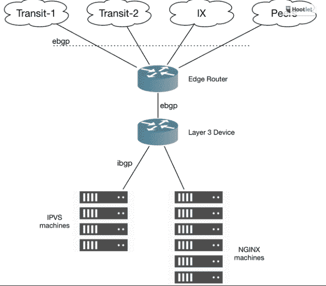

# Dropbox 宣布大规模网络扩张

> 原文：<https://web.archive.org/web/https://techcrunch.com/2017/06/19/dropbox-announces-massive-network-expansion/>

当 Dropbox 去年宣布离开 AWS 并将大部分业务转移到内部时，你不得不认为它正在进行重大的网络扩张，今天该公司宣布了一项大规模的全球网络增长计划，旨在提高用户的同步速度并削减公司的成本。

该计划涉及几种方法，包括定制类似于谷歌、亚马逊和脸书等其他网络规模公司的基础设施，但该公司认识到，要满足自己的独特需求，需要的不仅仅是硬件。它还需要找到加快这一过程的方法，这意味着提供尽可能接近用户的服务。这就是所谓的将计算转移到网络边缘。

据该公司称，他们开始了跨越三大洲七个国家 14 个城市的巨大网络扩张努力。Dropbox 的 Raghav Bhargava [在一篇公司博客文章](https://web.archive.org/web/20230326025352/https://blogs.dropbox.com/tech/2017/06/evolution-of-dropboxs-edge-network/)中写道:“这样做，我们增加了数百千兆位的互联网连接和数百个新的对等合作伙伴(我们直接交换流量，而不是通过 ISP)。”。

但是公司并没有就此止步。它还建立了一个基于开源软件的定制代理来驱动整个项目。Bhargava 写道:“边缘代理是一堆服务器，充当用户 TLS 和 TCP 握手的第一个网关，并部署在 pop(存在点)中，以提高用户从全球任何地方访问 Dropbox 的性能。”

这种类型的服务通常由 Akamai 等内容交付网络(CDN)提供商提供，但像许多像 Dropbox 这样规模的公司一样，它最终决定需要构建一个定制的解决方案来满足其独特的要求，并让它能够控制堆栈的所有方面。

图表:Dropbox

该公司从今天开始在其美国数据中心部署定制代理堆栈。它计划在接下来的几个季度中在全球范围内提供服务，首先是悉尼、迈阿密，然后是 2017 年第三季度的巴黎，以及 2017 年第四季度的马德里和米兰。到 2017 年底，Dropbox 计划在四大洲的十个国家拥有 25 个设施。

最终，这种扩张是出于两个原因。一是改善用户体验，无论他们住在哪里。这对 Dropbox 尤其重要，因为它发现约 75%的用户在美国以外。通过转移到边缘，就像网飞一样，该公司正在尽可能靠近用户提供服务，一旦扩张完成，随着在世界各地的扩张，它应该能够提高用户最集中的那些地区的性能。

第二个原因是，通过构建自己的硬件和软件，该公司可以更容易地控制成本，他们声称新方法将网络成本削减了一半，这一数额必将为公司节省大量成本。

Dropbox 一直在为可能的 IPO 制造噪音，这种加快服务交付和削减成本的方式应该会吸引未来的潜在投资者。它应该让顾客满意，无论他们身在何处，都应该从更快的服务中受益。