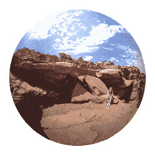

# Dropbox 收购 Bubbli，将把 3D 照片技术整合到其照片服务中

> 原文：<https://web.archive.org/web/https://techcrunch.com/2014/05/20/dropbox-buys-bubbli-will-integrate-its-3d-photo-tech-into-dropboxs-photo-service/>

看起来 [Dropbox](https://web.archive.org/web/20230326023713/http://www.dropbox.com/) 今天在照片领域又进行了一次收购:它收购了 [Bubbli](https://web.archive.org/web/20230326023713/http://bubb.li/) ，这是一家初创公司，它建立了一些创新的方式将 3D 技术融入 2D 的景色，并将其打包在[移动应用](https://web.archive.org/web/20230326023713/https://itunes.apple.com/us/app/bubbli/id720480745?mt=8)中，供普通消费者使用。

我们正试图从两家公司获得更多细节。目前，Bubbli 已经向其用户发出通知，宣布这项交易。

该说明指出，可以说 Bubbli 没有爆裂。这项技术正在被集成到 Dropbox 中，与此同时，现有的 Bubbli 应用程序将继续存在。

全文如下。

> 我们有一些激动人心的消息要分享:Dropbox 收购了 bubbli！
> 
> 我们很高兴加入 Dropbox。Bubbli 的目标一直是捕捉体验，让你感觉不仅仅是在看照片，而是在重温记忆。通过联手，我们将能够在更大的范围内继续改变您体验记忆的方式。
> 
> 每个人分享的泡沫把我们吹走了。我们正在努力将 bubbles 集成到 Dropbox 中，我们将随时向您通报我们的进展。在那之前，你可以像过去一样继续捕捉泡泡！
> 
> 感谢你们迄今为止的支持，为未来干杯！
> 
> 干杯，
> 本&泰伦斯
> 联合创始人

Bubbli 由两位斯坦福校友 Ben Newhouse 和 Terrence McArdle 创建，他们分别在成像技术领域取得了突破。

Bubbli 在其[网站](https://web.archive.org/web/20230326023713/http://bubb.li/about.html)上写道，McArdle“在 1991 年，也就是 QTVR 发布的三年前，发明了第一张无缝数字球形照片”。与此同时，本几年前在 Yelp 工作时，创建了 Yelp Monocle，这是“第一个在美国应用商店推出的增强现实应用程序。”

两人在斯坦福相遇，并开始结合他们的专业知识进行合作，最终产生了 bubb . Li——用户可以通过手机扫描拍摄全景风格的照片，然后使用这些照片创建类似球形的移动图片，并配以声音。

此次收购基于 Dropbox 在照片领域的现有资产——特别是收购了 [Snapjoy](https://web.archive.org/web/20230326023713/https://techcrunch.com/2012/12/19/dropbox-acquires-snapjoy-and-puts-photos-into-its-focus/) (最终被关闭)和[Loom](https://web.archive.org/web/20230326023713/https://techcrunch.com/2014/04/17/dropbox-acquires-cloud-photos-startup-loom-service-to-be-shut-down-as-users-transferred-to-carousel/)——以及今年早些时候推出的照片存储应用 [Carousel](https://web.archive.org/web/20230326023713/https://techcrunch.com/2014/04/09/dropbox-debuts-carousel-aiming-to-be-the-go-to-storage-app-for-your-entire-photo-archive/) 。

但 Bubb.li 的有趣之处在于，它标志着 Dropbox 在照片领域的新篇章。

Snapjoy 和 Loom 是专注于以更智能的方式组织照片的初创公司——snap joy 帮助统一了不同平台上不同的相册，并按时间顺序组织它们，还会偶然出现一些你可能已经忘记存在的照片；Loom 有一个聪明的方法让你存储大文件，但在你的移动设备上使用更快更小的文件。

然而，Bubb.li 更多的是关于创建图片的艺术，以及用你记录和存储的基本图像做更多创新的事情。在我看来，这表明 Dropbox 正在寻求为其服务增加更多价值，而不仅仅是一个基本而高效的存储提供商。

随着公司的成长，它自然会寻求吸引更广泛的消费者，而不仅仅是需要大量存储空间的超级用户和早期用户。有了 Bubb.li 这样的东西，你可以想象一些用户可能会为漂亮的图片而来，然后留下来享受高级存储，或者 Dropbox 现在或未来可能会提供的其他服务——或者至少希望如此。

具有讽刺意味的是，就在今天早些时候(在我们知道 Bubb.li 之前)，我们在 TechCrunch 上讨论 Carousel 作为一个基本的照片存储应用程序是否为用户提供了足够的价值，以吸引他们离开 Flickr 和其他现有的服务。App Annie 的数据并没有描绘出一幅非常美好的画面:

(T0)

(T1 )

H/T (T2) 罗伯特·斯汀 (Robert Steen)