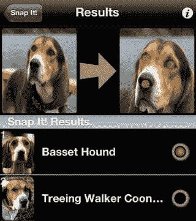

# Dropbox Acqui-雇佣 KBVT 的计算机视觉天才来挖掘其照片

> 原文：<https://web.archive.org/web/https://techcrunch.com/2014/09/09/dropbox-computer-vision/>

# Dropbox Acqui-雇佣 KBVT 的计算机视觉天才来挖掘它的照片

Dropbox 不只是想存储你的照片。它也想把它们组织起来，让它们更有用。这就是为什么今天 it ACQ 聘请了两位计算机视觉和机器学习教授，他们创立了[Kriegman-belhumer 视觉技术(KBVT)](https://web.archive.org/web/20230318020730/http://kbvt.com/) 。在建立 KBVT 十年之后，哥伦比亚大学的 Peter Belhumeur 教授和加州大学圣迭戈分校的 David Kriegman 教授今天将开始在 Dropbox 工作，尽管他们已经建立的现有技术不会随之而来。

Dropbox 工程副总裁 Aditya Agarwal 告诉我，他的公司需要这种人才，因为“我们创造记忆的速度正在快速增长，以至于组织、管理和理解我们积累的记忆的能力”是一个巨大的机会。照片是网络上最丰富的数据类型之一，对人们来说也极其重要。如果 Dropbox 或任何其他公司能够想出如何从照片中挖掘出更多的战略价值，或者为那些将珍贵时刻保存在照片中的用户提供额外的好处，它们可能会坐拥一座金矿。

这些人呢？他们是真材实料。

贝尔胡默尔是计算机科学教授，也是哥伦比亚视觉外观研究实验室的主任。他拥有哈佛大学的工程学博士学位，曾是剑桥大学艾萨克·牛顿数学科学研究所的博士后研究员。他研究计算机视觉、人脸识别和视觉识别的机器学习。他的学术论文被引用超过 21000 次，他还开发了 Leafsnap 和 Dogsnap iOS 应用程序，帮助人们从图像中识别树木和鸟类。

克里格曼已经发表了 150 多篇关于机器人、计算机图形学、人脸识别和物体识别的论文。这位斯坦福大学的博士已经在他的领域获得了大量的奖项，并且是 IEEE 模式分析和机器智能研究汇编的主编。

Agarwal 告诉我，Kriegman 和 Belhumeur 的专业知识可以帮助 Dropbox 识别照片中的内容，这样它就可以按照主题、位置和许多其他方式组织照片。这两位教授在面部和物体识别方面的工作可以帮助 Dropbox 扫描你所有的照片，并用关于照片内容的元数据给它们加标签。想象一下，如果你能调出所有有人“笑”或有“日落”或“狗”的照片。

 Dropbox 有大量的照片供伙计们挖掘。该服务现在拥有 3 亿用户，在 18 个月内增长了 200%，并拥有 8 万名付费用户。

Kriegman 和 Belhumeur 目前还没有具体的工作计划，因为 Dropbox 希望他们好好看看自己的数据集，让学者们找出下一步最明智的做法。

Agarwal 告诉我，“我认为这项技术可能实现的确切光谱仍在研究中”。“研究人员被这些大公司吸引的原因是，现在是时候制造一些真正酷的东西了。”