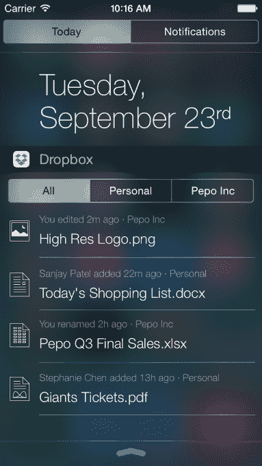
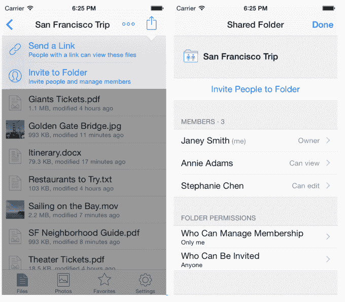

# Dropbox 现在已经为 iOS 8 做好了准备，提供了通知中心小工具、应用程序扩展支持等技术

> 原文：<https://web.archive.org/web/https://techcrunch.com/2014/09/23/dropbox-is-now-ios-8-ready-with-a-notification-center-widget-app-extension-support-and-more/>

# Dropbox 现在已经为 iOS 8 做好了准备，拥有通知中心小工具、应用程序扩展支持等等

现在 iOS 8 已经发布，苹果用户正在接收他们最喜欢的应用程序的改进版本，旨在利用 iOS 的新功能，如在通知中心创建自定义小工具的能力。今天，文件共享应用 [Dropbox](https://web.archive.org/web/20221006182519/http://www.dropbox.com/) 已经[推出了](https://web.archive.org/web/20221006182519/https://blog.dropbox.com/2014/09/do-more-on-the-go-with-a-new-dropbox-for-ios-8/)其 [iOS 8 升级](https://web.archive.org/web/20221006182519/https://itunes.apple.com/us/app/dropbox/id327630330)，现在包括一个自己的新通知中心小工具，提供对你的文件和最近变化的快速概览。其他新功能使管理文件夹、从其他应用程序连接到 Dropbox 以及控制最终用户(如果在 Dropbox for Business 或 Dropbox Pro 上)的权限变得更容易。

升级后，最大的变化是 Dropbox 现在可以添加到 iOS 8 通知中心，提供最重要文件的视图，包括与您的业务和个人文件相关的文件(如果适用)。对于那些只有业务或个人文件的人，你只会看到一个列表，而不是三个单独的标签(所有个人，业务)。

在小部件中，您可以跟踪新添加的文件，以及诸如重命名的文件和编辑之类的更改。只需点击一个文件名，你就可以快速启动 Dropbox，而无需在手机上找到该应用。

新应用的另一个变化涉及共享文件夹，现在可以在 iPhone 和 iPad 上通过 Dropbox 应用随时创建和管理共享文件夹。这一增加与其说是利用 iOS 8 专门提供的东西，不如说是推出用户一段时间以来一直要求的功能。

现在，您可以从应用程序中的操作菜单共享文件夹链接，或者邀请用户访问文件夹并管理他们的访问级别。

此外，由于 iOS 8 支持应用程序扩展，你现在可以从支持苹果“存储提供商应用程序扩展”功能的其他 iOS 应用程序导入和导出文件。为了将文件导入 Dropbox，您需要点击文件列表顶部的省略号图标(…)，然后选择“更多”并在“管理存储提供商”下打开或关闭 Dropbox 选项

最后，对于商业或专业用户来说，iOS 8 更新带来了通过 Dropbox 应用程序设置和管理共享文件夹的只读权限的能力，以控制正在共享的内容——另一个更次要(但有用)的功能，但同样与苹果的 iOS 8 改进无关。

更新后的应用程序[现在在 iTunes](https://web.archive.org/web/20221006182519/https://itunes.apple.com/us/app/dropbox/id327630330) 上直播。