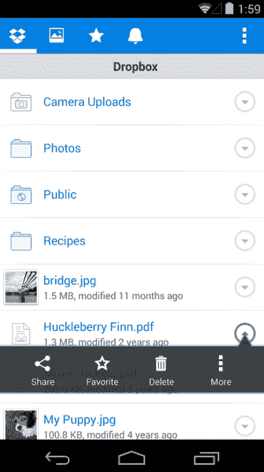

# Dropbox 重新设计其安卓应用 

> 原文：<https://web.archive.org/web/https://techcrunch.com/2015/06/23/dropbox-redesigns-its-android-app/>

# Dropbox 重新设计了它的安卓应用

Dropbox 今天发布了对其 Android 应用程序的重新设计，旨在简化共享文件和上传文件夹的过程。

新的 Android 应用程序将在未来几天推出，是对用户界面的重新设计，与之前的版本相比，更加无缝。新的应用程序还包括该公司搜索功能的新位置，现在直接基于应用程序界面的顶部。这些功能对于需要快速浏览大量大文件的高级用户来说非常重要。

这是旧的 Dropbox 应用程序的样子。

此外，Dropbox 在改变其在多种设备上共享文件的原始模式后，仍在试图弄清楚它的移动存在到底是什么样的。移动设备上的用户行为通常不同于桌面设备，因此用户体验必须符合这种行为。

自然，这很大程度上围绕着用户如何拍摄和分享照片——因此 Dropbox 在新应用中处理照片的方式发生了变化。用户可以通过屏幕底部的一个新按钮直接从他们当前正在浏览的文件夹中拍摄照片。新的应用程序还将共享控制和过程移动到用户界面的一个位置，如移动文件和收藏文件。

该应用程序也经过了重新设计，速度更快，看起来更符合谷歌在其安卓操作系统的最新更新中重新设计的其他新安卓应用程序。

与此同时，Dropbox 也一直在努力扩大其在企业中的足迹，最近推出了一款工具，让用户可以从不一定使用 Dropbox 的人那里请求文件。这也成为 Dropbox 使命的一个核心部分，即弄清楚 2015 年及以后的下一代文件共享会是什么样子。