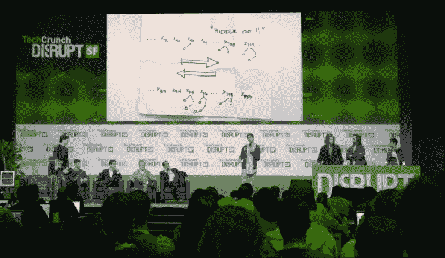
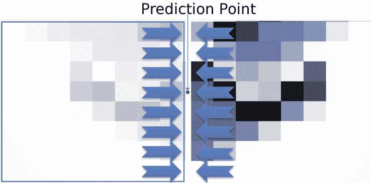

# Dropbox 的 Lepton 无损图像压缩实际上使用了一种“中间输出”算法 

> 原文：<https://web.archive.org/web/https://techcrunch.com/2016/07/14/dropboxs-lepton-lossless-image-compression-really-uses-a-middle-out-algorithm/>

# Dropbox 的 Lepton 无损图像压缩实际上使用了一种“中间输出”算法

这不是魔笛手，但有相似之处。

源自 HBO 的《硅谷》中最臭名昭著(可能也是最有趣)的场景的“中出”算法可能是虚构的，但类似的东西可以在 Lepton 中找到，Lepton 是 Dropbox 创建的一种很酷的新型无损图像压缩器。

Lepton 将 JPEG 编码图像(大部分图像)的文件大小减少了 22 %,却没有丢失原始图像的任何一点。这怎么可能呢？中出局。

实际上，要比这复杂得多。Lepton 通过更有效地编码亮度值节省了一部分成本，这些亮度值以高度确定的方式存储在 JPEGs 中。对于普通的熊(或者，如果我诚实的话，博客作者)，[可能有点难以理解的细节，可以在这篇博文](https://web.archive.org/web/20221207044246/https://blogs.dropbox.com/tech/2016/07/lepton-image-compression-saving-22-losslessly-from-images-at-15mbs/)中找到。

中间输出位位于解压缩位的末尾。该算法查看 JPEG 创建的两个 8×8 像素块之间的边界，其中一侧已经完成解码。未解码侧倾向于遵循由通向中间区域的像素中发现的亮度梯度建立的亮度梯度，因此算法基于此进行预测。然后，它只保存预测值和实际值之间的差值——格式化后非常适合 VP8 算术编码器。

从中间……..出去。

以这种方式编码的亮度系数往往占该团队遇到的图像的平均 8%，但他们将这 8%缩小了约 61%，仅这种方法就使整体文件大小减少了 5%。另外 17 %(记住，总数是 22)的节省来自各种其他技术，如果你能相信的话，它们背后有一个更少*娱乐性的故事。*

你不会注意到这些。轻子压缩只在 Dropbox 服务器上进行，在那里你的数据被放入冷存储。当你请求它时，Lepton 的工作被反转(而且很快)，你得到的是普通的 JPEG。但在 Dropbox 方面，它节省了数 Pb 的空间。

Lepton 是开源的，Dropbox 有[把它的代码放到 GitHub](https://web.archive.org/web/20221207044246/https://github.com/dropbox/lepton) 上。请随意修改它——如果您在本文中已经做到了这一步，您很可能会这样做！