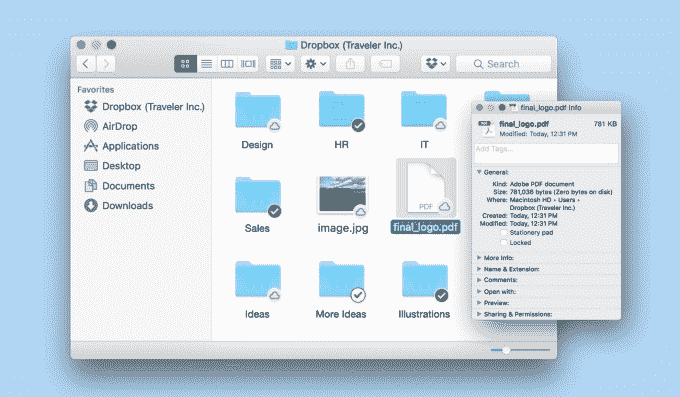

# Dropbox 的智能同步允许用户像打开任何普通文件一样打开只存储在云中的文件

> 原文：<https://web.archive.org/web/https://techcrunch.com/2017/01/30/dropboxs-smart-sync-lets-users-open-a-file-stored-only-in-the-cloud-like-any-normal-file/>

# Dropbox 的智能同步允许用户像打开任何普通文件一样打开只存储在云中的文件

Dropbox 今天发布了智能同步(Smart Sync ),该工具允许用户在桌面上自动访问存储在 Dropbox 账户中的文件，而无需将文件存储在本地。

之前被称为 Dropbox Infinite 的 Smart Sync 为企业提供了一种共享和访问文件的方式，而无需在桌面上存储大量文件。这个想法是，企业经常处理成堆的大型文件，这些文件会很快淹没本地计算机，但仍然需要找到与队友合作的方法来处理这些文件。这些文件的行为就像您通常在桌面上所期望的一样——照片在预览时打开为照片，等等。

集团产品经理 Genevieve Sheehan 说:“整个团队或公司的用户所需的一切都可以从桌面系统中获得。“用户拥有大量信息，他们不需要将所有这些信息都保存在自己的设备上，但需要访问所有这些信息。他们可以快速到达他们需要的任何地方，而不必跳转到 web 应用程序，这就是他们所期望的。这给了团队简化的团队更多的权力，和更少的开销。”

这些文件本身并不是“流式的”——就像，你不是在某个容器中查看一张照片或类似的东西，而这个容器运行的程序允许你以低带宽的方式与它进行交互。取而代之的是，文件被同步、打开，并在编辑后被传送回云端，然后被清除。

当然，这需要互联网连接，但在演示中，该产品看起来非常无缝。对于更大的文件(例如从几百兆字节到一千兆字节或更多的文件)，这可能会有所不同，但目的是确保硬盘驱动器不会不堪重负。Smart Sync 的一个部分甚至允许员工查看文件的基本数据，这将与文件的所有内容完全相同，只是占用了很小的空间。

Sheehan 强调，此次发布的一个重要部分是确保整个企业的员工可以在多个不同的环境中协作。通过这种方式，windows 设备上的用户可以访问和管理文件，并与 Mac 上的用户同步和显示。Sheehan 说，Smart Sync 使用可用的内核扩展，并且已经过彻底的安全性审查。

“你可以有一个拥有不同设备和地理位置的团队，”希恩说。“他们拥有相同的访问权限和相同的功能，而不必升级他们的系统，并确保每个人都使用相同的 Windows 或 Mac 版本。”

智能同步将于今天向所有 Dropbox 商业和企业客户提供，以便提前访问。如果管理人员确定他们仍然希望确保这些文件存储在本地，他们仍然可以选择智能同步。