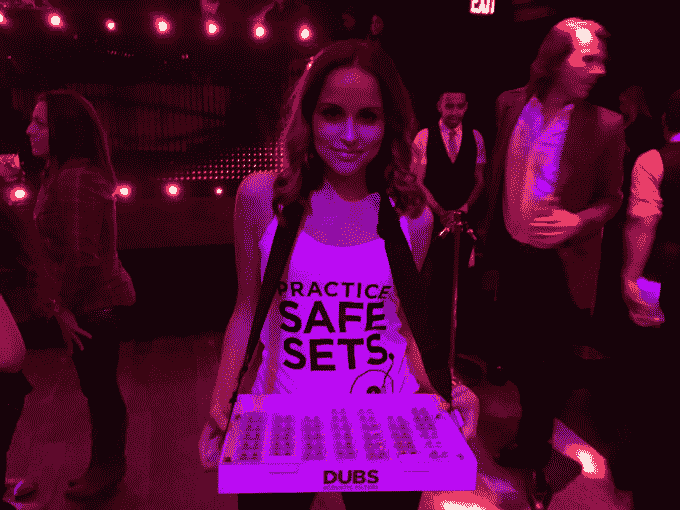
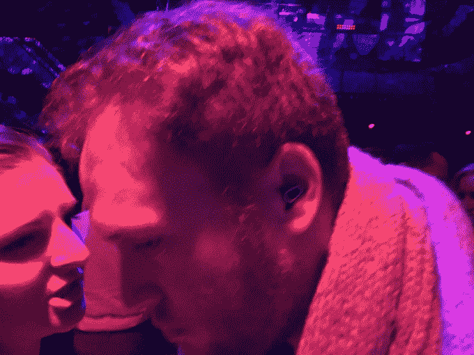

# 配音降低夜总会的噪音 

> 原文：<https://web.archive.org/web/https://techcrunch.com/2014/12/05/dubs-bring-down-the-noise-in-night-clubs/>

昨晚，我走进纽约市的 Marquee 夜总会。大卫·盖塔在预定名单上。人们穿着最好的衣服，灯光闪烁，我手里拿着满满一杯酒。我应该很兴奋，但是我的头却很痛。

我老了吗？俱乐部的声音越来越大吗？

不管是哪种情况，Dubs 滤声器都解决了我的问题。

由多普勒实验室创造的配音是耳塞的现代再造。

它们完全是机械耳塞，可以保持音质，同时降低分贝水平，所以你的耳朵不会整夜嗡嗡作响。唱片在网上[和百思买出售，还有像欧洲的 ADE 这样的各种音乐节，在过去的 60 天里已经卖了 100 多万美元。以每台 25 美元的价格计算，两个月内售出了 4 万台。](https://web.archive.org/web/20221208154120/http://www.getdubs.com/)

当然，配音并不是市场上唯一的选择。你也可以戴上加油站出售的那种亮橙色、粘糊糊的耳塞，20 个一包，或者你可以购买巨大的、挂在耳朵上的[电子耳罩](https://web.archive.org/web/20221208154120/http://www.amazon.com/s/?ie=UTF8&keywords=electronic+shooting+ear+muffs&tag=googhydr-20&index=aps&hvadid=12486841907&hvpos=1t1&hvexid=&hvnetw=g&hvrand=14137127082665423104&hvpone=&hvptwo=&hvqmt=b&hvdev=c&ref=pd_sl_4zmb35dxgr_b)。然而，配音似乎找到了很好的中间立场。

昨晚，Dubs 推出了 Marquee，这是全国最大的夜总会连锁店。这种耳塞现在将在舞池里出售，来自那些端着托盘和方形读卡器走来走去的漂亮男女。

“我们对配音在网上的销售情况感到惊讶，”联合创始人诺亚·克拉夫特说。“但活动现场的销售也非常好，与 Marquee 的合作让我们非常兴奋。”

除了 Marquee 的发布，昨晚也是我第一次有机会在真实的用例场景中测试配音。

花了一分钟来适应。起初，配音和其他耳塞感觉差不多，只是稍微消音，把声音推进你的下巴和头部，而不是通过耳朵进入。但是一旦我的耳朵适应了，我注意到我仍然可以听到小军鼓的高“tsss ”,像针一样的激光音符，而低音感觉舒适，仍然有力。

然后我把它们拿出来。

俱乐部是势不可挡的。声音太大，回响太大，无法欣赏。

我要说的是，当我与人交谈时，我更喜欢去掉配音，因为在我自己的头脑中发生所有噪音的情况下进行对话太困难了。但是当我在外面听音乐的时候，我似乎明白了为什么 Dubs runs 的口号是“越大声越好”

这可能不是那种只有喝酒才能让人麻木的殴打身体的体验(你很可能更喜欢这种体验)，但它把去俱乐部的体验变成了足够舒适的东西，可以持续很长时间。

只要 25 美元。

[gallery ids="1091037，1091038，1091039"]

在百思买或在线[这里](https://web.archive.org/web/20221208154120/http://www.getdubs.com/)查看它们。