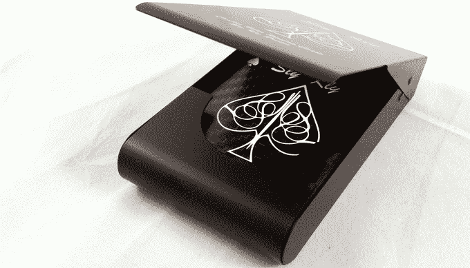

# 这些扑克牌可以承受子弹|技术崩溃

> 原文：<https://web.archive.org/web/https://techcrunch.com/2015/09/04/duck-while-going-fish/>

# 这些扑克牌可以承受子弹

和其他任何事情一样，玩牌的时机已经成熟。我在机场、CVS 和超市购买过信用卡……但从未在网上购买过。这可能会因为这个 Kickstarter 而改变。这是自[凯夫拉尔口袋广场](https://web.archive.org/web/20230316065240/https://techcrunch.com/2008/10/07/kevlar-pocket-square/)以来最大的新闻。

如果你曾经想过如果你在玩扑克的时候有人拿枪指着你，你会怎么做，那就不要再想了。一个名为“狡猾的克利”的组织看到了由凯夫拉尔纤维或碳纤维制成的扑克牌，这是你的选择。你可能知道，这些材料可以承受子弹。我不是唯一一个觉得我需要这种额外保障的人，因为截至发稿时，他们已经筹集了 40，371 美元(远远超过了他们 25，000 美元的目标)。

我从来没有射击过一副普通的游戏车，因为我真的不喜欢枪，当然也没有枪，但是我想象它会在每张牌上打一个洞。这些凯夫拉尔的？没那么多。有一个手表作为他们的偏转子弹是放在显示器上:

我肯定 Sly Kly 不想说这些卡可以救你的命，但是如果你碰巧把它们放在衬衫的前口袋里，有人从很远的地方朝你的大致方向瞄准一把枪，然后直接向你的卡存放的地方开枪……它们可能会救你的命。

事实上，这些牌不会像普通的廉价扑克牌那样弯曲或撕裂，我认为它们会持续更长时间。

它们装在这个漂亮的金属盒子里，你可以通过认捐 130 美元或更多得到一套碳纤维，或者通过认捐 135 美元或更多得到一套凯夫拉尔纤维。防弹扑克牌的价格很低。我想是的。