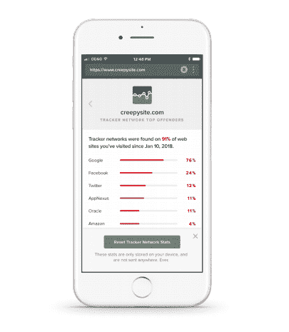

# DuckDuckGo 增加了跟踪拦截功能，有助于遏制更广泛的监控网络 

> 原文：<https://web.archive.org/web/https://techcrunch.com/2018/01/23/duckduckgo-adds-tracker-blocking-to-help-curb-the-wider-surveillance-web/>

来自老牌反跟踪搜索引擎的一些主要产品新闻:今天，[发布了](https://web.archive.org/web/20221206160332/https://spreadprivacy.com/p/37d8d233-6655-4807-977f-11644ddb0013/)改进的移动应用和浏览器扩展，内置了第三方网站的跟踪拦截器，并包括一套其他隐私功能，旨在帮助用户在网上导航时保持隐私。

截至目前，这些应用和浏览器扩展在全球范围内适用于 Android、iOS、Chrome、Firefox 和 Safari。(DDG 告诉我们 Opera 也在它的考虑范围内，但是还没有发布日期。)

“我们的愿景是设立网上信任的标准，”首席执行官兼创始人 Gabe Weinberg 在讨论新产品时说。“(到目前为止)我们一直非常专注于搜索引擎，因为在谷歌的核心市场与它竞争非常复杂。但是现在我们觉得我们可以处理，我们在保护互联网上的人们的更广泛的愿景上取得了进展。

“我们真正想做的是超越搜索框…我们从与人们的交谈中意识到，特别是在过去两年中，隐私风险已经完全成为主流。

> 人们真的想要一个主流的、简单的隐私解决方案。

“人们真的想要一个主流的、简单的隐私解决方案。”

DDG 的目标是创建一个“随处使用”的隐私工具，将对其私人搜索引擎的访问与追踪器拦截和一系列其他“隐私要素”结合起来，例如一个加密保护功能，自动将用户发送到一个加密版本的网站(如果有的话)，而不是接受默认的非加密版本。

另外:DDG 为每个被访问的网站提供隐私评级。该等级基于站点部署的隐藏跟踪器的数量；无论是加密你的连接；还考虑到网站自己的隐私政策(对于后一项活动，DDG 与服务条款评级倡议， [ToS 合作；博士](https://web.archive.org/web/20221206160332/https://tosdr.org/)，但也指出“大多数隐私政策仍未得到研究”，所以说这将有助于该组织对“尽可能多的网站”进行评级和标记。

“不幸的现实是，几乎没有任何网站在隐私方面真正值得一个‘A’，”温伯格对此表示。“如果我们能够……屏蔽所有追踪器并进行加密，我们可以让大多数网站达到‘B’级。那么 B 和 A 之间的鸿沟实际上是他们的隐私政策。

“不幸的是，即使事情被封锁和加密，网站本身仍然可以作为第一方收集数据并出售。因此，要真正获得“A”级，隐私政策需要经过审查。”

对于追踪器拦截，他说 DDG 正在使用来自 [EasyList](https://web.archive.org/web/20221206160332/https://easylist.to/) 和 [Disconnect](https://web.archive.org/web/20221206160332/https://disconnect.me/) 的一些技术，但也“通过我们自己的测试来尝试增加这一功能，并使它在你使用它时减少网站崩溃”。(需要明确的是，它没有做任何广告屏蔽；只是屏蔽了第三方追踪器。)

Weinberg 声称追踪器拦截器“现在非常有效”，依靠开源社区的专业知识，但表示 DDG 也希望建立在这个工具上，并随着时间的推移添加更多的隐私和阻止技术——例如，建议一个可以阻止隐藏的加密货币矿工的功能，这可以嵌入在网站上，作为他希望在未来添加的其他东西。

当被问及 DDG 的方法与 Mozilla 支持的私人搜索浏览器 Cliqz 相比如何时，Weinberg 认为竞争对手的产品没有“真正集成”，Cliqz 去年收购了 Ghostery 反跟踪工具。“他们更追求纯粹的浏览器环境，而我们所说的是，无论你在哪里，在任何设备或主要浏览器上，我们都可以增强它，以无缝的方式帮助保护你的隐私，”他说。

“总的来说，我认为隐私是主流，人们想要简单、无缝的解决方案，但直到现在它们还不存在，”他继续说道，“我们希望大多数搜索引擎用户接受并使用这个扩展和应用程序，因为它真的扩展了他们的隐私保护。

“除了我们的用户群，我认为这是所有消费者都可以受益的事情——所以我们希望它能被广泛下载。”

据温伯格称，DuckDuckGo 自 2014 年以来一直盈利。(它不是像谷歌那样通过跟踪和分析用户来赚钱，而是通过根据每次搜索时使用的搜索词来投放广告，以及通过联盟收入来赚钱。)因此，现在感觉自己有足够的现金来拓展核心的私人搜索服务之外的业务。

去年，DDG 的搜索引擎提供了不到 60 亿次私人搜索，使用量比 2016 年增长了约 50%。(鉴于它不跟踪个人用户，它不能真正打破固定的用户指标，但温伯格说，第三方估计 peg 用户目前在 2500 万左右。)

关于增长点，DDG 表示，在其十年的生命周期中，超过三分之一(36%)的搜索是在 2017 年进行的。因此，在美国国家安全局举报者爱德华·斯诺登揭露政府大规模监控项目后，2013 年[的使用量激增](https://web.archive.org/web/20221206160332/https://beta.techcrunch.com/2014/01/12/duckduckgos-popularity-exploded-in-2013-following-the-nsaprism-leaks/)，显然已经变成了某种持续的势头。

TL；博士，隐私不仅仅是一时的时尚。因为大规模监控不仅仅是政府的活动。商业网络也充斥着追踪者和数据经纪人——温伯格认为网络用户越来越意识到他们在网络上是如何被跟踪的。

“在过去的几年里，主流人群已经真正接受了互联网令人毛骨悚然的观点——这在很大程度上是由于谷歌和脸书，”他说。"特别是他们积累了每个人前所未有的大量个人信息."

温伯格认为，这两人使用在线跟踪进行在线分析，以推动各自的超目标广告平台，“往好里说，是令人讨厌的”，而且“往坏里说，会导致重大的政治动荡，比如俄罗斯的广告干涉”(比如在[美国大选](https://web.archive.org/web/20221206160332/https://beta.techcrunch.com/2017/11/22/russian-trolls/)和[英国英国退出欧盟公投](https://web.archive.org/web/20221206160332/https://beta.techcrunch.com/2018/01/18/facebook-agrees-to-take-a-deeper-look-into-russian-brexit-meddling/?ncid=mobilenavtrend)，这只是这方面的两个例子)。

他引用的数据显示，谷歌使用的追踪器现在出现在 76%的排名前 100 万的网站上，脸书的追踪器出现在 24%的页面上——称其“在那之后很快”就消失了，而 Twitter 只有 12%。

> 实际上，你访问的任何网站都可能有脸书，谷歌在那里看着你。

“我认为人们现在已经意识到隐藏的追踪者就在附近，并且正在窃取他们的个人信息。然而，他们没有意识到谷歌和脸书追踪器有多普及，”他建议道。

“实际上，你访问的任何网站都可能有脸书，谷歌在那里监视着你。我认为人们现在开始意识到这一点。”

他认为，大规模监控广告定位在线商业模式加剧的另一个问题是过滤泡沫——也就是平台利用人们自己的偏见作为策略，通过减少向他们提供更多相同的东西来保持他们的点击。

此外，近几个月和近几年来，对过滤器泡沫的社会影响的担忧日益成为主流讨论点。

温伯格解释说，DDG 新产品的追踪器拦截器将追踪器分组到网络中，试图让人们更容易了解哪些公司负责追踪你。因此，DDG 工具的用户将被告知哪些追踪器网络被拦截以及“它们的目的是什么”，而不是像一个典型的反追踪器工具可能做的那样，只是说一些通用的东西——比如它“拦截了 25 个追踪器”。

“当人们意识到过滤泡沫和无孔不入的广告的危害时，他们会产生情感共鸣，并希望摆脱它们。这是最简单的方法，”他补充道。

在欧盟，一个更新的在线隐私框架， [GDPR](https://web.archive.org/web/20221206160332/https://beta.techcrunch.com/2018/01/20/wtf-is-gdpr/) 将从五月开始实施。这项规定明确提到了在线侧写，包括人们有权反对这种活动——一些隐私专家认为，这可能会给广告技术和在线侧写带来巨大的变革。

但当被问及他对 GDPR 对脸谱化的影响的看法时，温伯格并不认为这会对网络上的两大商业监控实体:脸书和谷歌构成很大的障碍。

“我非常支持这项规定，我希望许多这种没有消费者关系的更隐蔽的数据经纪人真的会被抓住，因为他们无法获得同意，”他说。“但不幸的是，在我看来——脸书和谷歌——我不认为他们会受到监管的影响。

“因为虽然同意将会以更有力的方式被要求，但我认为他们将会在他们的产品中推行这一点。然后人们会最终同意。”

“我认为你也需要不同的消费者反弹——要么人们真的离开服务。或者，在这种情况下，介于两者之间:在网络上屏蔽他们所有隐藏的追踪器。而不是等待他们采取任何重大行动来遏制他们的监视，”他补充说。