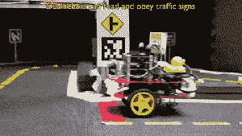

# 麻省理工学院用橡胶鸭子解释自动驾驶汽车 

> 原文：<https://web.archive.org/web/https://techcrunch.com/2016/04/20/ducking-awesome-self-driving-cars/>

# 麻省理工学院用橡胶鸭子解释自动驾驶汽车

无人驾驶汽车看起来非常像魔术。它们包含汽车技术、计算机视觉、人工智能和许多其他尖端技术领域的元素。所以，如果你想知道它们是如何结合在一起的，你会从哪里开始呢？麻省理工学院决定从…橡胶鸭子开始。

让学生在真正的 3 吨重的交通工具上自由活动，这种交通工具有能力杀人、致残，否则会给律师带来噩梦，这可能有点过分。为了解决这个问题，并且仍然有助于激发学生的想象力，[麻省理工学院的计算机科学和人工智能实验室](https://web.archive.org/web/20230201132407/https://www.csail.mit.edu/)(或者，对于那些了解内情的人来说，更容易接受的“CSAIL”)创建了[鸭子城](https://web.archive.org/web/20230201132407/http://www.duckietown.com/)，在这个项目中，50 只橡胶鸭子必须在一个模型城市上自主互动，以完美的和谐方式导航交通标志和道路标记，并相互交流。

哦，再次成为一名学生；这看起来太有趣了。

第一类项目是雄心勃勃的:创建一个无人驾驶出租车车队(当然是为了橡胶鸭子)。挑战:使用单个机载相机，并且没有预编程的环境地图。我不知道你怎么想，但这听起来很有趣，这让我很难过我已经不在学校了。

为了创建一个始终如一的精确系统，学生们面临着挑战，需要做出工程决策和权衡。例如，在复杂算法和更便宜的硬件之间或者简单算法和更可靠的硬件之间做出选择，什么是正确的决定？

然而，这个项目不是一次性的；CSAIL 希望以此为起点，开展更多雄心勃勃的项目。

“我们相信像这样的工具将有助于为研究人员创造一个共同的平台和语言，”与研究科学家安德里亚·森西(Andrea Censi)共同领导新课程的[利亚姆·保罗(Liam Paull](https://web.archive.org/web/20230201132407/http://people.csail.mit.edu/lpaull/) 说。“我们希望这将使计算机科学家更容易继续合作，将自动驾驶汽车带入现实世界。”

据推测，对于已经有一两只多余的橡皮鸭来说，这是更安全的运输选择。

请在下面的视频中观看他们的行动。