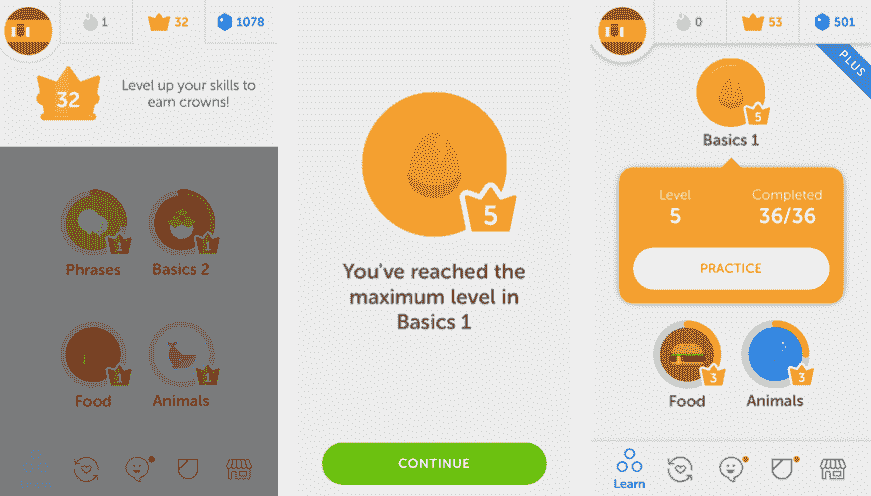
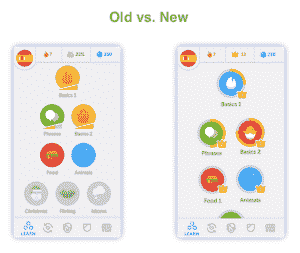

# Duolingo 增加了新的语言练习并改进了其等级系统 

> 原文：<https://web.archive.org/web/https://techcrunch.com/2018/04/09/duolingo-adds-new-language-exercises-and-revamps-its-leveling-system/>

# Duolingo 增加了新的语言练习并改进了它的等级系统

今天，Duolingo 发布了近年来最大的一次更新。该公司正在推出一系列新的锻炼类型，以及一个新的分级系统，让你在深入钻研特定技能或学习新内容之间进行选择。

当你在构建一个像 Duolingo 这样受欢迎的语言学习服务时，你不可避免地会遇到一个问题:你的一些用户是真正认真学习一门新语言的，而另一些只是普通用户。即使你试图为每个用户提供个性化的体验，也很难找到平衡点。但是当你添加更难的内容时，用户参与度会下降，学习者也会减少。

为了应对这种情况，Duolingo 现在推出了“皇冠关卡”。这些新的水平是重新设计的技能树的一部分，让用户可以选择钻研特定技能的更难的内容，或者继续学习新技能。

今年早些时候，该公司悄悄地[在](https://web.archive.org/web/20221207024340/https://www.duolingo.com/comment/25615588)宣布了这一功能，并在 A/B 测试后，决定现在向更广泛的受众推出这一功能。“每当我们试图添加更难的内容以便更好地教学时，我们的参与度指标就会下降。学习者会气馁，离开应用程序，”该团队当时解释道。“这使得我们的目标很难取得任何进展，我们的目标不仅是成为一个有趣的学习应用程序，而且是一个真正教你学好语言的有效应用程序。”

新的技能树现在允许初级学习者像以前一样在多林戈技能树中移动，而高级学习者可以更深入地学习他们刚刚学到的新技能。理想情况下，这意味着每个人现在都应该开心，学得更好。

通过这次更新，Duolingo 还引入了许多新的练习类型，重点是听力和发音。其中包括一套围绕特定发音的新的语音练习，以及一种要求你在听单词时敲击单词的新练习。另一个新的练习不太关注具体的单词，而是测试你的听力。