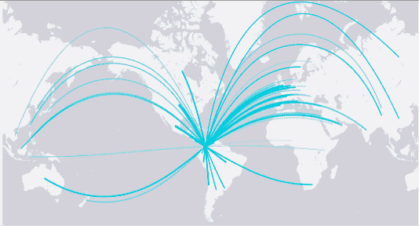

# Duolingo 推出免费快速测试评估，与优步合作认证哥伦比亚司机的英语技能 

> 原文：<https://web.archive.org/web/https://techcrunch.com/2015/09/09/duolingo-launches-free-quick-test-assesments-partners-with-uber-to-certify-colombian-drivers-english-skills/>

# Duolingo 推出免费快速测试评估，与优步合作认证哥伦比亚司机的英语技能

语言学习平台 Duolingo 今天宣布了一系列围绕其 T2 测试服务 T3 的更新。

首先，该公司现在提供免费的基本语言评估测试。与该公司价值 20 美元的证书不同，该证书直接与托福等成熟的英语考试竞争，快速测试不需要人工进行远程验证。这样一来，Duolingo 提供证书的主要成本就没有了，该公司因此能够免费提供这项测试。这里的主要思想是建立一个在简历上展示语言技能的新标准。

该公司在今天的公告中指出:“这些基本上都是自我评估(“我的法语水平是中级”)，因此不太可能被机构认真对待。”。

公司发言人告诉我，付费证书测试和快速测试之间的内容差异很小。包含 21 个问题和 152 个子项的证书考试大约需要 20 分钟，包含 15 个问题和 110 个子项的快速考试大约需要 15 分钟。(**更正** : *Duolingo 最初给我们提供了错误的快速测试题数。正确的数字是 110，而不是 150。我们已经更新了帖子来反映这一点。*)

用户可以在 Duolingo 的考试中心网站和 Android 上的考试中心应用程序上进行快速测试。

平台上开始使用免费测试的人越多，这些用户在某个时候也想获得完整证书的可能性就越大。如果有的话，这些免费测试将允许用户检查自己的语言能力和准备考试，而不必支付费用。

第二份声明对 Duolingo 及其新合作伙伴优步来说都是首次。在哥伦比亚，优步现在将使用 Duolingo 来认证你的司机的英语技能(使用付费的 20 美元证书测试，而不是新的免费快速测试)。

优步告诉我，大约 60 名司机已经完成了这个项目，1000 多名优步司机目前正在使用这项服务来认证他们的英语考试，而在哥伦比亚的外国游客，优步在巴兰基亚、麦德林、卡利和波哥大都很活跃，现在可以申请 UberEnglish 司机。

我在哥伦比亚乘坐过出租车，从来没有感到不安全，但我明白为什么一个西班牙语水平很低的外国游客想要一个会说英语的司机。

使用 UberEnglish 将额外花费约 1500 哥伦比亚比索，该选项可用于 UberX 和常规优步乘车。

计划是在今年晚些时候在拉丁美洲的其他主要城市推出这项服务。

