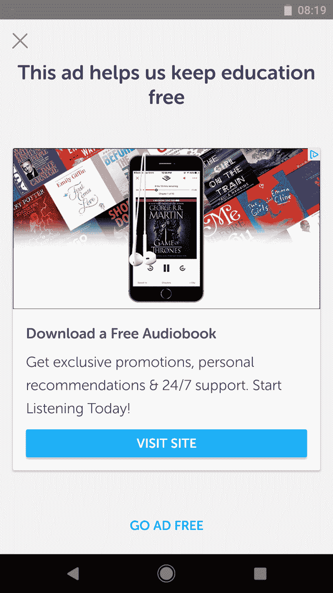

# Duolingo 推出付费订阅，尝试新的服务盈利方式 

> 原文：<https://web.archive.org/web/https://techcrunch.com/2017/04/21/duolingo-launches-paid-subscriptions-as-it-struggles-to-monetize-its-service/>

本周早些时候，广受欢迎的语言学习服务 Duolingo [悄悄在其安卓应用中引入了](https://web.archive.org/web/20221205235529/https://www.duolingo.com/comment/22202238)付费月费。

订阅者有两个好处:他们不会在应用程序中看到广告，他们可以下载课程供离线使用。此外，这也有一个令人感觉良好的方面，因为 Duolingo 强调，Duolingo Plus 的订户(订阅名称)将帮助“全世界数百万人免费学习”。

新的订阅服务可以通过应用内购买，目前每月收费 9.99 美元。它现在在 Android 上直播，将来会在 iOS 上直播。

值得强调的是，这种订阅完全是可选的，公司发言人告诉我，“Duolingo 的学习内容将永远是免费的。”

Duolingo 的一位发言人告诉我，该公司预计在今年年底实现收支平衡(或接近收支平衡)，并且该公司有一个“充分充实的货币化计划”。我们更新了标题以反映这一点。

大约一年前(T1)，Duolingo 首席执行官 Luis von Ahn 宣布，该公司将开始尝试广告和可选的应用内购买，以了解每种方式将如何影响应用的使用和公司的财务健康。当时，von Ahn 说，Duolingo 每天在服务器、员工和其他运营费用上的支出约为 42，000 美元，这个数字在过去一年左右肯定会有所增加。

冯安在本周的声明中写道:“订户将有助于让全世界数百万人免费接受语言教育。”。

教育应用中的广告总是在盈利和用户体验之间进行艰难的权衡，因为默认情况下，它们的设计是为了将用户从应用中带走。冯安也承认了这一点。“我和你一样不喜欢广告，但我们需要测试一下，在一节课结束时，一个非侵入性的小广告是否会让人们少用 Duolingo。(我们知道这将使我们在很大程度上达到收支平衡。)，”他一年前写道。

然而，现在看起来广告不会很快消失，因为看不到广告毕竟是支付 Duolingo Plus 的主要好处之一。

[将 Duolingo 货币化的最初想法](https://web.archive.org/web/20221205235529/https://www.youtube.com/watch?v=WyzJ2Qq9Abs&feature=youtu.be&t=28)是利用其用户的集体智慧来推动翻译服务。然而，[的这项服务在这么多年后仍处于测试阶段](https://web.archive.org/web/20221205235529/https://translations.duolingo.com/)，该公司不再强调它(据我所知，现在甚至没有一个链接指向它的主页)。

https://www.youtube.com/watch?v = wyzj 2 QQ 9 ABS & feature = youtu . be & t = 28

Duolingo 的使命是“向全世界提供免费的语言教育。”在过去的几年里，我和冯安谈过很多次，我知道他对此非常有热情。但与此同时，自 2011 年推出以来，Duolingo 也获得了近 8400 万美元的风险投资——这些投资者肯定希望看到回报。

值得注意的是，Duolingo 在这里的举动与该公司在欧洲最大的竞争对手、总部位于柏林的 Babbel 有点相似。巴贝尔也尝试了广告模式，但发现它无法仅靠广告维持业务。在资金告罄前的最后一分钟，巴贝尔转向了付费模式，如今它拥有数百名员工，并实现了现金流的良性运转。然而，平心而论，它的使命并不是为每个人提供免费的语言教育，所以它有更多的自由来选择。

【T2