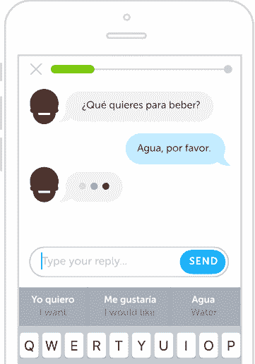

# Duolingo 的聊天机器人帮助你学习一门新语言

> 原文：<https://web.archive.org/web/https://techcrunch.com/2016/10/06/duolingos-chatbots-help-you-learn-a-new-language/>

今天的聊天机器人，在很大程度上，并不是那么有用，但是如果你可以用它们来学习一门新的语言呢？说到学习语言，在对话中运用你所学的知识是非常有用的。但是，如果你在网上学习，你通常没有人可以交谈。这就是为什么 Duolingo 今天在其应用程序中引入了聊天机器人，让你可以进行人工智能驱动的对话。

 这些 Duolingo 机器人目前为想要学习法语、西班牙语和德语的用户服务。该公司承诺将很快增加其他语言。可悲的是，这个功能目前也只在 [Duolingo iPhone 应用](https://web.archive.org/web/20230324011744/http://apple.co/Duolingo)中有效。鉴于机器人的智能驻留在云中，你必须连接到互联网才能使用这项功能。

为了让与机器人的对话更有吸引力，该公司试图赋予不同的机器人一点个性。例如，厨师罗伯特、司机蕾妮和警官阿达。他们会对你的回答做出不同的反应(并在必要时纠正你)，但在大多数情况下，这里的想法是模仿真实的对话。

这些机器人还允许你的答案有一定程度的灵活性，这是大多数语言学习软件根本没有设计的。例如，问候某人有很多方式，但大多数服务通常只接受一个答案。然而，当你完全不知所措时，Duolingo 提供了一个“帮助我回复”按钮，上面有一些建议答案。

“人们学习语言的主要原因之一是进行对话，”Duolingo 首席执行官兼联合创始人 Luis von Ahn 在今天的声明中写道。“学生们通过多林哥掌握了词汇和理解技能，但在现实生活中想出一些东西来说仍然令人生畏。机器人为这种需求提供了一个复杂而有效的答案。”

目前，你只能使用文本聊天来与机器人交谈。不过，随着时间的推移，Duolingo 计划也允许口语对话。