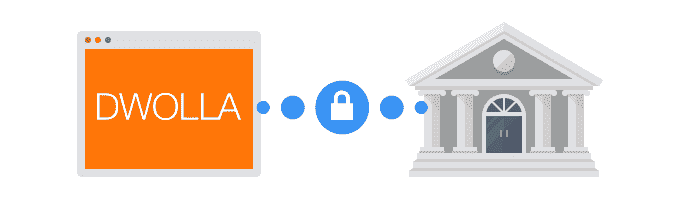
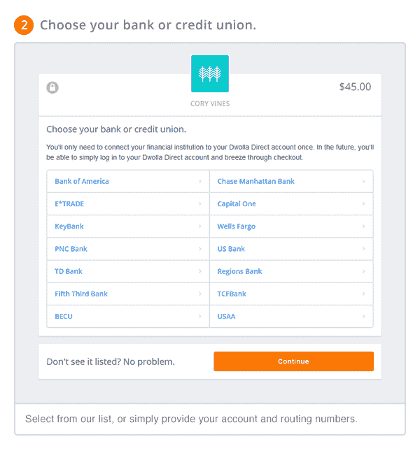

# Dwolla Direct 使使用您的银行账户进行在线支付(并成为 Dwolla 用户)变得更加容易 

> 原文：<https://web.archive.org/web/https://techcrunch.com/2014/06/18/dwolla-direct-makes-it-easier-to-pay-online-using-your-bank-account-and-become-a-dwolla-user/>

支付网络 [Dwolla](https://web.archive.org/web/20221209205819/http://www.dwolla.com/) 一直在试图改变资金的电子流动方式，用服务取代传统的银行技术，例如长达几天的 [ACH 转账过程](https://web.archive.org/web/20221209205819/http://en.wikipedia.org/wiki/Automated_Clearing_House)。但是今天[宣布推出一项名为 Dwolla Direct 的新服务](https://web.archive.org/web/20221209205819/http://blog.dwolla.com/introducing-dwolla-direct/),算是承认了 ACH 交易不会很快消失。

使用 [Dwolla Direct](https://web.archive.org/web/20221209205819/http://blog.dwolla.com/introducing-dwolla-direct/) ，目标是使首次使用 Dwolla 的用户的注册过程更加简单快捷，允许他们从自己的银行账户中汇款，而不必先通过公司网站建立 Dwolla 账户。但随后，这些钱通过“最快的方法”转移，遗憾的是，仍然是 ACH。

如今，许多企业已经允许你从银行账户进行支付，例如，你会在有线电视提供商或移动运营商等大公司的网站上经常看到这一选项。所以 Dwolla 推出的底层技术并不算新。

相反，这里的“新”是注册体验。在此之前，要开始使用 Dwolla，您必须首先使用 Dwolla.com 的网站建立一个帐户，在那里您可以输入您的银行凭证。现在，您将能够在企业网站上进行类似但更简化的帐户设置，然后能够在任何其他支持 Dwolla 的网站或服务上重复使用这些相同的凭据。

然而，这里特别巧妙的是，许多用户甚至不需要提供他们的路由或账号来进行首次支付。相反，由于这一过程现在的工作方式，该公司能够以类似于 Mint.com 的方式验证银行信息——在那里，你只需验证你的银行凭证即可开始。(该公司使用第三方提供商来验证您的银行，这一点它不能透露。如果非要猜的话，我们会猜测它是类似于 Yodlee 或某个竞争对手的东西。)

第一次在受支持的网站上使用 Dwolla Direct 时，您会看到一个可供选择的银行列表，作为必须输入路由和帐户信息的替代方法。然后建立一个 Dwolla ID 和密码，可以在其他支持的站点上再次使用。

该公司今天将这项服务的目标锁定在小企业和非营利组织——否则会使用 PayPal(费用更高)的公司，不得不接受在线信用卡，或者等待邮件中的支票。

Dwolla 表示，目前其平台上有大约 35，000 家中小型企业，以及州政府。事实上，后者是 Dwolla 的一大重点，该公司预计未来几个月将有更多关于政府服务的公告。

Dwolla Direct 将于 6 月 25 日自动向所有之前已经集成了 Dwolla 的用户推出。它将成为其各种集成点的默认体验，包括其[表单构建工具](https://web.archive.org/web/20221209205819/http://forms.dwollalabs.com/)、[购物车插件](https://web.archive.org/web/20221209205819/https://developers.dwolla.com/bd/carts)、[发票选项](https://web.archive.org/web/20221209205819/http://blog.dwolla.com/how-to-send-online-invoices-with-dwolla/)，或 [Dwolla 按钮](https://web.archive.org/web/20221209205819/https://developers.dwolla.com/bd/button)，以及[场外网关](https://web.archive.org/web/20221209205819/https://developers.dwolla.com/dev/pages/gateway) API。