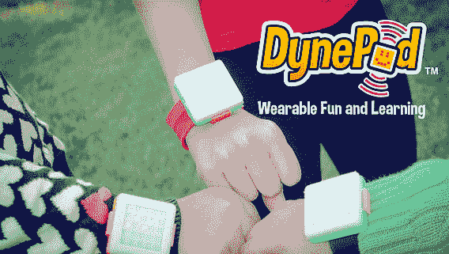
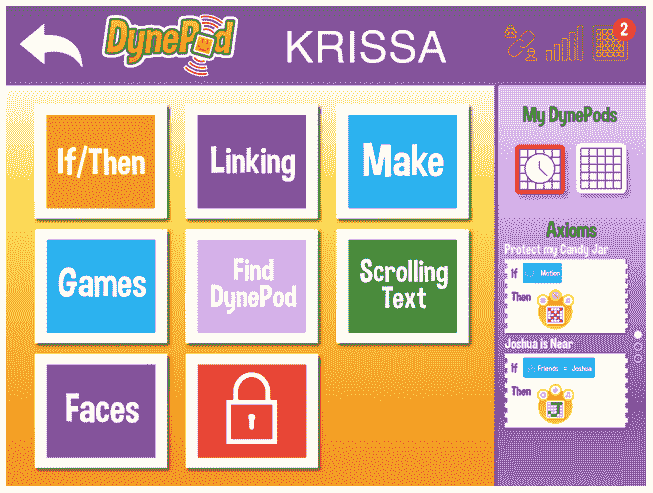
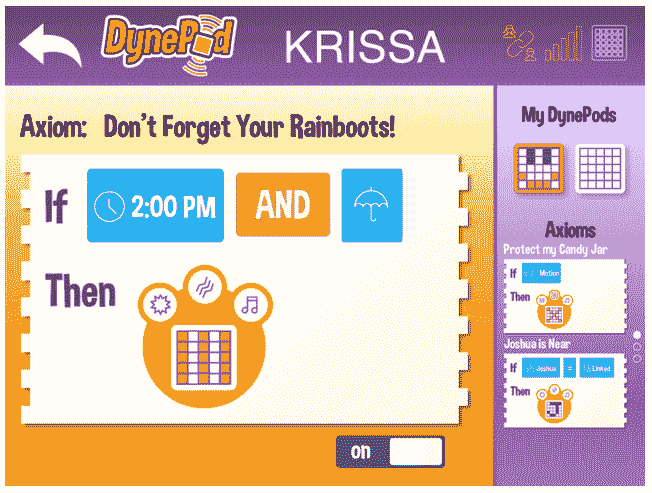

# 这种互联玩具能激励下一代创客吗？

> 原文：<https://web.archive.org/web/https://techcrunch.com/2014/11/15/dynepod-kickstarter/>

不要怀疑麻省理工学院毕业生和 Dynepic 联合创始人 Krissa Watry 的承诺。她曾在美国空军担任首席工程师，设计和制造航空航天硬件，并帮助发射卫星。但是，为 kit destined for space 工作只是她成为企业家的真正梦想道路上的一块垫脚石。

“去太空很酷，但我真的很想开发一种可以改变人们生活的消费产品——这是拨动我心弦、让我每天起床的东西，”她说。“开 Dynepic 真的是我一生的梦想。开发消费产品。”

2011 年，Watry 辞去了在航空航天行业的工作，成立了自己的产品设计公司。DynePic 最初的重点是健身产品，但现在它已经剥离了这项业务(作为 Dynepic Sports)，Watry 和她的联合创始人已经完全转向联网玩具的“硬充电”。

“我真的认为孩子们有一个令人兴奋的未来，我想帮助给他们所有这些使能器，”沃特里说。“对我来说，玩具是我进入工程领域的一大动力。可能不像很多女性，我有很多不同的性别中立、机器人风格的玩具，这确实有助于影响我喜欢什么。”

Dynepic 现在的任务是建立沃特里所说的玩具互联网(或 IoToys)。又名开放平台，允许玩具和各种数字云服务通过开放 API 的力量连接在一起。Dynepic 及其 IoToys 宏伟计划的重点完全放在教育游戏上——通过孩子们使用与基于平板电脑的编程界面相连的物理玩具来学习技术和工程类技能，让他们配置自己的功能，甚至从网上下载内容来扩展他们的游戏。

“我很早就采用了很多联网的物联网技术，比如忍者积木和智能设备。沃特里说:“让我一直困扰的是，这种东西确实存在，但没有人真正接受它。”。“孩子们真的是技术的早期采用者。他们很少提问，而且更好奇。所以我们说，如果我们可以通过收养来教学呢？”

沃特里的联合创始人有早期教育背景。早在 2012 年，两人就获得了国家科学基金会近 20 万美元的资助，用于研究他们的想法，并从南卡罗来纳州研究协会获得了 5 万美元的匹配资金。

为了实现其 IoToys 愿景，Dynepic 一直在开发自己的联网玩具，名为 DynePod，它今天在 [Kickstarter](https://web.archive.org/web/20221006232059/https://www.kickstarter.com/projects/dynepic/738560186?token=47ee1146) 上发布——希望再筹集 3 万美元的众筹资金，将原型变成一个联网玩具，孩子们可以拿到手，用来构建自己的应用程序。Watry 说，这些资金需要用于支付生产成本、儿童安全测试和通过 FCC 的审查，以及最终确定其云 API。

DynePod 既是玩具又是 STEM 技能学习工具的特点并不独特。事实上，最近我们已经看到了大量儿童友好的编码倡议，比如最近的 [Kano Raspberry Pi 驱动的 DIY 计算机](https://web.archive.org/web/20221006232059/https://beta.techcrunch.com/2014/09/27/kano-ships/)，或者 [Tynker iPad 应用程序供儿童学习编程](https://web.archive.org/web/20221006232059/https://beta.techcrunch.com/2014/03/12/with-5m-users-already-on-board-tynker-goes-mobile-to-help-kids-learn-to-code-on-the-ipad/)等等。通过玩小工具来帮助孩子学习技术已经是一个很好的开端，但是提升技能和激励下一代程序员和工程师的任务是一个巨大的任务。

“这里有很多人，”当我指着其他在这里玩的人时，沃特里承认道。“很多人更关注编码本身，所以 Wonder Workshop、以前的 Play-I……tinder bots，甚至 LittleBits。我们试图做的有点不同的是，DynePod 本身是一个独立的设备……(但我们也)致力于建立一个完整的开放平台，允许玩具之间安全地无线连接，然后下载这些云内容——这样我们不仅可以链接到其他玩具，还可以链接到云服务，这样我们就可以下载孩子和父母感兴趣的相关信息，以便他们的孩子学习。”

那么 DynePod 到底是什么？这是一个蓝牙连接的小盒子，顶部有一个 LED 显示屏，内部有一系列传感器，因此它可以检测运动和其他倍增管的接近。可以通过在屏幕上显示特定的图形、振动或蜂鸣来向用户提供反馈。DynePod 可以与一个巴掌带结合起来，让孩子可以穿戴，或者通过一个专用乐高附件的夹子连接到其他物体或玩具上，包括乐高。它使用的包括 Digital 的 BLE 芯片，该芯片托管 Arduino 引导加载程序——所以 DynePod 也是 Arduino 可编程的，提供了额外的技术学习潜力。

根据 Watry 的说法，该设备支持四种基本使用模式:独立模式，因此使用 pod 和平板电脑来创建定制应用程序；或者链接到其他倍增管以与倍增管的其他所有者交流和玩耍；或者可以作为控制器，通过 DynePod app 玩平板游戏；或者是她所谓的全连接播放模式，利用开放 API 将 DynePod 连接到其他各种云服务。显然，最后一部分主要是 DynePod 开发阶段的愿景。

“这只是我们希望连接起来的众多玩具中的第一个。我们的许多玩具，以及许多其他人的玩具。我们的目标是尝试并创造这种开放的环境来连接玩具，并帮助推动智能内容。这正是我们要做的——作为看门人，确保这出戏对我们的孩子来说是安全的。所有这些都是为父母准备的。但有很多人在开发非常酷的学习算法和东西，我们的目标不是全部都做，而是成为连接这些云服务的工具，并帮助他们扩展儿童游戏，”沃特里说。

“现在，孩子们最喜欢的玩具是平板电脑，许多家长抱怨说，他们的孩子被平板电脑缠住了。这很大程度上是因为他们可以控制一个巨大的视觉游戏场。因此，如果我们能让他们更多地控制他们的三维空间，我们相信我们不仅能让他们再次探索他们的世界，还能使用他们需要知道的技术，以便在他们将要成为的劳动力中生存下来，”她补充道。

DynePod 是使用 Dynepic 的 If/then 简化语言在平板电脑上运行的(最初仅适用于 iPad)。沃特里说，这种设计比其他面向儿童的图形编程语言要简单得多，比如麻省理工学院的 Scratch。

“我们的目标是这样的:真正尝试去影响 95%的孩子，他们可能没有完全被技术背景所吸引。她说:“让他们参与进来，这样对所有孩子来说都很容易，对父母来说也很容易，能够与它互动。”。“一年多前，我们首先在课堂上测试了这种语言，然后在公共场合进行了测试，并不断完善界面，使其尽可能简单、直观。”

例如，使用这种 If/then 平板电脑界面，孩子可以编写一个程序，让他们的 DynePod 在检测到移动时发出声音蜂鸣器，以保护他们的糖果罐免受兄弟姐妹的伤害。或者——在未来，当其他服务连接到该平台时——将他们的 DynePod 连接到数字天气服务，以显示明天是否会下雨的视觉通知。

虽然 IoToys 的最初想法来自于 2011 年的 Watry，但她指出，自那以来，可用于驱动它的技术已经发生了很大变化，例如，现在的连接集中在蓝牙低能耗方面，而不是 Zigbee，以及许多其他允许 DynePod 成型的发展。

“与 2011 年相比，这项技术显然发生了很大变化。Zigbee 上有很多东西。然后是蓝牙和蓝牙 le 的移动配对，功耗优势和尺寸下降，然后是 Arduino 操作系统托管在 BLE 芯片上。对我们来说，这是一个很大的推动因素，”她补充道。

如果它实现了融资目标，Dynepic 的目标是明年 6 月向支持者运送第一批 DynePods。DynePod 的 earlybird Kickstarter 价格为 79 美元，其中还包括一个通用安装夹、一个硅胶手环、USB 充电器和一个 3D 可打印文件，用于打印 DynePod 的其他附件。