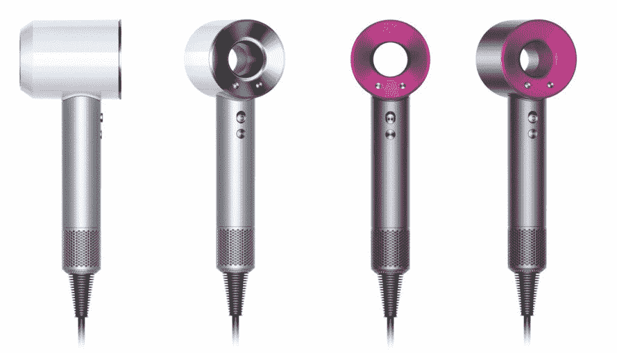

# 一名戴森工程师解释了为什么该公司花费 7100 万美元和四年时间开发一种高科技吹风机

> 原文：<https://web.archive.org/web/https://techcrunch.com/2016/04/28/dyson-supersonic/>

吹风机到处都是。浴室。健身房更衣室。打开你酒店房间的抽屉——嘣，免费吹风机。通常需要很多才能让我真正注意到吹风机。但戴森成功了，所花的只是 7100 万美元和 4 年的开发。

这是一个逻辑进程，真的。在其真空吸尘器、无叶风扇和被不祥地称为“空气叶片”的干手器之间，这家英国公司真的为自己赢得了移动空气的名声，空气叶片使湿气希望它从未被冷凝。

新的[戴森超音速](https://web.archive.org/web/20230407163155/http://www.dyson.com/haircare/supersonic.aspx)将这一知识应用于美容类别，通过公司严格的质量控制进行过滤。对戴森或消费者来说，这种对高端工程的关注并不便宜。当超音速 9 月份上市时，它的售价将达到 400 美元。

我会第一个承认我不是目标受众。我用毛巾或快步走就能很好地擦干身体。我征求了一位长发同事的回应，他对该产品能否完全实现其昂贵的承诺有些怀疑，但补充说，如果它真的像该公司声称的那样安静，对美容院和年幼儿童的母亲有潜在的吸引力。头发湿漉漉的图书馆员也可能加入进来。

戴森对吹干头发的圣杯的长期寻找有助于解释高价标签。正如新品类产品开发主管汤姆·克劳福德(Tom Crawford)告诉 TechCrunch 的那样，“当戴森进入一个新品类时，我们总是会考虑如何让它变得更好。挑战的一部分是确保我们投资于正确的技术并为此进行测试。第一部分是学习头发科学。如何测试，如何使其可重复，然后如何测量。我们建立了自己最先进的实验室，致力于研究头发科学。”

戴森不是在这里瞎折腾~~头发~~。据克劳福德称，该公司仅在发束上就花费了惊人的 4 万英镑(5.8 万美元)。“我们对各种真实的头发类型进行了测试，以便全面了解它的性能，”他解释道。“根据我们所用头发的长度，一根发束的价格在 12 英镑到 20 英镑之间。平均而言，戴森的工程师每次测试使用 40 根发束——也就是说，一次测试需要 780 根发束和 640 英寸长的头发。

https://www.youtube.com/watch?v=qw6iillnXbk

对于很多头发来说这是很多钱。但他坚持认为，该空间早就应该进行彻底检查了。

克劳福德说:“传统的吹风机设计已经 60 多年没有改变了。传统的吹风机通常有大型马达，而且因为尺寸的关系，它们必须放在机器的头部。因此，它们可能体积庞大，并且可能在极端温度下鼓风，所有这些都有头发被吸入过滤器并被截留的风险。我们专门为这台机器制造了一台戴森数字马达 V9。”

有时候吹风机不是吹风机。嘿，如果美国国家航空航天局不那么执着于去无聊的旧月球，我们就不会有记忆泡沫或冻干冰淇淋。

“戴森将一直投资新技术，即使我们还不确定它们的应用。Crawford 解释说:“有时，我们会看到一些技术在一个应用程序中发挥作用，并想知道这是否可以解决另一个应用程序中的问题。

“我们的 Airblade 技术就是这样诞生的。戴森的工程师们正在探索用气刀使用我们的数字马达的新方法——迫使高速空气通过微小的孔。它不起作用。但后来有一天，有人的手碰巧湿了，气刀把它干得很漂亮。我们的电机技术与其他突破性技术相结合，帮助我们创造了第一台吹风机。想象一下五年后它会创造出什么。”

不管是什么，潮湿显然是不可能的。