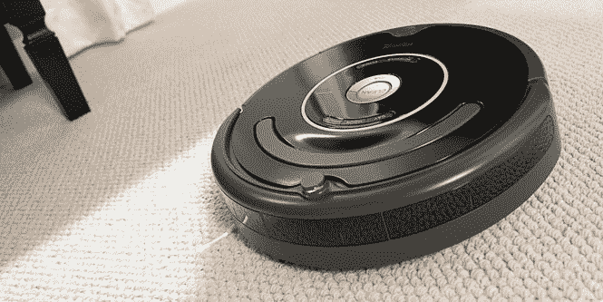

# 戴森的新玩笑话解释了他们为何在机器人上花费如此之多 

> 原文：<https://web.archive.org/web/https://techcrunch.com/2014/08/28/dysons-new-teaser-explains-why-theyve-been-spending-so-much-on-robots/>

# 戴森的新玩笑话解释了为什么他们在机器人上花了这么多钱

【YouTube https://www.youtube.com/watch?v=L6ReNFlxqJc&w=854&h=510]

戴森正在为 9 月 4 日发布一项重大公告，它发布了一个新的视频预告，让人们思考可能会推出什么。该视频显示了从一个特别广角的镜头视角看到的一个实验室，以及快速爆发的示意性图像，这有点像机器人真空设计，视频中甚至描绘了一个圆形设备在地板上滚动。

戴森还没有确切说明“N223 项目”是什么，但该公司已经在机器人技术上投入了大量资金。早在二月份，我们就报道了其对机器人视觉研究的 500 万[(超过 800 万美元)投资，该研究由伦敦帝国理工学院进行。甚至在这笔投资之前，戴森已经参与了一个为期 15 年的项目，研究允许机器人设备查看和分析周围环境的系统，这对机器人真空硬件有明显的好处。](https://web.archive.org/web/20221206115958/https://beta.techcrunch.com/2014/02/10/dyson-puts-5m-into-robotics-vision-research-with-imperial-college-london/)

iRobot Roomba 650，戴森可能会抢先一步。

机器人真空领域的先驱包括 iRobot，它创造了 Roomba，但看看世界上最好的真空制造商能提供什么样的产品，特别是考虑到他们给传统真空带来的创新，应该是令人兴奋的。当然，理论上这仍然可能是一个机器人管家或其他东西，但至少我们不必在悬念中等待太久。