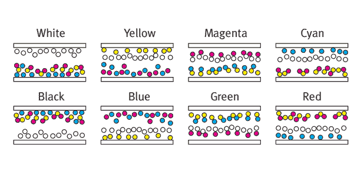

# 电子墨水给电子纸带来了丰富的色彩，但却没有给电子阅读器带来色彩 

> 原文：<https://web.archive.org/web/https://techcrunch.com/2016/05/24/e-ink-brings-rich-color-to-epaper-but-not-to-e-readers/>

# 电子墨水给电子纸带来了丰富的色彩，却没有给电子阅读器带来色彩

E Ink 是许多电子阅读器中使用的 ePaper 显示器的制造商(一句话中有三个不同的 e 前缀令人恼火，但这是不可避免的)，它宣布了一种全新类型的反射显示器，可以显示大量的颜色——但这项技术目前只能作为标牌使用。

彩色反射显示器并不新鲜，但是这些年来被吹捧的技术都不够用。就个人而言，彩色电子阅读器似乎总是被淘汰，当你的竞争对手是精美的杂志和儿童书籍时，这就不好了。

E Ink 的[高级彩色 ePaper](https://web.archive.org/web/20221025223354/http://www.businesswire.com/news/home/20160524006209/en/Ink-Announces-Advanced-Color-ePaper-Breakthrough-Technology) 可以产生 32，000 种颜色，与其他一些电泳显示器不同，每个像素都包含了制造每种颜色所需的所有颜料。这是一个重大的工程挑战，比单色显示器更大。“需要许多材料和波形发明来独立控制多种颜色颜料的位置，”E Ink 的新闻稿中写道。

图表显示了微小的彩色颜料如何产生各种色调。

这提高了分辨率、对比度和整体显示质量——但目前 E Ink 只制造了 20 英寸对角线和 2500×1600 像素的面板。颜色也仍然是柔和的，正如你在 [SlashGear 的特写镜头](https://web.archive.org/web/20221025223354/http://www.slashgear.com/e-inks-color-epaper-up-close-24441401/)中看到的。对于商店的标牌来说很棒，但每英寸 150 像素，它经不起仔细检查——比如说，作为一个电子阅读器。

也就是说，早期的电子阅读器在分辨率或对比度方面都不是很好，自那以后它们已经取得了很大的进步。这是第一代 ACeP 技术，也是第一款真正有前途的彩色电泳显示器。E Ink 的一名代表表示，它仍处于 R&D 阶段，应该可以在两年内投入生产。

ACeP 和许多其他新奇的显示解决方案目前正在旧金山的[显示周](https://web.archive.org/web/20221025223354/http://www.displayweek.org/)展出。