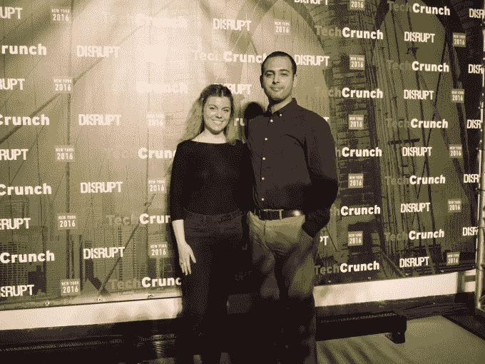
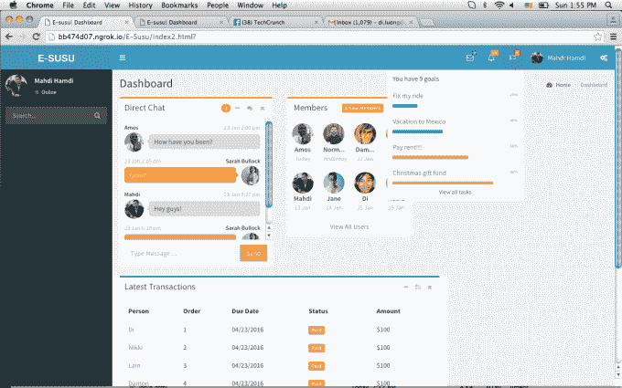

# E-susu 旨在缩小社区贷款团体和传统银行服务之间的差距 

> 原文：<https://web.archive.org/web/https://techcrunch.com/2016/05/08/e-susu-aims-to-close-the-gap-between-community-loan-groups-and-traditional-banking-services/>

今天在 TechCrunch Disrupt New York 2016 上展示的一个有趣的黑客是一个非传统银行服务平台。这款名为 e-susu 的应用程序是为参与非正式贷款团体的人设计的，旨在帮助他们更好地管理家庭或社区团体内的贷款过程，并通过增加透明度来鼓励储蓄过程。

该平台让用户可以跟踪集团内的欠款数额、付款到期时间以及付款时间。用户还可以创建目标来指定他们存钱的目的，还包括一个群组消息功能，同时该团队计划在未来将支付能力直接集成到平台中。

23 岁的团队成员尼基·帕克特(Nikki Puckett)指出，几个世纪以来，各种文化都有某种形式的非正式团体贷款，以提供传统银行服务的替代品。她在不参加科技黑客马拉松时从事金融工作。这些贷款团体的名称在不同的国家有所不同，但 susu 就是一个例子——因此这款应用被称为 e-susu。

“有时人们可能会因为参与其中而惹上麻烦，因为如果他们在工作，他们在收钱，这可能会被视为非法行为。这消除了风险，并将其带到在线平台，将所有内容放在一个位置，所有团队成员都确切知道发生了什么。因此，我们试图创建一个易于访问的平台，”帕克特告诉 TechCrunch。

“社区参与银行服务……但其中很多是非传统的。因此，我们试图通过采取一些已经完成的事情来弥合这一差距，只是让它更加可见，让你可以指着它说，现在我可以建立信用，因为看看我在这里的历史。”

“你可以去银行，说我们参加了一个储蓄项目，”她补充道。

Puckett 负责团队的核心概念和业务规划，并在舞台上展示 e-susu hack。

该团队的另一名成员、28 岁的 full stack 开发者马赫迪·哈姆迪(Mahdi Hamdi)认为，除了为被排除在银行信贷之外的人群提供服务之外，该平台还可能对年轻人有更广泛的吸引力——因为他认为千禧一代不信任传统金融机构。

“我认为千禧一代正在改变和更新一切。他告诉 TechCrunch:“现在的旅游业，人们不想去酒店，他们想和当地人呆在一起，即使是金融业——我听到的令人震惊的统计数据是，73%的千禧一代更喜欢去看牙医，而不是去银行。”“和这些正规的金融机构在一起，我们真的没有安全感。”

该团队表示，他们计划继续开发该应用程序——最初是在之前的黑客马拉松上提出这个概念的。TC Disrupt NY 是这对搭档的第二次黑客马拉松。

