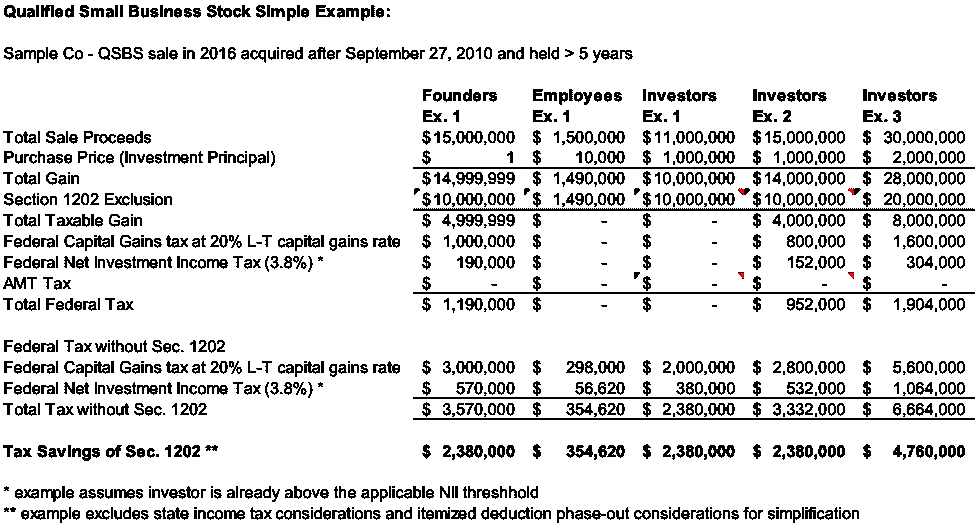

# 对企业家和个人投资者来说，早期投资变得更有吸引力了 

> 原文：<https://web.archive.org/web/https://techcrunch.com/2016/01/25/early-stage-investing-for-entrepreneurs-and-individual-investors-just-got-a-whole-lot-more-attractive/>

艾伦·帕特里科夫撰稿人

12 月 18 日，星期五，国会通过了[路径法案](https://web.archive.org/web/20221206195409/http://docs.house.gov/billsthisweek/20151214/121515.250_xml.pdf)(保护美国人免受增税)，这是一项价值 1 万亿美元的法案，作为 887 页的综合法案的一部分，即使是最精明的人也难以理解，更不用说华盛顿的许多人了。

尽管如此，第 813 页第 126 节提到了一个现已成为税法永久组成部分的特征——对于创业者和其他为初创公司和处于早期发展阶段的公司融资的个人，以及风险投资基金的普通合伙人和个人投资者来说，这是一个好消息。这是国会鼓励长期投资兴趣的一部分。

这一变化将对作为美国经济命脉的企业家产生重大影响。这项新法规将使公司创始人和持有股票(包括通过行使期权获得的股票)的员工在公司成功清算后节省高达数百万美元的税款。

冒险的企业家和投资者通过创业创造就业机会，他们的努力将得到回报，税收负担将减轻。在这种情况下，破坏性创新是一行税务代码而不是软件代码。

被称为 Sec。1202，这是一个小企业股票资本利得排除法，实际上从 1993 年就存在了(多年来有所修改)。但由于国会最近投票永久延长一些主要税收优惠，它比以往任何时候都更强大，因为它消除了所有的模糊性。

本质上，Sec。1202 允许个人投资者或企业家及其员工在股票发行之前和之后立即向总资产不超过 5000 万美元的合格公司投资，并且不参与回购任何已发行股票，现在可以享受特定投资收益的 100%税收减免，而不会抵消替代最低税(AMT)的好处。

投资必须至少持有五年。某些语言通常被插入被投资公司的购买文件中，以证明它在投资时是合格的小企业股票(QSBS ),并且它将继续保持 QSBS——这并不难实现。

对于创始人或投资初创企业的个人来说，这意味着什么，无论怎么强调都不为过。仅在 2014 年，就有 1，635，000 家公司向美国国税局申报了总资产不到 5000 万美元的纳税申报单。

根据 [PitchBook](https://web.archive.org/web/20221206195409/http://files.pitchbook.com/pdf/2015%20Annual%20U.S.%20Venture%20Industry%20Reporthej.pdf) 的数据，每年有 1-3，000 家公司从风险投资公司获得启动资金。根据[新罕布什尔大学风险研究中心](https://web.archive.org/web/20221206195409/https://paulcollege.unh.edu/sites/paulcollege.unh.edu/files/webform/2014%20Analysis%20Report.pdf)的数据，平均每年有 70，000 家公司通过天使网络融资——如果不是大部分的话，其中很多都符合 Sec 的条件。1202 治疗。

> 山姆大叔给早期投资者和创始人扔了一块大骨头。

这些组织中的每一个都有多名员工和投资者，他们也将从中受益。随着 Sec 的增强。1202，它还有进一步的好处—不要太专业，但非常重要—能够利用 Sec。1045，允许一个人保护出售证券交易委员会的收益。1202 股票，如果在 60 天内，它被再投资到另一个 QSBS 股票，从而开始一系列无限期推迟收益。因此，这种结合可以为公司稳固地建立起 QSBS 的地位。

此外，虽然在一个典型的风险资本基金中，大多数(但不是全部)参与者是养老基金、捐赠基金和其他不受任何税收约束的机构，但几乎同样重要的是投资于这些基金的个人，包括这些基金的普通合伙人，他们通常贡献基金总资产的 2%至 10%。

秘书 1202 规定，个人可以免税的收益金额是投资的 10 倍或基金所做的每笔特定合格投资的 1000 万美元，以较大者为准。分散到多项投资中，免税收益可能是巨大的。

Sec 的影响。对于一个创办公司的企业家来说，1202 可能意义深远。如果一个企业家按照 Sec 的要求组建和经营他或她的公司。未来的税收节省可能高达 240 万美元，或者对投资者来说更多(见文章末尾的图表)。

考虑一个企业家，他创建了一家公司，并在公司成立时利用 Sec 以 1 美元的价格购买了他或她的股权。1202，而不是简单地授予他们自己，这在公司成立时是司空见惯的。

例如，如果公司在五年后以 6000 万美元的价格被收购，在从投资者那里筹集外部资本后，创始人在收购时拥有公司 25%的股份，他或她将从出售中获得 1500 万美元的总收入。通常情况下，他或她的所有 1500 万美元的收入都要缴纳长期资本利得税，总税负约为 360 万美元。

然而，如果该公司的股票符合美国证券交易委员会。1202，这些收益中的 1000 万美元是免税的，从而将应纳税收益总额减少到 500 万美元。考虑到 20%的长期资本收益和 3.8%的联邦净投资所得税，联邦税收总负担约为 120 万美元。我们精明的创始人利用 Sec 节省了 240 万美元的税款。1202!

为了便于演示，这个例子假设创始人没有将他或她自己的任何资本投资到企业中——如果他们投资了，所涉及的税收节省可能要大得多。同样的待遇也适用于行使合格股票期权的员工。

> 在这种情况下，破坏性创新是一行税务代码而不是软件代码。

第 1202 条款对我来说有着特殊的意义，因为我是一个全国性组织的成员，这个组织在 20 世纪 90 年代早期创建了一个名为“克林顿-戈尔企业家”的组织，当时比尔·克林顿正在竞选总统。我们代表小企业提出了一些税收激励的建议；通过这些努力，Sec。1202 诞生了。

但是随着时间的推移，人们不再关注这项规定。除其他事项外，国会通过了侵蚀 Sec 的各种税收方案。1202 的优势，尤其是与 AMT 限制相关的优势。但是现在，由于国会通过的一项早期法案，Sec。1202 不再被视为 AMT 多功能体适一体机的“特殊选择”。

可以肯定的是，我们确实在早期投资中看到了很多损失，大多数时候投资在五年前就被出售了——这是 Sec 的另一个方面。1202，国家风险投资协会正在努力让国会考虑改变，除了建立严格的资格规则，以避免失误。

如果一个人足够幸运，能够创办或参与成功的公司，山姆大叔已经通过 PATH 法案向早期投资者和创始人扔出了一块巨大的骨头。希望随着小路的通过。更多的个人，包括创始人、天使投资人、众筹者、员工和风险投资家，将会更加努力地考虑 Sec。在完成投资前，1202 受益于他们的律师或会计师，看看它是否合格。

