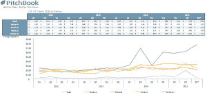

# 早期投资者踩刹车

> 原文：<https://web.archive.org/web/https://techcrunch.com/2015/09/28/early-stage-investors-apply-the-brakes/>

6 月，Union Square Ventures 的弗雷德·威尔逊(Fred Wilson)写了一篇被广泛阅读的帖子，该帖子使用了库利律师事务所的数据，用威尔逊的话说，该数据显示，种子和首轮交易“或多或少是健康的”，而 B 轮交易“变得过热”，C 轮及以后的交易“疯了”

市场研究公司 Pitchbook 的新数据显示，情况似乎正在发生变化。种子和首轮交易不仅仅是健康的。他们慢下来了。很多。

根据这些数字，投资者在第二季度的 115 笔交易中向早期创业公司投入了 19.5 亿美元。截至周五，我们已经看到第三季度的 66 笔交易中投资了 3 亿美元，剩下的时间不多了。该季度于周三结束。

导致投资者减少交易的因素可能有很多。美联储[可能会在年底前提高利率](https://web.archive.org/web/20230325184905/http://www.bloomberg.com/news/articles/2015-09-28/fed-s-dudley-says-u-s-on-track-for-2015-interest-rate-increase)，这可能会刺激新的创业投资者在固定收益或派息股票中寻找更确定的回报，并将他们转向风险更高的私募市场投资。

中国动荡的市场——8 月下旬，它出乎意料地也短暂拖累了美国市场[——可能也在发挥作用。](https://web.archive.org/web/20230325184905/http://www.wsj.com/articles/u-s-stocks-set-to-tumble-again-as-global-market-selloff-continues-1440418890)

正如风险投资家布莱恩·欧玛利在那次可怕的暴跌之后告诉我们的，当前的市场已经变得“可怕”。我们对需要融资的公司进行了大量投资，我认为全球市场开始发出足够多的信号，在某个时候，它必须影响私营部门。”

当市场波动袭来时，正如我们最近与杰克逊广场风险投资公司(Jackson Square Ventures)的风险投资家格雷格·格雷特奇(Greg Gretsch)交谈时指出的那样，“两个最快分散到山里的群体是后期投资者和天使投资者”。“观察一段时间后，市场对天使投资者的兴趣是否会下降，这可能会很有趣，”他补充道。

在上周的 TechCrunch Disrupt 上，早期投资者表示，事实上，他们开出的支票越来越少了，尽管他们列举了不同的原因。

Cowboy Ventures 的联合创始人艾琳·李(Aileen Lee)表示:“今年，我们的投资速度有所放缓，部分原因是，根据我们的分析，这些年有许多新想法和重大变化出现在新行业。“我觉得去年和前年是新想法诞生的好时机。今年，我们没有看到这么多。”

与此同时，Greycroft Partners 的联合创始人达纳·德安特(Dana Settle)告诉观众，她对过高的估值越来越警惕。

尽管种子阶段的交易“当你看到系列和 B 轮估值时并不疯狂，”Settle 说，但有很多理由暂停。正如她解释的那样:“当你回顾 2012 年到今天，融资前的估值基本上翻了一番。这对整个生态系统来说是不健康的……(当)你坐下来，看着(当前)平均 A 轮估值为 2000 万美元，B 轮估值为 4000 万美元，然后看着过去 30 年的平均退出额，90%以上的退出额约为 1 亿至 1.25 亿美元，当你加入风险时，数学变得很难。”

Haystack 的创始人 Semil Shah 说，这也可能是涓滴效应，Haystack 是一个活跃种子阶段的微型基金，像大多数公司一样，它与现有和潜在的投资者保持着联系。“许多(为风险基金提供资金的机构和个人投资者)已经推迟做出承诺，因为他们受到资本市场的影响，”当投资者的投资者开始紧张时，给初创公司的支票往往会减少。

当然，另一种可能仅仅是时机。夏天意味着假期，交易往往会在第三季度下滑。然而，有趣的是，正如你在 Pitchbook 下面的图表中所看到的，近年来情况并非如此。

请亲自查看，并告诉我们您的想法。

[这里的](https://web.archive.org/web/20230325184905/https://drive.google.com/file/d/0B6iN8SvXQGKYLTlkMTFtcDJCZ1U/view?usp=sharing)是电子表格的链接。

*【披露:沙阿是这位编辑创办的初创公司 StrictlyVC 的顾问委员会成员。]*