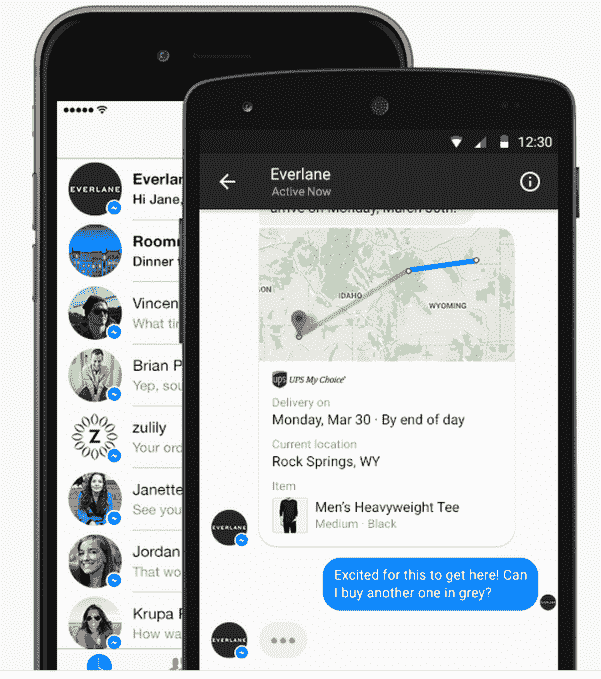
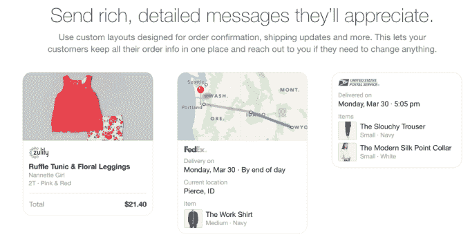

# 脸书利用 Messenger 和 WhatsApp 赚钱的剧本

> 原文：<https://web.archive.org/web/https://techcrunch.com/2015/07/29/ease-them-into-it/>

拥有 7 亿 Messenger 用户的投资者渴望看到脸书在这个平台上赚钱。但是扎克伯格今天在 Q2 收益电话会议上给这些预期踩了刹车，他解释说 Messenger 和 WhatsApp 将会像脸书和 News Feed 一样运行相同的盈利剧本:在你让公司付费接触客户之前，让人们与企业进行有机互动。

以下是扎克伯格的计划:

“如果你回到 2006 年和 2007 年，有很多人鼓励我们在体验中加入横幅广告和无机内容，”扎克伯格说。“我们的结论是，从长期来看，如果使用产品的人和企业之间有一个有机的互动，广告和货币化将会表现得更好。”

因此，脸书推出了 Pages，允许企业在社交网络上建立免费的存在。它要求用户订阅他们关心的企业的新闻，并提供洞察分析，以便公司可以跟踪他们页面的影响。一旦人们习惯了 feed 中的企业，它就开始慢慢地让企业付费，以扩大“赞助故事”对那些朋友与他们的品牌有过互动的人的影响。最终，它推出了更灵活的新闻提要广告，最近又推出了自动播放视频广告。

如果它直接跳到华丽的横幅广告或付费广告，用户可能会犹豫，放弃新闻订阅，脸书可能会毁了它未来的收入引擎。相反，随着时间的推移，使用率不断增长，金钱也随之而来。

扎克伯格想在 Messenger 和 WhatsApp 上做同样的事情。

当然，企业会喜欢单方面直接向用户发送信息，因为对 Messenger 和 WhatsApp 的参与度和关注度非常高。但这可能会阻碍脸书聊天应用的快速增长。

相反，它正在努力慢慢允许用户自愿通过其聊天应用程序与企业互动。

Messenger 最近推出了一个应用和游戏平台。在信使上的[商业项目](https://web.archive.org/web/20230326053751/https://www.messenger.com/business)[在 F8](https://web.archive.org/web/20230326053751/http://digitalmediatecs.com/facebook-f8-announcements/) 首次亮相，并正在慢慢推出，允许用户在通过信使而不是通过电子邮件进行电子商务购物后选择获得[客户支持。WhatsApp 已经允许企业设立账户，向联系他们的人发送内容或营销信息。](https://web.archive.org/web/20230326053751/https://techcrunch.com/2015/03/25/facebook-launches-messenger-platform-with-content-tools-and-chat-with-businesses/)

做得好的话，用户会很乐意通过聊天与企业互动，然后 it 就可以开始向品牌收费。扎克总结了这一论点，要求华尔街保持耐心，他说:“长期的赌注是，通过让人们与企业进行良好的有机互动，这最终将大大增加货币化的价值。”

本质上，如果它仍在快速增长，不要用货币化来扼杀它。

这个计划对脸书非常有效。数以亿计的人迷上了新闻提要，并在该公司在提要中插入广告之前开始订阅页面。现在[每季度收入超过 40 亿美元](https://web.archive.org/web/20230326053751/https://techcrunch.com/2015/07/29/facebook-earnings-q2-2015/)。同样的策略可以让使用脸书的即时通讯应用和与那里的企业交谈成为体验的一部分。然后它可以开始从聊天中榨取金钱。