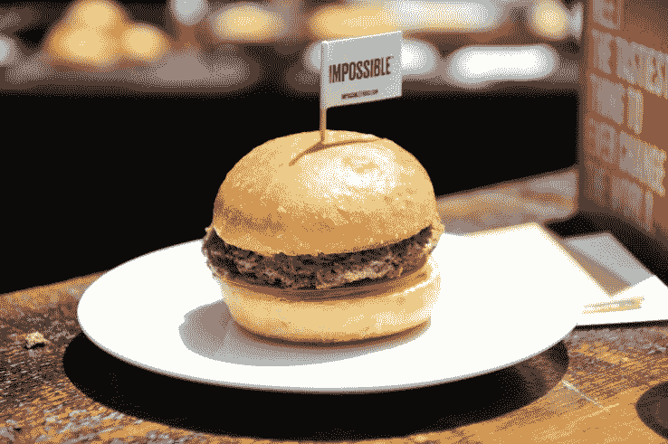

# 吃由桃福的常伟 制作的来自植物的不可能的汉堡

> 原文：<https://web.archive.org/web/https://techcrunch.com/2016/07/26/eating-the-plant-derived-impossible-burger-cooked-by-momofukus-david-chang/>

O

在一个随机的早晨，如果你被邀请去看常伟:厨师，个性和 Momofuku 餐馆的老板做一个“植物制成的肉汉堡”——你去。

这里有一些背景故事:Patrick Brown 领导的 Impossible Foods——一位在斯坦福大学工作了 25 年的生物化学教授——在五年的时间里投入了 8000 万美元进行研究，开发出一种不含有害防腐剂的出血性植物基芝士汉堡。

有什么问题吗？除了尝起来和操作起来像真牛肉之外，消费者的花费不能比你在全食超市或乔氏超市找到的有机碎牛肉贵。布朗确实有计划让它像超市级牛肉一样便宜，但这只有在品牌成功的情况下才有可能，当然，还有消费者接受肉饼。

## **味道怎么样？**

> [不可能的汉堡](https://web.archive.org/web/20230407045823/https://www.facebook.com/techcrunch/videos/10154474456797952/)
> 
> 吃由桃福的 http://tcrn.ch/2av1C3s 常伟制作的来自植物的不可能的汉堡
> 
> 由 [TechCrunch](https://web.archive.org/web/20230407045823/https://www.facebook.com/techcrunch/) 于 2016 年 7 月 26 日星期二发布

简短的回答是:非常好。

> 这些听起来都很棒，但是问题开始堆积:它是由什么制成的？

美食家的冗长回答:到目前为止，没有什么比这种由植物制成的汉堡更接近真正的汉堡了。

我想消除那种感觉就像你在吃夹在两片面包中间的蔬菜馅饼的想法。相反，你吃的是温热的东西，有着你所期待的真正牛肉的棕色和质地。这在一定程度上要归功于一种叫做“血红素”的分子的发现，这种分子赋予了真正的肉“外观”，而且这种分子在动物中比在植物中更普遍，这使得再造更具挑战性。

四分之一磅的肉饼很结实，有足够的味道来代替一块未调味的牛肉，烹饪到大约全熟。食客可以点一个厚一点的汉堡，烧到半熟、半熟、全熟等等。

这些听起来都很棒，但是问题开始堆积:它是由什么制成的？

事实证明，肉饼中的大部分成分，像土豆蛋白、用于质地的黄原胶、水、质地小麦蛋白、椰子油和其他“天然香料”，在许多专业厨师的厨房中都可以找到。因此，据布朗和他的同事说，它不是由任何可耻的东西制成的，比传统的牛肉含有更多的蛋白质和更少的热量。

> 还有，“实验室肉”是怎么保存的？

据 Chang 自己说,“不可能的汉堡肉”的处理方式和其他易腐肉类一样:从生产基地运到，冷藏，再卸到，然后小心处理。值得注意的是，肉饼也可以冷冻保存，然后烹饪和食用。

快进五年的发展，烹饪界开始注意到:常伟已经批准，将他自己版本的“不可能的汉堡”添加到西山丽的菜单上。这种植物汉堡从明天开始出售，配薯条售价 12 美元。