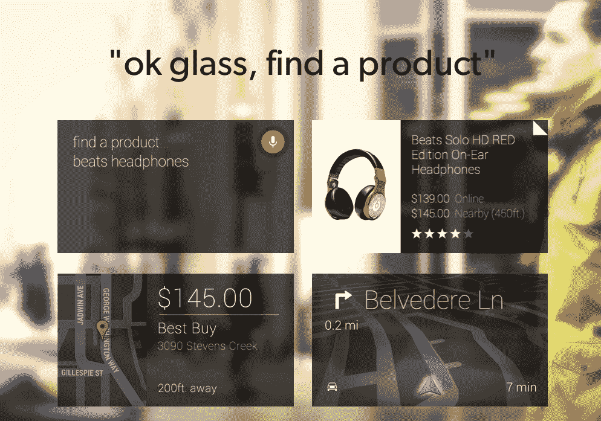

# 对于谷歌眼镜的首次尝试，EBay 改编了其 RedLaser 产品搜索应用 

> 原文：<https://web.archive.org/web/https://techcrunch.com/2014/07/22/ebay-google-glass-redlaser/>

早在 2013 年 3 月，[易贝](https://web.archive.org/web/20221206073055/http://ebay.com/) [表示](https://web.archive.org/web/20221206073055/http://www.reuters.com/article/2013/05/16/us-ebay-google-glass-idUSBRE94F1D920130516)将开始为[谷歌眼镜](https://web.archive.org/web/20221206073055/http://www.crunchbase.com/product/google-glass)开发应用程序——其想法是，安卓系统的头戴式电脑可以帮助消费者在网上和现实世界中更无缝地购物，而不是拿出你的智能手机(更不用说一台成熟的电脑)。

一年多后的今天，这家电子商务巨头推出了它的第一项努力:红色激光条形码扫描应用程序的[眼镜优化版本，人们可以在网上和本地搜索产品，使用语音和图像识别激活。玻璃工可以在这里](https://web.archive.org/web/20221206073055/http://redlaser.com/glass)下载应用[。](https://web.archive.org/web/20221206073055/https://glass.google.com/u/0/glassware/4359753993605872520)

该项目来自易贝的创新和新风险实验室，副总裁 Steve Yankovich 将其描述为专注于“零努力商务理念的登月计划”，他指的是减少(甚至完全消除)购买所需点击的新服务。

已经有许多其他的谷歌眼镜应用程序宣布，在利用头戴式设备进行商业活动。一款名为 Eaze 的软件让用户“[点头支付](https://web.archive.org/web/20221206073055/https://beta.techcrunch.com/2014/05/16/new-google-glass-app-lets-you-nod-to-pay-with-bitcoin-will-add-dollars-this-summer/)”来完成交易，它甚至声称激起了易贝子公司 PayPal 的兴趣。

但是像易贝这样的商业巨头涉足新技术的意义是对市场的一个信号。谷歌眼镜可能仍然是一个非常新生的概念(只有大约 10，000 台在外面，甚至那些还没有被普遍接受，甚至被一些人嘲笑)。

这是一个迹象，表明它如何吸引了最大的玩家的注意力，他们认为它和其他可穿戴设备(包括连接你自己的眼镜的方式)将成为未来商业服务开发和使用的一部分。

你可能还记得，RedLaser 是一款智能手机条形码扫描应用，易贝[于 2010 年从一家名为 Occipital](https://web.archive.org/web/20221206073055/https://beta.techcrunch.com/2010/06/23/ebay-acquires-barcode-scanning-iphone-app-redlaser/) 的初创公司收购了该应用。RedLaser 随后通过收购另一家易贝公司 [Milo](https://web.archive.org/web/20221206073055/https://beta.techcrunch.com/2010/12/02/confirmed-ebay-acquires-milo-for-75-million-investors-make-a-killing/) ，进一步加强了定位搜索。

RedLaser 已经有了针对 [iPhone](https://web.archive.org/web/20221206073055/http://itunes.apple.com/us/app/id474902001?ls=1&mt=8) 、 [Android](https://web.archive.org/web/20221206073055/https://play.google.com/store/apps/details?id=com.ebay.redlaser) 和 [Windows Phone](https://web.archive.org/web/20221206073055/http://www.windowsphone.com/en-US/apps/8fbeb777-a17c-4afd-b880-deac88ed86ca) 的应用。易贝并未披露 RedLaser 迄今已积累了多少用户，但其对基本网站以外应用的关注，反映在消费者对易贝的使用上。该公司在本月的 Q2 财报中称，59%的易贝消费者在多个屏幕上购物。

虽然总是有一些令人兴奋的前沿新技术，但这里也有一个非常实际的商业目的。

Yankovich 在一次采访中告诉我，“我们发现，在手机上，任何时候减少摩擦都会增加交易。”这就是可穿戴设备发挥作用的地方，它甚至比智能手机更自然地出现在你的身上。“每次一款可穿戴产品出现，我们都必须关注它，”他说，即使它是新的东西，可能不会成为大众市场产品。“你甚至不知道这是否会成为商业工具，但我们必须尝试。”

RedLaser 谷歌眼镜应用程序有两个组成部分:第一个是用户在激活 RedLaser 应用程序后，只需说出产品的名称就可以找到它。(“OK 玻璃。找个产品。”)

另一条可能更精确的路线是命令谷歌眼镜扫描你面前产品的条形码。(OK 玻璃。扫描条形码。”)然后，像其他 RedLaser 应用程序一样，这将触发附近其他可以购买该产品的地方的列表，或者如何在线找到它的列表。

目前，RedLaser Glass 应用程序上没有直接购买功能。事实上，这些商务应用几乎没有任何盈利元素。一位发言人告诉我，一些现有的 RedLaser 关系将扩展到玻璃。(例如，百思买与易贝合作，在 RedLaser 上创造特殊的店内体验，这将扩展到眼镜领域。)

Yankovich 称支付为商业技术的“圣杯”,他说这将是未来的一步，但不是现在。

“支付最困难的部分是 RedLaser 在这方面是不可知论者，”他说。“不管有什么样的支付方式，我们都会把用户送到零售商那里。”除此之外，其他类型的移动支付也面临同样的问题:零售商的“管道胶带”传统基础设施，以及消费者使用什么东西最简单、最安全的问题。“消费者会摸自己的镜架吗？他们会说些什么吗？你仍然必须想知道人们实际上想要做什么。”

支付是这些可穿戴设备新应用的一个发展方向；但另一个原因是他们在其他方面变得更加复杂。Yankovich 暗示，易贝正在密切关注的一个领域是图像识别。

他说:“实现图像识别会更加困难，因为现在的相机性能还不够好。”。“但那可能是下一步。很快就会有改进的硬件，这将刺激某种进化，我们将对此做出反应。我们将利用这些产品。”