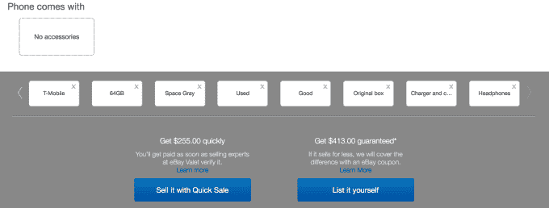

# 易贝推出名为“快速销售”的智能手机折价网站 

> 原文：<https://web.archive.org/web/https://techcrunch.com/2016/09/12/ebay-launches-a-smartphone-trade-in-site-called-quick-sale/>

由于上周宣布推出新款 iPhone 7 和 iPhone 7 Plus，易贝今天将推出一项新计划，旨在利用大量老款 iPhone 和其他移动设备进入转售市场。这个名为“[快速销售](https://web.archive.org/web/20221205230914/http://www.ebay.com/s/quicksale/phone)”的新项目由易贝代客服务公司提供支持，这项服务是易贝将消费者与超级卖家配对，超级卖家为你处理网上销售的麻烦，包括拍照、写清单、处理付款和将产品运送给买家等。

从今天开始，想知道他们的旧手机值多少钱的消费者可以前往[快速销售网站](https://web.archive.org/web/20221205230914/http://www.ebay.com/s/quicksale/phone)获取报价。然后，他们会收到一份基于设备品牌、型号、运营商、容量、颜色和状况等细节的报价。如果你选择接受这个提议，你可以打印出一个免费购物标签，然后把手机送到易贝代客商店。一旦手机被接收和验证，您将收到设备的付款-在最终销售之前。

从发货到付款的整个过程大约需要 7-10 天，老实说，这并不是那么“快”。这是因为，在你把手机寄到易贝后大约 5 天，服务员就会收到手机，然后在付款前花 2 天时间检查手机。

当然，如果你决定自己卖你的手机，你会赚更多的钱，因为易贝的服务生会从销售中收取佣金。快速销售网站的有趣之处在于，它向你展示了易贝代客服务提供的服务和你自己出售手机的预期收益之间的差异。它甚至会保证最低价格，如果设备卖得更低，它会用一张易贝优惠券来补偿差价。

另外，你不能通过代客服务出售任何旧手机。电力销售商不会接受状况不佳的手机、旧型号手机或价值低于 100 美元的手机。

新的快速销售网站还将指导用户如何准备转售设备，提供如何擦拭手机并将其重置为出厂设置的信息。

易贝指出，老款手机的销量在新 iPhone 发布时达到顶峰。去年，在新款 iPhone 6s 发布后，易贝卖家销售 iPhone 6 和 6 Plus 的平均收入为 508 美元。易贝表示，今年，销售 iPhone 6 及以上手机的卖家预计能赚 350 至 600 美元。

目前，iPhone 6 的平均售价为 358 美元，iPhone 6 Plus 的平均售价为 438 美元，iPhone 6s 的平均售价为 532 美元，iPhone 6s Plus 的平均售价为 601 美元，让你知道如果你决定自己出售这些手机，它们会值多少钱。

此外，易贝表示，由于其拥有 1.64 亿买家的庞大社区，其网站上每 4 秒钟就有一部智能手机售出。

Quick Sale 将与移动运营商、[苹果本身、](https://web.archive.org/web/20221205230914/http://www.apple.com/iphone/trade-up/)和其他第三方，如 [Outerwall 拥有的折价网站 Gazelle 提供的折价项目竞争。](https://web.archive.org/web/20221205230914/https://beta.techcrunch.com/2015/11/03/redbox-coinstar-and-ecoatm-owner-outerwall-buys-gadget-trade-in-site-gazelle-for-18-million/)