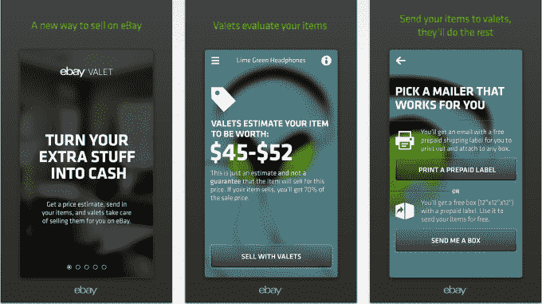
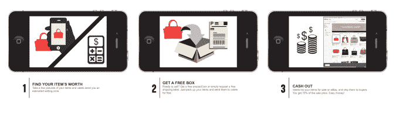

# 易贝推出“易贝代客”，一款为你推销的 iPhone 应用 

> 原文：<https://web.archive.org/web/https://techcrunch.com/2014/06/17/ebay-launches-ebay-valet-an-iphone-app-that-does-the-selling-for-you/>

易贝今天正在将其不太知名的易贝帮我卖东西服务扩展到移动领域，推出了一款名为易贝代客服务的新应用，该应用承诺让易贝帮你卖东西。也就是说，它处理销售过程中的每一步——从确定一件商品的价值，到在网上列出它，再到售出后发货——并为你处理。

像其基于网络的同行一样，易贝代客旨在使在线销售更容易、更平易近人，这不仅适用于首次卖家，也适用于那些没有时间自己处理列表的人。(这有点像那些会为你“在易贝出售”的商店的数字版，你可能会记得电影《[40 岁的处女](https://web.archive.org/web/20230130100805/http://en.wikiquote.org/wiki/The_40-Year-Old_Virgin)》中的商店。))

在某种程度上，易贝的 Sell For Me 服务是对最近涌现的各种在线寄售商店的一种模仿，如 Poshmark、The Real Real、ThredUp、Threadflip、Twice 等。但与这些服务不同的是，无论是易贝的 Sell It For Me，还是现在的代客手机，都不支持销售服装。

相反，在其 Sell For Me 网站上，易贝[一直在宣传](https://web.archive.org/web/20230130100805/http://sellforme.ebay.com/home?_trksid=p2059161.l5350)如何为你销售许多其他商品，包括电子产品、收藏品、鞋子、手袋、体育用品、乐器，甚至汽车零部件。然而，它不能处理任何东西，如重量超过 25 磅的大件物品，价值低于 40 美元的破旧物品，DVD 和 CD 等媒体，高端贵重物品等。

我们被告知，新的移动应用将有类似的限制。

这款应用由 IIC (Israel Innovation Center)设计和开发，该中心是总部位于特拉维夫的创新和新风险组织(Innovation and New Ventures organization)的一个部门，是易贝公司的快速原型。目前，这家电子商务巨头表示，易贝代客是一个“试点”项目，它没有想到要向前发展必须达到的具体指标。

对于消费者来说，使用易贝代客的过程很容易。要开始，你只需拍下有问题的物品的照片，然后输入(或说出)你的物品的描述。30 分钟内，你的“贴身男仆”会给出一个估价范围，并询问你是否仍想出售。如果你手边有一个盒子，易贝会寄给你一个运输标签。如果没有，公司可以送你一个免费的预付费盒子。

然后你可以登录 eBay.com 观看拍卖，拍卖是在贴身男仆的账户下进行的。在物品售出后——通常是通过 7 天的列表——你保留 70%的利润，并存入你的贝宝账户。

“即使你不是在卖东西，也有一种销售的体验，”易贝创新和新风险投资副总裁史蒂夫·扬科维奇说。"你可以体验上市，但不做任何工作."

此外，他解释说，易贝代客应用程序和其他销售程序的区别在于，在业务方面，易贝实际上是在审查商品。“我们有一个人在看这个项目，研究易贝的状况，我们的市场有很好的库存，”他说。

易贝代客是我们最近几个月遇到的一些其他创业公司的回忆。例如，[出售了](https://web.archive.org/web/20230130100805/https://techcrunch.com/2013/09/24/sold-the-app-that-sells-your-stuff-for-you-arrives-on-android/)(其中[退出了 Dropbox](https://web.archive.org/web/20230130100805/https://techcrunch.com/2013/11/04/dropbox-snatches-up-sold-the-service-that-simplifies-selling-online-to-help-it-build-a-new-mystery-ecommerce-product/) )，正试图做类似的事情，在此之前，几家服务公司试图推翻像易贝或 Craigslist(在当地)、 [Zaarly](https://web.archive.org/web/20230130100805/https://techcrunch.com/2013/03/09/zaarly-shutters-its-reverse-craigslist-marketplace-goes-all-in-on-virtual-storefronts-as-co-founder-exits/) 、 [YardSellr](https://web.archive.org/web/20230130100805/https://techcrunch.com/2013/02/11/yardsellr-the-ebay-for-facebook-becomes-the-latest-casualty-in-social-local-commerce/) 和 [EggDrop](https://web.archive.org/web/20230130100805/https://techcrunch.com/2012/10/11/mobile-marketplace-eggdrop-shuts-down-following-craigslist-cd-but-says-slow-growth-to-blame/) 这样的老牌公司。迄今为止，没有一个真正成功。但是易贝——因为它是易贝——可能有机会。

新的应用程序已经在 iTunes 上上线。