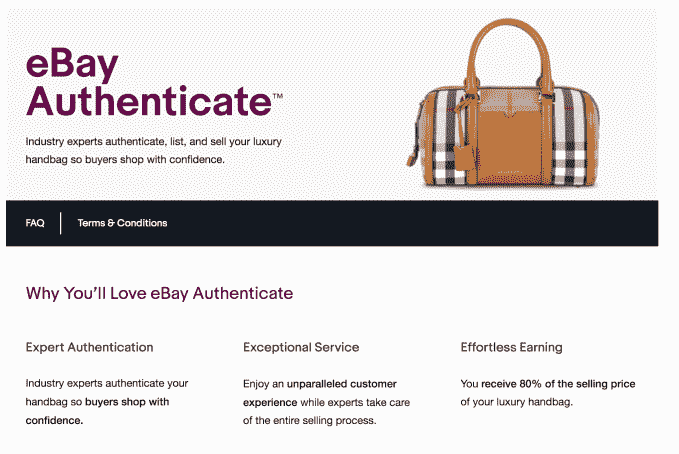
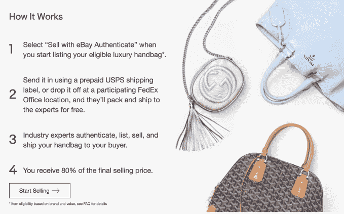

# 易贝推出认证计划 TechCrunch，挑战 RealReal 和其他时尚经销商

> 原文：<https://web.archive.org/web/https://techcrunch.com/2017/10/16/ebay-takes-on-the-realreal-and-other-fashion-resellers-with-launch-of-authentication-program/>

随着今天[易贝认证](https://web.archive.org/web/20221207033658/https://www.ebay.com/s/itemauthentication/seller)的[发布，易贝正在追逐寻找奢侈品的高端客户，这是一个新的项目，允许卖家选择让他们的商品被验证为真实的。最初，这项服务将专注于 12 个高端品牌的奢侈手袋和钱包，包括路易威登、香奈儿、爱马仕、古驰、普拉达、博柏利、迪奥、芬迪、巴黎世家、Goyard、Celine 和华伦天奴。](https://web.archive.org/web/20221207033658/https://www.ebayinc.com/stories/news/launch-of-ebay-authenticate-tm-boosts-shopper-confidence-for-luxury-handbag-purchases/)

早在一月份，[公司就宣布了即将推出的](https://web.archive.org/web/20221207033658/https://beta.techcrunch.com/2017/01/12/ebay-takes-on-fashion-resale-startups-with-launch-of-authentication-program/)易贝认证，称该服务将在“年底”前推出

当时，易贝解释说，有必要提供这样一项服务，因为越来越多的顾客转向网上购物，购买奢侈品二手商品，但由于潜在的伪造和假冒，他们往往犹豫不决。

此外，在易贝的网站上，手袋是一个特别受欢迎的类别，在美国每 13 秒钟就有一个手袋售出

提供自己的认证程序的举动也正值易贝受到许多电子商务竞争对手的挑战，这些竞争对手专注于二手时尚服装、手袋和配饰，如 RealReal、Tradesy、ThredUp 等。这些初创公司很可能已经抢走了易贝的一部分业务，因为这个领域的大多数参与者都会鉴定他们出售的商品，让客户放心，他们买的是真货。

然而，易贝认证对于卖家来说是可选。该服务将允许卖家列出价值超过 500 美元的奢侈手袋和钱包，然后获得最终售价的 80%。

在这种情况下，易贝向卖家提供的佣金比 RealReal 更高，real real 使用的是分层结构，净销售额在 1500 美元或以下的卖家获得 55%的佣金，精品手表获得 80%以上的佣金。

在截至 2018 年 1 月 31 日的有限时间内，易贝的服务将接受价值 250 美元或以上的物品，并给卖家 90%的售价。这将允许潜在的卖家用更多的商品来尝试这项服务，以观察它是否能提高销售额。

为了使用这项服务，卖家访问易贝认证网站开始列出他们的商品，然后用预付运费标签将手提包或钱包放进去，或者放在联邦快递。易贝说，联邦快递办公室将免费包装和运送物品给专家。

该项目然后被发送到易贝的行业专家网络进行验证。这个“网络”包括与易贝合作的专业鉴定人，而不是内部员工。如果物品是真的，专家们会拍照、列表、出售并运送手提包或其他物品给买家。(如果商品不是正品，它会被免费运回。)

该计划是对易贝目前反假冒措施的扩展，包括检测工具、执法机制及其与品牌、零售商和执法部门的现有关系。其验证版权所有者计划自 1998 年以来一直在运行，允许超过 40，000 个版权所有者报告可能的假冒商品。

易贝认证从今天开始可供市场的消费者卖家使用。企业卖家将来也可以使用这项服务。

这项服务明年还将扩展到其他类别。易贝此前曾表示，这将包括珠宝和手表。